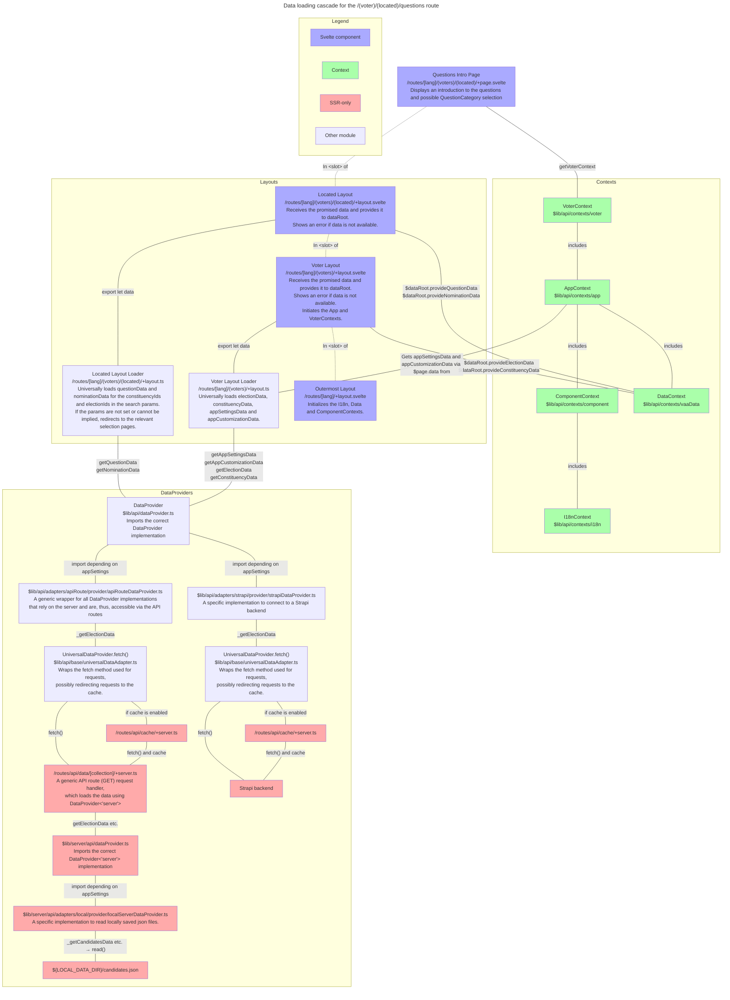

# OpenVAA Voting Advice Application

===

# Frontpage contents

## What is a VAA?

A voting advice application (VAA), also known as a vote matcher, vote compass or election compass is an application that helps voters find a political candidate or political party that stands closest to their preferences. VAAs work by posing both the candidates and the voter the same set of statements and ranking the candidates based on their agreement with the voter. This ranks is presented as percentage.

See also [VAA on Wikipedia](https://en.wikipedia.org/wiki/Voting_advice_application).

## How does OpenVAA differ from other VAAs?

First of all, OpenVAA is fully open source and free to use.

While not the only open-source VAA, OpenVAA is to our knowledge the most flexible and feature-rich open-source VAA.

OpenVAA is built from the start to be fully localisable and applicable to any electoral system and also supports multiple simultaneous elections in the same app. It is modular, customisable and can be easily extended.

It comes with a candidate or party app as well, with which they can enter their answers to statements.

## Who built OpenVAA?

OpenVAA is built and maintained by the eponymous OpenVAA Association which is a non-profit incorporated in Finland.

In addition two student groups from the Aalto University along with other volunteers have participated in the development.

The initial 3-year project was funded by the Finnish innovation fund Sitra.

## Who is OpenVAA for?

- Publishers of VAAs, such as pro-democracy groups and media
- Developers of VAAs
- Researchers studying VAAs
- Organizations willing to use VAAs in internal elections
- Voters using VAAs

## What can you do with OpenVAA now and in the future?

1. You can publish your own VAA using the existing codebase
   - Go to Publishers’ Guide
2. You can edit the codebase to your liking
   - Go to Developers’ Guide
3. You can conduct research on VAA use
   - Go to Researchers’ Guide
4. You can contact OpenVAA if you need a custom solution but don’t want to develop it yourself
   - Go to About OpenVAA

## What is the current state of OpenVAA’s development

Release 0.1 Shiba.

Next 0.2 Akita.

===

# Older intro

## Introduction

A software framework for creating [Voting Advice Applications](https://en.wikipedia.org/wiki/Voting_advice_application) (VAA), also known as Election Compasses. In short, VAAs are applications that help voters find candidates or parties in elections based on how much they agree about political or value statements. They’re currently most popular in the Nordic countries, the Netherlands and the German-speaking part of Europe.

This repository is a monorepo containing the frontend and backend, as well as other modules. In addition to the voters’ frontend, there is a similar UI for candidates that they can use to input their answers.

The project is coordinated by the Finnish non-profit association [OpenVAA](https://openvaa.org/en) and funded by [Sitra](https://www.sitra.fi/en/) – the Finnish innovation fund.

### 💡 Features

- 🔎 Transparent
- 💸 Free to use
- 🌍 Fully localisable
- 🗳 Use in any election
- 🤲 Accessible
- 🧩 Modular, customisable and extendable
- 🕶️ Privacy-preserving
- 🎓 Informed by research and research-friendly

See full list of [features](#features-1).

### 🔨 Use cases

- Collect candidates’ or parties’ answers and publish a VAA for voters
- Use previously collected answers to publish a VAA
- Rapidly prototype new VAA designs or functions
- Collect VAA usage data for research

### 🥅 Project goals

- Offer a fully transparent alternative to closed-source VAAs
- Make it easier to develop new VAA features and designs
- Expand the use of VAAs to elections where they’re not currently used
- Facilitate research on VAAs

### 🚧 Project status: Alpha

> Our latest VAA release is the [2025 Finnish Local Elections Election Compass for Youth](https://nuortenvaalikone.openvaa.org).

> To stay up to speed, please ⭐️ star the repo or [📧 subscribe to our newsletter](https://openvaa.org/newsletter).

The project is currently in an alpha phase with the onus being on refactoring the existing code base for greater robustness and a better developer experience, as well as implementing some missing features.

We released two pilot VAAs for the 2024 EU Elections, which you can try out to see the software in action.

| Video-based VAA                                                                                               |  Traditional VAA                                                                                                                                  |
| ------------------------------------------------------------------------------------------------------------- | ------------------------------------------------------------------------------------------------------------------------------------------------- |
|   | <a href="https://vaalikone.openvaa.org" target="_blank"></a> |
|  Finnish, Swedish and English                                                                                 |  Finnish only                                                                                                                                     |
| Features custom video content                                                                                 | Select questions by theme                                                                                                                         |
| User survey and extended analytics                                                                            | No analytics                                                                                                                                      |
|  Data stored in Strapi backend                                                                                | Data stored in local JSON files                                                                                                                   |
|  Postgres server and two Docker containers running on Render                                                  | Single Docker container running on Render                                                                                                         |
| nuortenvaalikone.openvaa.org                                                                                  | vaalikone.openvaa.org                                                                                                                             |

### 🪢 Collaborate

In addition to developers and designers willing to contribute to the codebase (see below), we’re also looking for researchers to collaborate with and organisations willing to publish their own VAAs. Reach us at info@openvaa.org if you’re interested.

### 🍭 Contributing

We’re very happy to accept any help in coding, design, testing, translating and so on. If you want to help, drop a line at info@openvaa.org.

See [the contribution guide](#contributing) for further info about contributing to the project.

===

# Preliminary contents

## Introduction

## Features

A non-exhaustive list of the application features.

### Localization

- All texts used in the application are localizable
- All text properties of the data are localizable
- Translations can be exported and imported as `csv` files
- Translations can be easily overriden term by term
- Automatic serving of requested locale to users if available
- Currently available in
  - English
  - Finnish
  - Swedish

### Accessibility

- WGAC 2.1 AA compliant
- Automatic color contrast tuning for user-specified colors
- Mobile first design
- Light and dark mode enabled

### Customization

- Fonts and colors
- Logos
- Questions and question categories
- Available entity types
- Result sections
- Content of entity cards in lists and in the details view
- Numerous other settings which can be edited in real time via the backend
- Futher customization available by editing the source code

### Data Input

- Using Strapi Admin UI
- Using a json import tool
- Using a custom Admin UI (TBA)
- Support for a local version without Strapi
  - Data provided as flat json files
  - Does not support the Candidate App

### Elections and Constituencies

- Multiple simultaneous elections
  - Users may be given the option to select which elections they want to get recommendations for or all can be automatically included
- Multiple election rounds
- Different constituency groups for elections
- Hierarchical constituencies, e.g. regions containing municipalities
  - When users select their constituency, the hierarchies are used to automatically select parent constituencies

### Statements or Questions

- Support for separate info and opinion questions
  - Opinion questions are used in calculating the matches
  - Info questions are shown in candidate or party profiles and can be used for filtering
- Opinion question types
  - Ordinal questions, e.g. Likert with full configurability (number of options and their labels)
  - Categorical questions
  - Preference order (TBA)
  - Number (TBA)
- Info question types
  - Text
  - Number
  - Boolean
  - Categorical
  - Categorical with multiple selections
  - Date
  - Website link
  - Multiple-item text (TBA)
  - Image (partial support)
- Candidate portrait or Party logo
- Question categories
- Arbitrary ordering
- Questions or question categories that are specific to an election, constituency or type of entity
- Entities’ answers to question can be supplemented by a (translatable) open answer
- Background information for questions
  - Rich text
  - Can be separated into multiple sections
  - Video content
  - Term definitions (WIP)
  - AI-generated information (WIP)

### Entities

- Candidates
- Parties, i.e., Organizations
- Electoral Alliances
- Party Factions (partial support), e.g. those in _ley de lemas_ systems

### Matching algorithm

- Separated in an independent module
- Based on a generic mathematical model (multidimensional space) and fully extensible within its confines
- Distance calculation methods:
  - Manhattan
  - Directional
  - Euclidean
- Sub-category matching, e.g., by Question category
- Configurable method for imputing missing answers

### Candidate application

- Full application for candidates with which they can enter their data and opinions
- Support for multi-lingual input
- Optional support for self-registration using bank authentication

### Feedback and analytics

- Built-in feedback form
- Configurable user survey prompt for research purposes
- Support for Umami analytics with or without detailed events
  - User consent is asked if detailed events are tracked

## Publishers’ Guide

- Overview of a VAA project
- Statement formulation
  - Methodological
- Application settings and features
  - List all
  - Env variables vs other settings
  - Methodological
- Data collection
  - Initial data
    - Sheets templates
  - Backend model vs static json model
  - Candidate or party data
    - Methodological
- Event tracking
- Customisation
- Localization
- Deployment
- Marketing

## Developers’ Guide

- Quick start
- App and repo structure
- Development
  - Monorepo
  - Docker
  - Mock data
  - Roadmap
- Contributing
- Backend
- Frontend
  - Data API
  - Contexts
  - Components
- LLM features
- Deployment
- Troubleshooting

## Researchers’ Guide

- Event tracking
- Customisation
- Development
- A/B testing
- Open research questions

===

# Developers’ Guide

## Quick start

1. Make sure you have `yarn` 4 and `docker` installed and that the latter is running.
2. Install dependencies for all workspaces:
   ```bash
   yarn install
   ```
3. Make a copy of the root `.env.example` file and rename the copy as `.env`.
4. Build and run development Docker images for the entire stack:
   ```bash
   yarn dev
   ```
5. Once the process is complete, your database should be filled with mock data unless you edited that part of the `.env` file.
6. See the app live at http://localhost:1337/
7. Access the backend at http://localhost:5173/
   - Username `admin`
   - Password `admin`

- If you run into errors, try checking the tips related to Docker in [Troubleshooting](#troubleshooting).

## App and repo structure

The project is a monorepo and it consists of several yarn workspaces (each is a separate NPM module). See the READMEs in each for more information.

- Abstract logic
  - [`@openvaa/core`](/packages/core/)
  - [`@openvaa/data`](/packages/data/)
  - [`@openvaa/filters`](/packages/filters/)
  - [`@openvaa/matching`](/packages/matching/)
- Application
  - [`@openvaa/app-shared`](/packages/app-shared/)
  - [`@openvaa/strapi`](/backend/vaa-strapi/)
  - [`@openvaa/strapi-admin-tools`](/backend/vaa-strapi/src/plugins/openvaa-admin-tools/)
  - [`@openvaa/frontend`](/frontend/)
- Experimental LLM features
  - [`@openvaa/argument-condensation`](/packages/argument-condensation/)
  - [`@openvaa/llm`](/packages/llm/)
  - [`@openvaa/question-info`](/packages/question-info/)
- Development
  - [`@openvaa/shared-config`](/packages/shared-config/)

## Development

You can run the whole application in Docker containers (frontend, backend, postgres database,and AWS local stack for developing), or run the frontend or backend separately depending on your preferences. Using the Docker image is recommended and the quickest way to set up the application. This guide assumes you’re using Docker.

### Requirements

- Yarn 4
- Docker (unless you plan to run the app outside of Docker)
- Node.js. Use the version specified under `engines` in the root [package.json](/package.json). Use of nvm is encouraged for Node version management
- Ports 1337, 5173 and 5432 should be free for the application if using default settings
  - These ports can be changed in the `.env` file if desired.

### Running the Development Environment

Make sure that you’re using the recommended Node version (see [Requirements](#requirements)) by running `node -v`. If needed set the correct version with `nvm use <VERSION>`.

First, install dependencies for all workspaces:

```bash
yarn install
```

To build and run development Docker images for the entire stack (frontend, backend and DB), in the project's root directory:

- Make a copy of the `.env.example` file and rename the copy as `.env`
- Run `yarn dev`
- If you run into errors, try checking the tips related to Docker in [Troubleshooting](#troubleshooting).

The `yarn dev` script will automatically build all the shared packages and start watching them for changes. If these change, they will be rerebuilt and the frontend restarted to reflect the changes.

To bring down the Docker stack properly (delete all containers, images and named volumes which include backend DB volume with potentially seeded mock data) run:

```bash
yarn dev:down
```

**When running the project in Docker, only use the `.env` file in project root. You usually
don't have to touch the separate .env files for frontend and backend.**

If you want to seed backend DB with mock data (e.g. for demostration, development or testing purposes purposes), please follow the instructions [here](#mock-data-generation).

#### Hot Reloading the Backend

Development Docker images will listen to changes in the files and allow hot reloading, meaning the Docker images don't need to be re-generated after making changes to the codebase. Hot reloading is enabled by default in the frontend, but for backend this can be enabled by adding the volume `- ./:/opt` as a mounted point in [docker-compose.dev.yml](/backend/vaa-strapi/docker-compose.dev.yml) and re-building the Docker container. However, this can make the development process slow at times, so it is not recommended to keep that on unless doing direct development on the backend source code.

### Monorepo

All workspaces share a single `yarn.lock` file located at the project root but contain their own `tsconfig.json` and `package.json` files.

The workspaces can be addressed by yarn from any directory as follows:

```bash
yarn workspace [module-name] [script-name].
```

E.g., the `app-shared` module can be built by running:

```bash
yarn workspace @openvaa/app-shared build
```

In order to install dependencies for all modules and build all modules (although, you’d rarely want to this) run:

```bash
yarn install
yarn workspaces foreach -A build
```

When adding interdependencies between the modules, use yarn’s `workspace:` syntax:

```json
  "dependencies": {
    "@openvaa/core": "workspace:^"
  }
```

Also add a reference to the package’s `tsconfig.json` file (see more in [Module resolution](#module-resolution)):

```json
  "references": [{ "path": "../core/tsconfig.json" }]
```

The root [`package.json`](/package.json) contains scipts for many repo-wide tasks.

#### Module resolution

##### IDE

In order to resolve cross `import`s between the monorepo modules Code uses TypeScript references, which are defined in the `tsconfig.json` files of the corresponding modules.

In other words, you DO NOT have to build the **dependee** modules in order for the IDE to resolve their `import`s within a **dependent** module or to pick up changes you make in the **dependee’s** `.ts` sources.

##### NPM/Node

When you use Yarn and during runtime NPM/Node module resolution mechanism is used instead. It relies on various pointers defined in `package.json` files of the corresponding modules (e.g. `main`, `module` or `exports`). These pointers usually refer to `build`/`dist` directory containing already transpiled TS sources of a given module (`.js` files). This directory subsequently gets symlinked by `yarn install` in a `node_modules` directory of a **dependent** module.

In other words, you DO have to build the **dependee** modules prior to running a **dependent** module or using Yarn on it, so that NPM/Node can find the transpiled `.js` sources and pick up changes you make in the original `.ts` code.

The `yarn dev` script automatically watches the packages for changes. If there are some, they will be rerebuilt and the frontend restarted to reflect the changes.

### Roadmap

- 2026/H1
  - Update to Svelte 5
  - Migrate backend from Strapi to Supabase
  - Update monorepo structure
- 2026/H2
  - Enable plugins or easier customisation of pages and main components
  - Multi-tenant model

## Testing

The project uses `vitest` for unit tests and `Playwright` for E2E testing.

### Unit tests

The unit tests can be run centrally from the repo root. You need to only build the shared dependencies one.

```bash
yarn build:shared
## Run once
yarn test:unit
## or keep running
yarn test:unit:watch
```

### E2E tests

The project uses Playwright for E2E testing. The tests rely on generated data which the local PosgresDB is being seeded with. All of the E2E tests are collected in the [`tests`](/tests) folder.

To run the E2E tests start all the services locally:

```bash
yarn dev
```

... and then:

```bash
yarn playwright install
yarn test:e2e
```

If you encounter any unexpected issues with the E2E tests, make sure to bring down the Docker stack properly to reseed the DB with the original mock data (more on mock data [here](#mock-data-generation)).

To bring down the Docker stack properly (delete all containers, images and named volumes which include backend DB volume with potentially seeded mock data) run:

```bash
yarn dev:down
```

## Deployment

The application is fully containerized and the recommended way of deploying it is as Docker containers.

### Costs

The hosting costs vary depending on the providers you use and the amount of expected traffic.

Recent (2024–2025) realized costs on Render have been:

- Database $19–55/month
- Backend service $25–85/month – a more performant instance is needed if there are a lot of candidates
- Frontend service $25–85/month
- Media CDN on AWS $10–100/month - the higher figure was for a version with 30 videos, the smaller figure is more likely in most cases
- External analytics server (Umami) $20/month

### Setup with Render and AWS

The instructions below detail how the application is deployed using [Render](https://render.com/) and [AWS](https://aws.amazon.com/) for email and media CDN, but the process is essentially the same with other cloud infrastructure providers.

#### 1. Fork

Fork the repo and make any changes you need to the source code. You’ll most likely need to edit at least:

- [StaticSettings](/packages/app-shared/src/settings/staticSettings.ts)
- For local development, copy [.env.example](/.env.example) to `.env` and edit the variables therein.

#### 2. Configure AWS

The backend uses AWS by default for media storage (S3) and email (SES). If you do not wish to use AWS, you will need to edit the [Strapi plugin config](/backend/vaa-strapi/config/plugins.ts).

You will need to set the following `env` variables for AWS to work. You can collect the variables in an `.env` file for easier import into Render services, which are set up below.

```dotenv
### These settings correspond to LocalStack system defaults
### https://docs.localstack.cloud/references/configuration/
AWS_SES_ACCESS_KEY_ID="test"
AWS_SES_SECRET_ACCESS_KEY="test"
AWS_SES_REGION=us-east-1

## Used for emails sent by Strapi. (`MAIL_FROM_NAME` only affects emails sent by the `users-permissions` plugin.)
MAIL_FROM="no-reply@example.com"
MAIL_FROM_NAME="Voting Advice Application"
MAIL_REPLY_TO="contact@example.com"

### AWS S3 settings

AWS_S3_BUCKET=static.example.com

### These settings correspond to LocalStack system defaults
### https://docs.localstack.cloud/references/configuration/
AWS_S3_ACCESS_KEY_ID="test"
AWS_S3_ACCESS_SECRET="test"
AWS_S3_REGION=us-east-1

### The base URL is used to access static content uploaded via Strapi's UI to AWS S3:
### - on production it uses a dedicated subdomain which is linked to an eponymous AWS S3 bucket via a CNAME DNS record
### - in development it points directly to LocalStack host and is appended by the S3 bucket name in Strapi's `plugin.ts`
STATIC_CONTENT_BASE_URL=http://localhost:4566
STATIC_MEDIA_CONTENT_PATH=public/media
```

#### 3. Create Render project

Login to Render or create an account.

You can either use the [Render Blueprints](https://render.com/docs/infrastructure-as-code) feature by modifying the [render.example.yaml](/render.example.yaml) or create the services manually.

If you choose the blueprints option, you can skip to [Step 9](#9-use-your-own-domain-name-for-the-frontend).

Otherwise, create a new project for your app. Next, you’ll need to create three services in it.

#### 4. Create Postgres database

Create a new Postgres service.

- Use Postgres version 16.
- Select an appropriate instance type:
  - Even Basic-1gb may be enough
  - Disk size can be the smallest possible, e.g. 1GB, because we’re using AWS for media storage.
- Select a Database name and Username

Copy the following details from the newly-created instance to your `env` variables.

```dotenv
DATABASE_HOST=<Hostname, e.g. dpg-123456abcdefg-a>
DATABASE_PORT=<Port, e.g. 5432>
DATABASE_NAME=<Database>
DATABASE_USERNAME=<Username>
DATABASE_PASSWORD=<Password>
```

#### 5. Create the Backend web service

Create a new Web Service.

- Select an instance type: Standard (2GB, 1CPU) or higher is safer than Starter, which may crash
- Link to your repository on Github
- Select the branch to deploy from
- Edit settings:
  - Set `Dockerfile Path` to `./backend/vaa-strapi/Dockerfile`
  - You may want to turn `Auto-Deploy` off
  - The other settings can be left to defaults

Set up `env` variables for the backend.

1. Create the following new variables:

```dotenv
STRAPI_HOST=0.0.0.0
STRAPI_PORT=1337
APP_KEYS="<toBeModified1>,<toBeModified2>"
API_TOKEN_SALT=<tobemodified3>
## ADMIN_JWT_SECRET and JWT_SECRET have to be different
ADMIN_JWT_SECRET=<tobemodified4>
JWT_SECRET=<tobemodified5>
DATABASE_SCHEMA=public
DATABASE_SSL_SELF=false
## Set to true if you want create mock data on an empty database
GENERATE_MOCK_DATA_ON_INITIALISE=false
GENERATE_MOCK_DATA_ON_RESTART=false
```

2. Add the following variables from above:

```dotenv
DATABASE_HOST
DATABASE_PORT
DATABASE_NAME
DATABASE_USERNAME
DATABASE_PASSWORD
```

Copy the following details from the newly-created instance to your `env` variables.

```dotenv
PUBLIC_BROWSER_BACKEND_URL=<The Service URL>
PUBLIC_SERVER_BACKEND_URL=<The Service URL>
```

#### 6. Create the Frontend web service

Create a new Web Service.

- Select an instance type: Standard (2GB, 1CPU) or higher is safer than Starter, which may crash
- Link to your repository on Github (likely the same as for the backend)
- Select the branch to deploy from (likely the same as for the backend)
- Edit settings:
  - Set `Dockerfile Path` to `./frontend/Dockerfile`
  - You may want to turn `Auto-Deploy` off
  - The other settings can be left to defaults

1. Create the following new variables:

```dotenv
PUBLIC_DEBUG=false
PUBLIC_BROWSER_FRONTEND_URLL=<The Service URL>
PUBLIC_SERVER_FRONTEND_URLL=<The Service URL>
```

2. Add the following variables from above:

```dotenv
PUBLIC_BROWSER_BACKEND_URL
PUBLIC_SERVER_BACKEND_URL
```

3. If you're using bank authentication, also add the following variables:

```dotenv
## Source: https://openvaa.sandbox.signicat.com/auth/open/.well-known/openid-configuration
## The URL where users are redirected to authenticate with the OpenID Connect provider before obtaining an authorization code.
PUBLIC_IDENTITY_PROVIDER_AUTHORIZATION_ENDPOINT=https://openvaa.sandbox.signicat.com/auth/open/connect/authorize
## The URL used to exchange an authorization code for access, ID, and refresh tokens.
IDENTITY_PROVIDER_TOKEN_ENDPOINT=https://openvaa.sandbox.signicat.com/auth/open/connect/token
## The endpoint that provides a JSON Web Key Set (JWKS) used to verify the authenticity of signed tokens from the identity provider.
IDENTITY_PROVIDER_JWKS_URI=https://openvaa.sandbox.signicat.com/auth/open/.well-known/openid-configuration/jwks
## Source: https://dashboard.signicat.com/oidc-clients/clientdetails/{client_id}
PUBLIC_IDENTITY_PROVIDER_CLIENT_ID=client_id
## Source: https://dashboard.signicat.com/oidc-clients/clientdetails/{client_id}/secrets
IDENTITY_PROVIDER_CLIENT_SECRET=client_secret
## Source: https://dashboard.signicat.com/oidc-clients/new-public-key/{client_id}.
## Select "Encryption", keep the private part of the key pair.
IDENTITY_PROVIDER_ENCRYPTION_PRIVATE_KEY='{"kty":"RSA","kid":"{key_id}","use":"enc","alg":"RSA-OAEP","e":"{secret}","n":"{secret}","d":"{secret}","p":"{secret}","q":"{secret}","dp":"{secret}","dq":"{secret}","qi":"{secret}"}'
```

#### 7. Create a Strapi Admin

Go to the Strapi admin panel via the backend url and create the new Admin user as prompted.

If using bank authentication, create an API access token for the frontend:

1. In the Admin panel, go to Settings > API Tokens
2. Create a new token:
   - Type: Custom
   - Duration: Unlimited
   - Permissions (only one):
     - `Users-permissions.Candidate.preregister`
3. Copy the token into the `env` variable

```dotenv
BACKEND_API_TOKEN="<API Token>"
```

#### 8. Fill in further `env` variables

There are still a couple of `env` variables you now have, which need to be added to the services.

1. Backend:

```dotenv
PUBLIC_FRONTEND_URL
```

2. If using bank authentication, frontend:

```dotenv
BACKEND_API_TOKEN
```

#### 9. Use your own domain name for the frontend

1. In Render, go to the Frontend Service.
   - Go to Settings > Custom Domain > Add Custom domain:
     - Set the domain name you want to use, e.g. `subdomain.domain.tld`
     - Write down the Render URL
2. Go to your DNS provider, e.g, Cloudflare.
   - Create a new CNAME record in the DNS:
     - Type: `CNAME`
     - Name: the `subdomain` you chose above
     - Target: the Render frontend URL
3. Go back to Render and verify the domain.

### Manually Creating a Production Build

You can also create production builds of the frontend and backend, but directly using the Docker containers is the recommended approach.

#### Build from Dockerimage

Run `yarn prod` in the project root. This will create a production-ready build of the app in Docker and create containers
for both backend and frontend which are ready to use by themselves. Frontend is accessible from port 80 by default.

#### Building the frontend separately

To build the frontend separately for production, run `yarn build` in the `frontend` directory. This will build the frontend into JavaScript
files contained in the `build` directory. You can then copy the contents of the `build` folder into a Node server along with
the `package.json` and `yarn.lock` files and can start the frontend by running `node index.js` in the directory. The frontend
will use port 3000 by default.

Don't forget to run `yarn install --production` before starting the frontend.

#### Building the backend separately

To build the backend separately, run `yarn build` and `yarn start` in the `backend/vaa-strapi` directory.
This will build Strapi and start it in port 1337.

## Contributing

### Recommended IDE settings (Code)

Plugins:

- [ESLint](https://marketplace.visualstudio.com/items?itemName=dbaeumer.vscode-eslint)
- [Pretter](https://marketplace.visualstudio.com/items?itemName=esbenp.prettier-vscode)
- [Svelte for VS Code](https://marketplace.visualstudio.com/items?itemName=svelte.svelte-vscode)
- [Tailwind CSS IntelliSense](https://marketplace.visualstudio.com/items?itemName=bradlc.vscode-tailwindcss)

We also recommend Git Graph for easier branch management:

- [Git Graph v3](https://marketplace.visualstudio.com/items?itemName=dbaeumer.vscode-eslint)

Settings:

```json
"editor.defaultFormatter": "esbenp.prettier-vscode",
"editor.formatOnSave": true,
"editor.codeActionsOnSave": {
  "source.fixAll": "explicit",
},
```

### Issues

#### Create a new issue

If you detect a problem with the application or have a new request, search first in the list of issues to see whether or
not a similar issue has already been reported by someone else. If the issue doesn't exist, you can open a new one by
following these steps.

1. Add a descriptive title.
2. Add a descriptive description.
3. Assign the issue to the Voting Advice Application project.
4. [Add labels](#issue-labels).

#### Search for an issue

Scan through our [existing issues](https://github.com/OpenVAA/voting-advice-application/issues). You can
narrow down the search using `labels` as filters. See [Labels](#issue-labels) for more information.
If you find an issue to work on, you are welcome to open a PR with a fix.

#### Issue labels

Labels can help you find an issue you'd like to help with. On the other hand, labels allow us to manage the project and categorize the information in a more meaningful way.

Currently, the labels divide into four categories:

- Category: [CATEGORY] => This category lets us know what category the issue belongs to. Fox example, if the issue contains only security related changes, the label will be `category: security`.
- Status: [STATE of ISSUE] => This category lets us know what state the issue is in right now.
- Type: [TYPE OF ISSUE] => This category lets us know what type of issue this is. For example, if the issue is a bug, the label will be `type: bug`, or if the issue is a new feature, the label will be `type: feature`.
- Scope: [SCOPE] => This category describes the scope of this issue. For example, suppose that the issue involves the voter side of the app. Then the appropriate label would be `scope: voter`.

Do not add more than one label from each category in each issue or pull request.

It is imperative to add labels to the new issues. If you are not sure which labels to add, you can always ask for help from the team.

Additionally, please use Milestones to indicate which release target and scope contribution belongs to (for example: Alpha version, Beta version, Post-launch bug fixing patch, etc.).

### Contribute

If you want to make changes to the project, you must follow the following steps.

1. Clone the repository
2. Create a new branch with a descriptive yet short name. For example, `fix-404-page` or `add-privacy-policy-page`.
3. Once you start adding changes, make sure you split your work into small, meaningful, manageable commits.

#### Commit your update

Commit the changes once you are happy with them. Try to keep commits small and to not mix unrelated changes in one commit.

Don't add any editor config files, such as the `.vscode` folder, to your commit. These are not included in the project's `.gitignore` file but you can [add them to a global `.gitignore`](https://blog.martinhujer.cz/dont-put-idea-vscode-directories-to-projects-gitignore/) on your own machine.

The commit message should follow the [conventional commits conventions](https://www.conventionalcommits.org/en/v1.0.0/). Use the `refactor:` prefix for changes that only affect styling.

For commits that affect packages other than the frontend, add the package name (without the `@openvaa/` scope) to the commit prefix in brackets, e.g.:

- `refactor[data]: doo foo`
- `refactor[q-info]: doo bar` (you can use the abbreviations `q-info` and `arg-cond` for `question-info` and `argument-condensation`)

On top of that, the commit message should follow the following rules:

- Commit messages must have a subject line and may have a body. A blank line must separate the subject line and body.
- If possible, the subject line must not exceed 50 characters
- The subject line must not end in a period
- The body copy must be wrapped at 72 columns
- The body copy must only explain _what_ and _why_, never _how_. The latter belongs in documentation and implementation.

After you're satisfied with your commits, clean up the commit history so that the commits make sense for others. The best way to accomplish this is to use the [fixup workflow](https://dev.to/koffeinfrei/the-git-fixup-workflow-386d) so that the commit history will contain only one commit for some feature instead of multiple ones with cumulative fixes, i.e., your PR’s commit history should finally look like:

- `feat: NewComponent`

Instead of:

- `feat: NewComponent`
- `fix: something in NewComponent`
- `fix: something else in NewComponent`

Once your changes are ready, make sure you have followed all the steps in the [PR Review Checklist](#self-review).

### Workflows

The project uses GitHub Actions among other things to verify each commit passes unit tests, is able to build the app successfully and adheres to the [coding conventions used by the project](#code-style-guide). If a commit fails the verification, please check your changes from the logs and fix changes before submitting a review request.

### Pull Request

When you're done with the changes, create a pull request known as a PR.

- Make sure that your commits pass the validation workflows, are able to run the [tests](#testing), and build the application.
- Make sure you have followed all the steps in the [PR Review Checklist](#self-review).
- Fill in the pull requested template. Mark your PR as a draft if you're still working on it.
- Don't forget to [link PR to an issue](https://docs.github.com/en/issues/tracking-your-work-with-issues/linking-a-pull-request-to-an-issue) if you are solving one.
- When you're satisfied with the PR, mark it as ready for review, and a team member will review it. The team may ask questions or request changes to your PR. Either using [suggested changes](https://docs.github.com/en/github/collaborating-with-issues-and-pull-requests/incorporating-feedback-in-your-pull-request) or pull request comments.
- As you update your PR and apply changes, mark each conversation as [resolved](https://docs.github.com/en/github/collaborating-with-issues-and-pull-requests/commenting-on-a-pull-request#resolving-conversations).
- While the review process is ongoing, do not force push changes to the branch but make the changes in new [fixup](https://dev.to/koffeinfrei/the-git-fixup-workflow-386d) commits. Only when the PR is otherwise approved, squash the commits and `push --force-with-lease`.

### Your PR is ready to be merged!

Once all the changes have been approved, the reviewers may still ask you to clean the git history before merging the changes into the main branch of the project.

### Self-review

You should always review your own PR first before asking someone to review it. Below you can find a checklist of things you should check before submitting your PR.

- [ ] Confirm that the changes solve the issue you are trying to solve partially or fully.
- [ ] Review the code in terms of the [OWASP top 10 security issues](https://owasp.org/Top10/).
- [ ] Verify that your code follows the [Code style guide](#code-style-guide). Prettier will take care most of the formatting, but the guide specifies some things regarding documentation.
- [ ] There is no code that is repeated within your PR or elsewhere in the repo.
- [ ] You have documented all new components, functions and other entities.
- [ ] You have updated the repo documentation md files if your changes touch those.
- [ ] You have enabled possibly new tracking events if your change adds functions available to the user.
- [ ] Any new Svelte components you have created, follow the [Svelte component guidelines](#svelte-components).
- [ ] Errors are handled properly and logged in your code.
- [ ] If there are any failing checks in your PR, troubleshoot them until they're all passing.
- [ ] Run the unit tests successfully.
- [ ] Run the e2e tests successfully.
- [ ] Test the change thoroughly on my own device, including parts that may have been affected via shared code.
- [ ] Test the changes using the [WAVE extension](https://wave.webaim.org/extension/) for accessibility.
- [ ] Test the changes using keyboard navigation and screen-reading.
- [ ] Make sure you have added documentation where necessary.
- [ ] Cleaned up the commit history and check that the commits follow [the guidelines](#commit-your-update)

### Code style guide

In general, Prettier formats the code on the surface in a nice way, but there are other requirements that you must take care of manually.

#### Principles

##### Don't Repeat Yourself

Check that no code is repeated if the same functionality is already implemented elsewhere. Be careful to check at least the following paths and modules for possible general use components, classes and utilities:

- `$lib/api`
- `$lib/components`
- `$lib/dynamic-components`
- `$lib/contexts`
- `$lib/utils`
- `@openvaa/app-shared`
- `@openvaa/core`
- `@openvaa/data`
- `@openvaa/filters`
- `@openvaa/matching`

If some existing code doesn’t do exactly the thing you want, consider extending the existing code instead of copy-pasting more than a few lines of code.

##### Top-Down Organization

Check that files with hierarchical functions are organized top-down such that the main (exported) function is first and its subfunctions come after. Preferably even split the functions into their own files and import them into the main function.

Thus, a complex file should read like this (or with `foo` and `bar` imported from their own files):

```ts
export function longProcess() {
  const result = foo();
  if (!result) return undefined;
  return bar(result);
}

function foo() {
  // Code here
}

function bar(result) {
  // Code here
}
```

#### Comments

Add comments to all exported variables as well as the properties of exported object, methods of classes and items of union types.

Try to make the code understandable by itself, but if you suspect the program logic might be unclear to others, rather add comments than leave them out.

Do not manually break comments into lines of a certain length unless separating paragraphs. This enables developers to use line-wrapping based on their own preference without adding unneccessary lines to the code.

##### TSDoc

In Typescript, use [TSDoc comments](https://tsdoc.org/) for all documentation unless you're only adding remarks concering the program flow, e.g.:

```ts
/**
 * Sum the inputs.
 * @param a - The first addend.
 * @param b - The second addend.
 * @returns the sum of the addends.
 */
export function sum(a: number, b: number): number {
  // Add the numbers together
  return a + b;
}
```

#### TypeScript

We follow the conventions of [TypeScript Style Guide](https://mkosir.github.io/typescript-style-guide/) with the following exception:

- [The naming conventions](https://mkosir.github.io/typescript-style-guide/#variables-1) for booleans are optional but if possible should be adhered to.

Common errors, which will be flagged, include:

- `Array<Foo>` must be used instead of `Foo[]`
- Type parameters cannot be single letters: `type Foo<TBar> = ...` instead of `type Foo<T>`.

##### Function parameters

> This requirement is not flagged by automatic checks.

To avoid bugs, try to always use named parameters to functions and methods, when there is any risk of confusion, i.e., in most cases where the functions expects more than one parameter.

```ts
// NOT like this
function confused(foo: string, bar: string, baz = 'BAZ') {
  // Do smth
}
// YES like this
function unConfused({ foo, bar, baz = 'BAZ' }: { foo: string; bar: string; baz?: string }) {
  // Do smth
}
```

To make things smooth, try to use the same names for parameter across the board, so they can be destructured and passed as is, e.g.

```typescript
const { foo } = getFoo();
const { bar } = getBar();
foobar({ foo, bar }); // Instead of foobar({ foo: foo, bar: bar })
function foobar({ foo, bar }: { foo: string; bar: string }) {
  // Do smthx
}
```

##### File organization

Try to separate pure type files from the functional ones and keep them next to each other, as well as tests. Do not usually collect these into separate folders. E.g.

- `foo.ts`: The file to compile
- `foo.type.ts`: Related types and types only
- `foo.test.ts`: The unit tests

#### CSS

Use Tailwind for styling.

See the [frontend styling guide](#frontend) for information about using Tailwind classes.

#### Svelte components

> The frontend currently uses Svelte 4. An update to Svelte 5 is scheduled for H1/2026.

##### File structure

Put each component in its own folder in `$lib/components`, or `$lib/dynamic-components` in case of [dynamic components](#dynamic-and-static-components). Multiple components that are integrally tied together may be included in the same folder (but see note below on exports). Separate the type definitions in a `.type.ts` file and provide an `index.ts` for easy imports. Thus, the `$lib/components/myComponent` folder would have the files:

- `MyComponent.svelte`: the component itself
- `MyComponent.type.ts`: the type definitions for the component's properties
- `index.ts`: provides shortcuts to imports:
  ```ts
  export {default as MyComponent} from './MyComponent.svelte;
  export * from './MyComponent.type;
  ```

**NB.** All components exported from the `index.ts` file, will be loaded even when only one of them imported in the application, so place multiple components in the same folder tree only when it's absolutely necessary.

##### Component properties

Currently, most components use attribute forwarding with [Svelte's `$$restProps` variable](https://svelte.dev/docs/basic-markup#attributes-and-props). This means that any HTML or SVG attributes that the main element of the component accepts can be passed as the components properties – or, in case of a component derived from another Svelte component, the parent components properties. This is most commonly used for passing extra classes to the element.

For example, in the `HeroEmoji` component additional CSS classes as well as any arbitraty properties of the `<div>` element can be passed to the `<div>` surrounding the emoji.

```ts
// HeroEmoji.type.ts
import type { SvelteHTMLElements } from 'svelte/elements';
export type HeroEmojiProps = SvelteHTMLElements['div'] & {
  /**
   * The emoji to use. Note that all non-emoji characters will be removed. If `undefined` the component will not be rendered at all. @default `undefined`
   */
  emoji?: string;
};
```

```tsx
// HeroEmoji.svelte
<script lang="ts">
  import { concatClass } from '$lib/utils/components';
  import type { HeroEmojiProps } from './HeroEmoji.type';

  type $$Props = HeroEmojiProps;

  export let emoji: $$Props['emoji'] = undefined;
</script>

{#if emoji}
  <div
    aria-hidden="true"
    role="img"
    style="font-variant-emoji: emoji;"
    {...concatClass(
      $$restProps,
      'whitespace-nowrap truncate text-clip text-center font-emoji text-[6.5rem] leading-[1.1]'
    )}>
    {emoji}
  </div>
{/if}
```

Also see the other existing components for more details on how this is done.

###### Default values for properties included `$$restProps`

In most cases, default values for properties included in `$$restProps`, such as `aria-hidden` can be just added as attributes in the relevant element or component. The only thing to keep in mind is that they must precede `$$restProps`, otherwise they will override the values in it. For example:

```tsx
<div aria-label="Default label" {...$$restProps}>
  ...
</div>
```

However, if you want to concatenate values with properties in `$$restProps`, such as concatenating a default `class` string with one possibly defined in `$$restProps`, this should be added after `{...$$restProps}`. To make this easier, a `concatClass` helper function is provided in [`$lib/utils/components`](/frontend/src/lib/utils/components.ts). For example:

```tsx
<div {...concatClass($$restProps, 'default-class')}>...</div>
```

###### Aria attributes and the `class` attribute

Note that you most Aria attributes cannot be exposed with `let export foo` because their names contain dashes, which also applies to the HTML `class` attribute. In order to access these, either use the `$restProps` object or specify them in the properties type the component uses, i.e., the one assigned to `type $$Props` and access them via `$$props`. For example:

```tsx
// Foo.type.ts
export type FooProps = SvelteHTMLElements['p'] & {
  'aria-roledescription'?: string | null;
  class?: string | null;
};

// Foo.svelte: <script>
type $$Props = FooProps;
let ariaDesc: $$Props['aria-roledescription'] = $$props['aria-roledescription'];
let className: $$Props['class'] = $$props['class'];
```

##### Component documentation

Follow Svelte's [guidelines for component documentation](https://svelte.dev/docs/faq#how-do-i-document-my-components). For an example, see [`IconBase`](/frontend/src/lib/components/icon/base/IconBase.svelte) component and its associated [type definition](/frontend/src/lib/components/icon/base/IconBase.type.ts).

Place the Svelte docstring at the top of the file, before the `<script>` block.

Add documentation for pages, layouts and other non-reusable components, detailing their main purpose. Include in their documentation under separate subheadings:

- `Settings` affecting the page
- Route and query `Params` affecting the behaviour
- `Tracking events` initiated by the page

It is not necessary to duplicate the documentation of the individual properties in the doc string of the `.svelte` file, because the properties should have their explanations directly in the interface definition in the `.type.ts` file (using [`/** ... */` TSDoc comments](https://tsdoc.org/)). The component's possible slots should, however, be included in the doc string.

## Backend

> The current backend uses the Strapi headless CMS. It is scheduled to be migrated to Supabase in H1/2026.

### Preparing backend dependencies

The backend module depends on `@openvaa/app-shared` and you need to build it prior to using `@openvaa/strapi` directly (no need if you use it via Docker):

```bash
yarn workspace @openvaa/app-shared install
yarn workspace @openvaa/app-shared build
```

### Plugins

- Email uses AWS SES, see [Candidate App documentation](#candidate-user-management)
- Upload uses AWS S3, see [plugins.ts](/backend/vaa-strapi/config/plugins.ts)
- [OpenVAA Strapi Admin Tools plugin](#openvaa-admin-tools-plugin-for-strapi) (local plugin)

### Running the backend separately

0. You should be running Strapi with the Node version specified under `engines` in the root [package.json](/package.json). Use of nvm is encouraged. **Additionally, you need Docker!**
1. Install dependencies by running `yarn install`.
2. Copy or rename the `.env.example` to `.env` before running any of the commands.
3. Run `docker compose -f docker-compose.dev.yml up postgres` to start Postgres container.
4. Run `yarn dev` or `yarn start` to run the Strapi server directly.

### Re-generating types

Run `yarn strapi ts:generate-types` to re-generate `types` folder.

### Customized behaviour

The Strapi backend has been customized in many ways to cater to VAA needs. The current implementation is split between direct edits to Strapi code and some functions implemented in the [OpenVAA Admin Tools plugin](#openvaa-admin-tools-plugin-for-strapi). Most of the customizations should be migrated to the plugin in the future.

### Default data loading

Some data is automatically loaded when Strapi is initialized. The data include:

- [Question Types](/backend/vaa-strapi/src/functions/loadDefaultData.ts)
- [App Settings](/backend/vaa-strapi/src/functions/loadDefaultAppSettings.ts)
- [Translation overrides](/backend/vaa-strapi/src/functions/loadDynamicTranslations.ts) (under the `dynamic` key)

API permissions are also set by defaul by [setDefaultApiPermissions.ts](/backend/vaa-strapi/src/functions/setDefaultApiPermissions.ts).

> Note that some of the defaults are **not** loaded if mock data generations is enabled.

### Mock data generation

> NB! This feature must only be used for local development and testing (not on production)

The database can be seeded with generated mock data using Faker.js.

If enabled, the data is generated by the rather messy [generateMockData](/backend/vaa-strapi/src/functions/generateMockData.ts) function. See the implementation for details and constants you can edit in-code to control the amount of data.

Mock data can be seeded only once on initialising the backend DB or on each restart of the Strapi backend. Mock data generation is controlled by these `.env` variables:

```dotenv
# Set to true to enable mock data on an empty database
GENERATE_MOCK_DATA_ON_INITIALISE=true

# Used only in development builds
GENERATE_MOCK_DATA_ON_RESTART=false
```

To enable mock data generation, set the `GENERATE_MOCK_DATA_ON_INITIALISE` variable as true. This will create mock data if the database is empty or give a warning if database is not empty and thus mock data could not be generated.

You can also set `GENERATE_MOCK_DATA_ON_RESTART` as true. This will generate new mock data every time the Strapi instance is restarted.

**Please keep in mind that setting this variable as true will clear the database contents of existing candidates, parties, elections, and so on and should only be used for debugging purposes.**
Setting `GENERATE_MOCK_DATA_ON_RESTART` as true will override `GENERATE_MOCK_DATA_ON_INITIALISE` setting.

**Note:** you need to modify these variables in the relevant `.env` file (located either in the project's root directory or in `backend/vaa-strapi`) depending on how you choose to run the backend service locally.

#### Mock users

By default, mock data includes the following Users (for up-to-date details, see [mockUsers](/backend/vaa-strapi/src/functions/mockData/mockUsers.json)):

| User type   | User role     | Email                    | Password     | Remarks                       |
| ----------- | ------------- | ------------------------ | ------------ | ----------------------------- |
| Candidate 1 | Authenticated | `first.last@example.com` | `Password1!` | Use to test the Candidate App |
| Candidate 2 | Authenticated | `test.test@example.com`  | `Password1!` | Use to test the Candidate App |
| Admin       | Admin         | `mock.admin@example.com` | `Password1!` | Use to test the Admin App     |

Note that the mock admin is different from the default Strapi Admin, generated along with mock data.

| User type    | Username | Email               | Password | Remarks                |
| ------------ | -------- | ------------------- | -------- | ---------------------- |
| Strapi Admin | `admin`  | `admin@example.com` | `admin`  | Use to login to Strapi |

### Authentication

Standard read calls require no authentication and are included in the default permissions, which are customized in the [Users’ permissions plugin](/src/extensions/users-permissions/strapi-server.ts).

Furthermore, all API routes are configured

Write calls require authentication:

- For registered Candidates, this is handled by creating a user. Read more in the [Candidate App documentation](#candidate-user-management).
- For pre-registration, an API token with the `users-permissions.candidate.preregister` priviledge is required, which must be saved in the `BACKEND_API_TOKEN` env variable. Read more on creating the token in the [Strapi documenation](https://docs.strapi.io/user-docs/settings/API-tokens#creating-a-new-api-token).

#### Adding new content types

If you add new content types that should be accessible, make sure:

1. Edit the `CONTENT_API` list in [api.ts](/backend/vaa-strapi/src/util/api.ts) to grant read rights to the public
2. Add the permission in the [Users’ permissions plugin](/backend/vaa-strapi/src/extensions/users-permissions/strapi-server.ts) so that registered users are granted access sa well
3. Also make sure that the route config includes the default restrictions:

```ts
// /src/api/<COLLECTION>/routes/<COLLECTION>.ts
export default factories.createCoreRouter('api::<COLLECTION>.<COLLECTION>', {
  only: ['find', 'findOne'], // Explicitly disabled create, update, delete
  config: {
    find: {
      policies: ['global::restrict-populate']
    },
    findOne: {
      policies: ['global::restrict-populate']
    }
  }
});
```

### Security

> NB. The Security chapter may be partly outdated.

By default, all content types inside Strapi are assumed to be safe to be publicly exposed. For reading, all the fields except any fields marked with the `private` keyword in their schema definition are returned per how Strapi works. For writing, the majority of the create, update, and delete endpoints are disabled by default unless explicitly used by the candidate application, and otherwise restricted to only resources that belong to the logged in candidate to prevent unauthorized modification of the data.

The restrictions are enforced using policies for each content type's route, usually found in the `backend/vaa-strapi/src/api/[schema]/routes/[schema].ts` file. To simplify this, there are a couple of helper functions available in [acl.ts](`/backend/vaa-strapi/src/util/acl.ts`) and [policies](`/backend/vaa-strapi/src/policies/`). Please see [Strapi's documentation on policies](https://docs.strapi.io/dev-docs/backend-customization/policies#usage) on how to use them.

The default permissions unauthenticated and authenticated users are managed in the [strapi-server.js](/backend/vaa-strapi/src/extensions/users-permissions/strapi-server.js) file, in the `defaultPermissions` array.

#### filter-by-candidate

Enforces that all the returned content belongs to the currently authenticated candidate by filtering the `candidate` field. This is primarily meant only for the find and findOne endpoints so that they only return resources belonging to the authenticated candidate in case the content type shouldn't be public for everyone.

Example usage:

```ts
export default factories.createCoreRouter('...', {
  ...
  config: {
    find: {
      policies: [
        'global::filter-by-candidate',
      ],
    },
  },
});
```

#### owned-by-candidate

Enforces that the request applies the `candidate` field to the currently authenticated candidate. This is primarily meant only for the create and update endpoints so that the created and updated resources body will always have the candidate set to the authenticated candidate to prevent impersonation.

Example usage:

```ts
export default factories.createCoreRouter('...', {
  ...
  config: {
    create: {
      policies: [
        'global::owned-by-candidate',
      ],
    },
  },
});
```

#### restrictPopulate

Enforces that only the allowed populate fields are set to prevent leaking content types from relationships. Strapi does not implement a convenient way to restrict populates, so this would need to be enforced for every content type that is able to eventually return the content type even if there is no direct relationship. For example, if there were the `shop -> pizza -> ingredient` relationship where `ingredient` should not be exposed to the public, it is still possible to use populate to get `ingredient` through the `shop` endpoint using the `shop -> pizza` and `pizza -> ingredient` relationship.

Example usage:

```ts
export default factories.createCoreRouter('...', {
  ...
  config: {
    find: {
      policies: [
        restrictPopulate([
          'pizza', // ?populate[pizza]=true
          'pizza.populate.shop' // ?populate[pizza][populate][shop]=true
        ]),
      ],
    },
  },
});
```

#### restrictFilters

Enforces that only the allowed filters are set to prevent leaking content types from relationships. This is useful in scenarios where a specific relationship should not be returned, which filter would allow querying for even though the value is not directly retrievable. For example, user would be able to filter relationship's value by checking the prefix, which would eventually give an oracle where if the character is correct, the content type is returned, or if it's wrong, the content type isn't returned. Repeating this would then allow recovering field values that they shouldn't be able to get.

Example usage:

```ts
export default factories.createCoreRouter('...', {
  ...
  config: {
    find: {
      policies: [
        restrictFilters([
          'candidate.id.$eq', // ?filters[candidate][id][$eq]=1
        ]),
      ],
    },
  },
});
```

#### restrictFields

Enforces that only the allowed fields are returned from the content type. If no fields are explicitly provided (using the `?fields=...` syntax in the request), it will default to only providing the allowed fields. This is intended for all the request endpoints as they all return the content type the action is performed on. Note that you should use the `private` field in the content type schema first for increased security (making this redundant), but if that isn't possible then this is an alternative option. This also has same caveats as `restrictPopulate` where the fields will not apply to relationships returned, and the field that shouldn't be returned will still be returned through populate if not carefully restricted.

Example usage:

```ts
export default factories.createCoreRouter('...', {
  ...
  config: {
    find: {
      policies: [
        restrictFields(['id', 'name']), // will allow returning id, name, or a subset of those
      ],
    },
  },
});
```

#### restrictBody

Enforces that only the allowed fields are allowed in the body. This is primarily meant only for the create and update endpoints to prevent modifying fields that should not be modified in the content type.

Example usage:

```ts
export default factories.createCoreRouter('...', {
  ...
  config: {
    update: {
      policies: [
        restrictBody(['name']), // will only setting the name field in the body
      ],
    },
  },
});
```

#### restrictResourceOwnedByCandidate

Enforces that the accessed resource belongs to the currently authenticated user by verifying that the accessed resource has `candidate` relationship to the authenticated user. This is primarily meant only for the findOne, create, update, and delete endpoints to prevent modification to resources not owned by that candidate. Note that one needs to be careful and make sure that the currently authenticated user is unable to modify another user's resource and set their candidate field to be themselves before performing modifications.

Example usage:

```ts
export default factories.createCoreRouter('api::my-content', {
  ...
  config: {
    update: {
      policies: [
        restrictResourceOwnedByCandidate('api::my-content'), // the content type name is needed for the checks
      ],
    },
  },
});
```

#### Preset

Here is a default preset one can use for new content-type that aims to be secure by default:

```ts
export default factories.createCoreRouter('...', {
  only: ['find', 'findOne', 'create', 'update', 'delete'],
  config: {
    find: {
      policies: [
        // Disable populate by default to avoid accidentally leaking data through relations
        restrictPopulate([]),
        // Disable filters by default to avoid accidentally leaking data of relations
        restrictFilters([])
      ]
    },
    findOne: {
      policies: [
        // Disable populate by default to avoid accidentally leaking data through relations
        restrictPopulate([]),
        // Disable filters by default to avoid accidentally leaking data of relations
        restrictFilters([])
      ]
    },
    create: {
      policies: [
        // Enforce ownership to always belong to the candidate
        'global::owned-by-candidate',
        // Disable populate by default to avoid accidentally leaking data through relations
        restrictPopulate([]),
        // Disable filters by default to avoid accidentally leaking data of relations
        restrictFilters([])
      ]
    },
    update: {
      policies: [
        // Allow only updating candidate's own resource
        restrictResourceOwnedByCandidate('...'),
        // Enforce ownership to always belong to the candidate
        'global::owned-by-candidate',
        // Disable populate by default to avoid accidentally leaking data through relations
        restrictPopulate([]),
        // Disable filters by default to avoid accidentally leaking data of relations
        restrictFilters([])
      ]
    },
    delete: {
      policies: [
        // Allow only deleting candidate's own resource
        restrictResourceOwnedByCandidate('api::answer.answer'),
        // Disable populate by default to avoid accidentally leaking data through relations
        restrictPopulate([]),
        // Disable filters by default to avoid accidentally leaking data of relations
        restrictFilters([])
      ]
    }
  }
});
```

Note that if you do not need the create, update, and delete endpoints, one should disable them by removing them from the `only` array.

### OpenVAA admin tools plugin for Strapi

> NB! The name of the plugin in Strapi is `openvaa-admin-tools`.

The plugin combines Strapi admin functions needed by the OpenVAA voting advice application.

#### Status: preliminary

Only some of the custom functions are currently contained in the plugin. Functions that should be migrated from the `@openvaa/strapi` include:

- Mock data generation
- Loading default settings and customization
- Candidate registration
- Candidate preregistration

#### Installation

The plugin is a local plugin and not currently published as an NPM package.

It is enabled by default in `@openvaa/strapi`’s [plugin config](/backend/vaa-strapi/config/plugins.ts):

```ts
export default ({ env }) => {
  return {
    // Other plugins
    'openvaa-admin-tools': {
      enabled: true,
      resolve: 'src/plugins/openvaa-admin-tools'
    }
  };
};
```

#### Developing

1. Enable [hot-reloading](#hot-reloading-the-backend) in Strapi.
2. Watch plugin source for edits by running `yarn workspace @openvaa/strapi-admin-tools watch`.

> NB! Before merging it’s safest to also try the plugin in the production environment as well, because some (unstable) Strapi function may not work there. To do that set `services.strapi.build.target=production` in [docker-compose](/backend/vaa-strapi/docker-compose.dev.yml).

#### Usage

The plugin functions are accessed via the Strapi Admin UI. There are currenlty two types of functions:

1. Registration email functions which appear on the right-hand column in the Content manager Candidate list view and single Candidate view.
2. Data import and deletion which are accessed via the admin tool page, which is opened with the jigsaw icon in the main navigation.

The services can also be invoked like any other plugins services with, e.g., `strapi.plugin('openvaa-admin-tools').service('data').import(data)`.

#### Functions

##### Registration email

###### Send the registration email to a single Candidate

- UI: Content manager > Candidates > Edit view
- Component: [RegistrationEmailToOne](/backend/vaa-strapi/src/plugins/openvaa-admin-tools/admin/src/components/RegistrationEmailToOne.tsx)
- Service: [`email.sendEmail`](/backend/vaa-strapi/src/plugins/openvaa-admin-tools/server/src/services/email.ts)
- API: `/openvaa-admin-tools/send-email`

Sends a registration link email with customizable content and subject to the Candidate.

Throws if the content does not include the link placeholder.

###### Send the registration email to all unregistered Candidates

- UI: Content manager > Candidates > List view
- Component: [RegistrationEmailToAll](/backend/vaa-strapi/src/plugins/openvaa-admin-tools/adminsrc/components/RegistrationEmailToAll.tsx)
- Service: [`email.sendEmailToUnregistered`](/backend/vaa-strapi/src/plugins/openvaa-admin-tools/server/src/services/email.ts)
- API: `/openvaa-admin-tools//send-email-to-unregistered`
- Required permission: `plugin::openvaa-admin-tools.send-email`

Sends a registration link email with customizable content and subject to all unregisterd Candidates.

Throws if the content does not include the link placeholder.

##### Import and delete data

The `externalId` is a private field that all collection types have which is used to store a stable id which can be referenced instead of the `documentId` in the import and delete functions.

###### Import any data in JSON format

- UI: OpenVAA Admin Tools page
- Component: [ImportData](/backend/vaa-strapi/src/plugins/openvaa-admin-tools/adminsrc/components/ImportData.tsx)
- Service: [`data.import`](/backend/vaa-strapi/src/plugins/openvaa-admin-tools/server/src/services/data.ts)
- API: `/openvaa-admin-tools/import-data`
- Required permission: `plugin::openvaa-admin-tools.import-data`

Import data into Strapi or update existing data based on `externalId` or `documentId` if provided. The data is supplied as `Array`s of `ImportData` objects collected by their collection name.

See the instructions in the component for further info.

###### Delete any data by its `externalId`

- UI: OpenVAA Admin Tools page
- Component: [DeleteData](/backend/vaa-strapi/src/plugins/openvaa-admin-tools/adminsrc/components/DeleteData.tsx)
- Service: [`data.delete`](/backend/vaa-strapi/src/plugins/openvaa-admin-tools/server/src/services/data.ts)
- API: `/openvaa-admin-tools/delete-data`
- Required permission: `plugin::openvaa-admin-tools.import-data`

Delete data based on `externalId`s. Objects whose `externalId`s (specified by collection) start with the provided, case-sensitive prefixes will be deleted. Mostly useful for deleting mock data which is generated with `externalId`s starting with `mock-`.

See the instructions in the component for further info.

###### Find any data using `filters`

- UI: OpenVAA Admin Tools page
- Component: [FindData](/backend/vaa-strapi/src/plugins/openvaa-admin-tools/adminsrc/components/FindData.tsx)
- Service: [`data.find`](/backend/vaa-strapi/src/plugins/openvaa-admin-tools/server/src/services/data.ts)
- API: `/openvaa-admin-tools/find-data`
- Required permission: `plugin::openvaa-admin-tools.import-data`

Find any data accessible by the data tools by providing arbitrary filters. You can also select the relations to populate.

See the instructions in the component for further info.

###### Send email to selected Candidates

- UI: OpenVAA Admin Tools page
- Component: [SendEmail](/backend/vaa-strapi/src/plugins/openvaa-admin-tools/adminsrc/components/SendEmail.tsx)
- Services:
  - [`data.findCandidates`](/backend/vaa-strapi/src/plugins/openvaa-admin-tools/server/src/services/data.ts)
  - [`email.sendEmail`](/backend/vaa-strapi/src/plugins/openvaa-admin-tools/server/src/services/email.ts)
- APIs:
  - `/openvaa-admin-tools/find-candidates`
  - `/openvaa-admin-tools/send-email`
- Required permissions:
  - `plugin::openvaa-admin-tools.import-data`
  - `plugin::openvaa-admin-tools.send-email`

A tool that combines searching for Candidates to build an editable list to whom to send emails.

See the instructions in the component for further info.

#### Access control

In addition to the specified permissions, all routes require `admin::isAuthenticatedAdmin`, see [route policies](/backend/vaa-strapi/src/plugins/openvaa-admin-tools/server/src/routes/admin/index.ts).

## Frontend

> The frontend currently uses Svelte 4. An update to Svelte 5 is scheduled for H1/2026.

See also:

- In-code documentation for all components, pages and layouts

### Components

For information about component properties, typing and documentation, see [Svelte components](#svelte-components) in the Contributors’ guide.

#### Dynamic and static components

The components used in the app are divided into dynamic and static ones, contained in [\$lib/components](/frontend/src/lib/components) and [\$lib/dynamic-components](/frontend/src/lib/dynamic-components), respectively.

**Static components** are ’dumb’ in the sense that their access to the application state is limited to the [`ComponentContext`](/frontend/src/lib/contexts/component/componentContext.type.ts), which currently includes only localization functions and a `darkMode` store. The reasons for this restriction is twofold:

1. When properties related to the application state are changed, static components need not be updated.
2. Static components can be used anywhere, even outside the app if the `ComponentContext` is available.

**Dynamic components**, on the other hand, are given full access to the application state and data. They implement sometimes complex logic dependent on the application settings, VAA data, search and route parameters, user selections etc. [`EntityDetails`](/frontend/src/lib/dynamic-components/entityDetails/EntityDetails.svelte), for example, provides the Voter’s answers to the [`EntityOpinions`](/frontend/src/lib/dynamic-components/entityDetails/EntityOpinions.svelte) subcomponent if it’s used within the Voter App:

```tsx
const { appType } = getAppContext();
let answers: AnswerStore | undefined;
if ($appType === 'voter') {
  const context = getVoterContext();
  answers = context.answers;
}
// In the html part
<EntityOpinions {answers} ... />
```

### Contexts

All of the data, shared stores and other state variables used by the app and components are collected in [Svelte contexts](https://svelte.dev/docs/svelte#setcontext). They are defined in the [$lib/api/contexts](/frontend/src/lib/contexts) folder.

Contexts must be initialized before they can be used by calling the `initFooContext()` function. Initialisation is performed by the ancestor `+layout.svelte` files of the routes on which the contexts are available. Afterwards the contexts are accessed by `getFooContext()`.

For ease of use, most contexts contain the properties provided by lower-level contexts. The [`VoterContext`](/frontend/src/lib/contexts/voter), for example, contains the [`AppContext`](/frontend/src/lib/contexts/app/appContext.type.ts), which in turn contains the [`I18nContext`](/frontend/src/lib/contexts/i18n/i18nContext.type.ts) and [`DataContext`](/frontend/src/lib/contexts/data/dataContext.type.ts).

> See also an [example of the data loading cascade](#example-loading-cascade-for-the-voterlocatedquestions-route-example).

#### Contexts vs global stores

Contexts are used instead of global stores, because they are explicitly initialised and restricted to components and their children. Tracking the use and dependency-loading of directly imported global stores is hard, because they’re initialized immediately when imported.

#### Example of Context Use

On the `/(voters)/elections/` route where the Voter can select which elections to get results for we have:

```tsx
import { getVoterContext } from '$lib/contexts/voter';
const { dataRoot, getRoute, selectedElections, t } = getVoterContext();
```

The properties accessed are:

- `dataRoot`: A store providing access to all of the VAA data which has been provided to it by `load` functions. Inherited from `DataContext`.
- `getRoute`: A store containing a function with which links to internal routes are build. Inherited from `AppContext`.
- `selectedElections`: A store containing the currently selected `Election` objects, derived from the `electionId` search parameters and `dataRoot`.
- `t`: A store containing the translation function. Inherited from `I18nContext`.

##### Available contexts

> For complete descriptions of the contexts’ contents, see their associated type files.

| Context                                                                             | Description                                                   |  Consumer                                                           | Includes                       | Own contents (non-exhaustive)                                                                                                                                                                                                                                                                                                                                                                                                                                                                                                                                                                                                           | Initialized by      |
| ----------------------------------------------------------------------------------- | ------------------------------------------------------------- | ------------------------------------------------------------------- | ------------------------------ | --------------------------------------------------------------------------------------------------------------------------------------------------------------------------------------------------------------------------------------------------------------------------------------------------------------------------------------------------------------------------------------------------------------------------------------------------------------------------------------------------------------------------------------------------------------------------------------------------------------------------------------- | ------------------- |
| [`I18nContext`](/frontend/src/lib/contexts/i18n/i18nContext.type.ts)                | All localization functions                                    | Other contexts                                                      | —                              | — `t`<br> — `locale`<br> — `locales` from `$lib/i18n`                                                                                                                                                                                                                                                                                                                                                                                                                                                                                                                                                                                   | `/[lang]`           |
| [`ComponentContext`](/frontend/src/lib/contexts/component/componentContext.type.ts) | Functions available to all components                         | Any component                                                       | `I18n`                         | — `darkMode: Readable<boolean>`                                                                                                                                                                                                                                                                                                                                                                                                                                                                                                                                                                                                         | `/[lang]`           |
| [`DataContext`](/frontend/src/lib/contexts/data/dataContext.type.ts)                | All VAA data (using the `@openvaa/data` model)                | Other contexts                                                      | `I18n`\*                       | — `dataRoot: Readable<dataRoot>`                                                                                                                                                                                                                                                                                                                                                                                                                                                                                                                                                                                                        | `/[lang]`           |
| [`AppContext`](/frontend/src/lib/contexts/app/appContext.type.ts)                   | All functions shared by the Voter and Candidate Apps          | Any page, layout or dynamic component                               | `I18n`, `VaaData`, `Component` | — `appType: Writable<AppType>`<br> — `appSettings: SettingsStore`<br> — `userPreferences: Writable<UserPreferences>`<br> — `getRoute: Readable<(options: RouteOptions) => string>`<br> — `sendFeedback: (data: FeedbackData) => Promise<Response>`<br> — contents of `TrackinService`<br> — popup and modal dialog handling<br> — handling data consent and user surveys                                                                                                                                                                                                                                                                | `/[lang]`           |
| [`LayoutContext`](/frontend/src/lib/contexts/layout/layoutContext.type.ts)          | Functions for subpages to affect the outer application layout | Any page or layout                                                  | —                              | — `topBarSettings: StackedStore<TopBarSettings, DeepPartial<TopBarSettings>>`<br> — `pageStyles: StackedStore<PageStyles, DeepPartial<PageStyles>>`<br> — `progress: Progress`<br> — `navigation: Navigation`                                                                                                                                                                                                                                                                                                                                                                                                                           | `/[lang]`           |
| [`VoterContext`](/frontend/src/lib/contexts/voter/voterContext.type.ts)             | All functions exclusive to the Voter App                      | Any part of the Voter App or dynamic components (conditionally)     | `App`                          | — `answers: AnswerStore`<br> — `matches: Readable<MatchTree>`<br> — `entityFilters: Readable<FilterTree>`<br> — `infoQuestions: Readable<Array<AnyQuestionVariant>>`<br> — `opinionQuestions: Readable<Array<AnyQuestionVariant>>`<br> — `selectedConstituencies: Readable<Array<Constituency>>`<br> — `selectedElections: Readable<Array<Election>>`<br> — handling question category selection and question ordering<br> — other selection-related functions                                                                                                                                                                          | `/[lang]/(voter)`   |
| [`CandidateContext`](/frontend/src/lib/contexts/candidate/candidateContext.type.ts) | All functions exclusive to the Candidate App                  | Any part of the Candidate App or dynamic components (conditionally) | `App`                          | — `userData: UserDataStore`<br> — `preregistrationElectionIds: Readable<Array<Id>>` and other preregisration stores<br> — `selectedElections: Readable<Array<Election>>` and other stores matching those in `VoterContext`<br> — `checkRegistrationKey(opts)`<br> — `register(opts)`<br> — `logout()`<br> — `requestForgotPasswordEmail(opts)`<br> — `resetPassword(opts)`<br> — `setPassword(opts)`<br> — `exchangeCodeForIdToken(opts)`<br> — `preregister(opts)`<br> — `clearIdToken()`<br> — `answersLocked: Readable<boolean>`<br> — `requiredInfoQuestions: Readable<Array<AnyQuestionVariant>>` and other utility derived stores | `/[lang]/candidate` |

\* The `DataContext` accesses the `I18nContext` because it needs `locale` but it doesn’t export its contents.

### Accessing data and state management

The overall model for loading and writing data and managing the application state is as follows.

1. External data is loaded (and written) using the [Data API](#data-api). The API is accessed by universal `load` functions in `+layout.ts` files, the `Context`s or some API routes.
   - Depending on [settings](/packages/app-shared/src/settings/staticSettings.type.ts), either a Strapi backend is accessed or data is read from local `json` files.
2. The loaded data is passed to the `dataRoot` store accessible via the `DataContext` and converted into functional objects using the [`@openvaa/data` model](/packages/data/).
   - All pages, some other [contexts](#contexts) and [dynamic components](#components) can access the `DataContext`.
   - Some data in the Candidate App is contained in a `UserDataStore` instead of the `dataRoot` store.
3. All other shared stores are contained in [contexts](#contexts).
   - Some contexts are globally available and some to only certain parts of the application.

#### Example: loading cascade for the `/(voter)/(located)/questions` route {#example}

Below is description of the data loading, provision and context initialisation cascade for the `/(voter)/(located)/questions/+page.svelte` page, which displays an introduction to the questions and possible `QuestionCategory` selection. See the individual files for more details.

- The `(located)` virtual route folder contains a layout that loads the `Entity`, `Nomination` and `QuestionData` that are relevant to the selected `electionId`s and `constituencyId`s, which are either stores in search parameters or implied, e.g. when there’s only on `Election`.

The basic paradigm is (from top to bottom):

- `+page.svelte` files access VAA data via the `dataRoot: Readable<DataRoot>` store contained in `DataContext` or derived stores using it.
- `+layout.svelte` files await for the data loaded by universal `load` functions and provide it to the `dataRoot` store. `DataRoot` converts the data into fully-fletched data objects with methods etc.
- `+layout.ts` universal loaders import a `DataProvider` from `$lib/api/dataProvider` and use it to get data as promises.
- `$lib/api/dataProvider` exports the correct `DataProvider` implementation based on the configuration.
- The specific `DataProvider` implementations may either
  - directly access the database, or
  - if they can only run on the server circulate the calls via the generic `ApiRouteDataProvider`—`/routes/api/data/[collection]/+server.ts`—`$lib/server/_api/serverDataProvider` chain, the last part of which exports the correct `ServerDataProvider` implementation.
- If the `PUBLIC_CACHE_ENABLED` env variable is set, the either adapters `fetch` requests are rerouted via the cache route (`/routes/api/cache/server.ts`). This is handled by the [`UniversalAdapter.fetch`](/frontend/src/lib/api/base/universalAdapter.ts), which the providers use internally.

The process is described in the flowchart below.



\* The AppContext and its associated data will be loaded by the outermost layout and in the future when the Candidate App is refactored.

### Data API

The Data API is the interface between the frontend and the backend. It handles reading and writing of data in such a way that the frontend can remain agnostic to the actual implementation.

The Data API is composed of three services:

1. `DataProvider`: Reads of public data used by the Voter App from the backend.
2. `FeedbackWriter`: Writes feedback items from either the Voter or Candidate App to the backend.
3. `DataWriter`: Writes data from the Candidate App to the backend and reads some data requiring authentication.

> See also an [example of the data loading cascade](#example-loading-cascade-for-the-voterlocatedquestions-route-example).

#### Cache

A simple [disk cache](https://github.com/jaredwray/cacheable#readme) may also be opted in by setting the `PUBLIC_CACHE_ENABLED` env variable to `true` (and configuring the other `CACHE_` variables). If enabled, non-authenticated `GET` requests are cached by default. Caching is handled by the [UniversalAdapter.fetch](/frontend/src/lib/api/base/universalAdapter.ts) method, using the [/api/cache/+server] route.

Note that the cache can be enabled also when the `local` data adapter is used. This may, however, not improve performance by much, as the only overhead saved is the application of query filters to the locally stored json data.

#### Folder structure

- [frontend/](/frontend)
  - [src/](/frontend/src)
    - [lib/api/](/frontend/src/lib/api) — All universally available Data API implementations.
      - [adapters/](/frontend/src/lib/api/adapters) — Specific Data API implemenations.
        - [apiRoute/](/frontend/src/lib/api/adapters/apiRoute) — Generic `ApiRouteDataProvider` and `ApiRouteFeedbackWriter` implementations through which all server-run implementations are accessed. Redirects calls to local API routes (see below).
        - [strapi/](/frontend/src/lib/api/adapters/strapi) – Specific `StrapiDataProvider`, `StrapiFeedbackWriter` and `StrapiDataWriter` implementations for use with the Strapi backend.
      - [base/](/frontend/src/lib/api/base) — Common types and interfaces as well as the `UniversalDataProvider`, `UniversalFeedbackWriter` and `UniversalDataWriter` classes which the specific implementations extend. All common data processing, such as color contrast checking, is handled by these classes.
      - [utils/](/frontend/src/lib/api/utils) — Utilities related to the Data API.
      - [dataProvider.ts](/frontend/src/lib/api/dataProvider.ts) — The main entry point for the `load` functions via `import { dataProvider } from '$lib/api/dataProvider'`. The implementation specified in the settings is returned (as a Promise).
      - [dataWriter.ts](/frontend/src/lib/api/dataWriter.ts) — The main entry point for the `CandidateContext` methods.
      - [feedbackWriter.ts](/frontend/src/lib/api/feedbackWriter.ts) — The main entry point for the `sendFeedback` method of `AppContext`.
    - [server/api/](/frontend/src/lib/server/api) – All Data API implementations that must run on the server.
      - [adapters/local/](/frontend/src/lib/server/api/adapters/local) — Specific `LocalServerDataProvider` and `LocalServerFeedbackWriter` implementations that read and write local `json` files in the [data](/frontend/data) folder.
      - [dataProvider.ts](/frontend/src/lib/server/api/dataProvider.ts) — The main entry point for the `GET` function of the `/api/data/[collection]/+server.ts` API route.
      - [feedbackWriter.ts](/frontend/src/lib/server/api/feedbackWriter.ts) — The main entry point for the `POST` function of the `/api/feedback/+server.ts` API route.
    - `routes/[lang=locale]/`
      - `api/` – Contains the API routes.
        - `cache/+server.ts` – Implements simple disk caching using [`flat-cache`](https://github.com/jaredwray/cacheable#readme)
        - `candidate/logout/+server.ts` – Clear the strict cookie containing the authentication token (does not actually access`DataWriter`).
        - `candidate/preregister/+server.ts` – Access to `DataWriter.preregisterWithApiToken`.
        - `data/[collection]/+server.ts` – Access to the server-run `ServerDataProvider` implementations.
        - `feedback/+server.ts` – Access to the server-run `ServerFeedbackWriter` implementations.
      - `candidate/login/+page.server.ts` - Access to `DataWriter.login` and set the authentication cookie.
  - [data/](/frontend/data) — For data used by the `LocalServerDataProvider` and `LocalServerFeedbackWriter`.

#### Classes and interfaces

```mermaid
---
title: Data API classes and interfaces
---
classDiagram
direction TD

%% CLASS DEFINITIONS

namespace Universal {

  class DPReturnType:::interface {
    <<Type>>
    Contains the return types for all DataProvider
    getter methods, e.g.:
    Partial~DynamicSettings~ +appSettings
    Array~ElectionData~ +elections
  }

  class DataProvider_AdapterType_:::interface {
    <<Interface>>
    Ensures that all the getters are implemented
    both universally and on the server
    with the return type defined by ~AdapterType~,
    which is either 'universal' or 'server'
    +getFooData(options) Promise~DPReturnType['foo'] | Response~
  }

  class DataWriter_AdapterType_:::interface {
    <<Interface>>
    Ensures that all the writers are implemented universally
    Contains methods for
    loggin in and out
    setting and resetting passwords
    registration
    pre-registration
    getting user data
    setting user data
  }

  class FeedbackWriter:::interface {
    <<Interface>>
    Ensures a matching interface for posting feedback
    both universally and on the server
    +postFeedback(data) Promise~Response~
  }

  class UniversalAdapter:::abstract {
    <<Abstract>>
    Implements common fetch for Data API services that handles possible disk caching,
    must be initialized by providing the fetch function before use.
    +init(fetch) void
    +fetch(opts) Promise~Response~
  }

  class UniversalDataProvider:::abstract {
    <<Abstract>>
    Implements all the data getter methods
    Processes all data returned, e.g., ensuring colors
    Requires subclasses to implement protected methods
    +getFooData(options) Promise~DPReturnType['foo']~
    #_getFooData(options)* Promise~DPReturnType['foo']~
  }

  class UniversalDataWriter:::abstract {
    <<Abstract>>
    Implements all the DataWriter methods,
    Requires subclasses to implement protected methods,
    except for methods using universal API routes
    +getFooData(options) Promise~DPReturnType['foo']~
    #_getFooData(options)* Promise~DPReturnType['foo']~
  }

  class UniversalFeedbackWriter:::abstract {
    <<Abstract>>
    Implements postFeedback method
    Processes the data by adding possibly missing fields
    Requires subclasses to implement the protected method
    +postFeedback(data) Promise~Response~
    #_postFeedback(data)* Promise~Response~
  }

  class StrapiAdapter:::abstract {
    <<Abstract/Mixin>>
    Implements methods for accessing the Strapi API
    +apiFetch(opts) Promise~Response~
    +apiGet(opts) Promise~StrapiReturnType['foo']~
    +apiPost(opts) Promise~Response~
    +apiPut(opts) Promise~Response~
  }

  class StrapiDataProvider {
    Implements the actual _getter methods,
    which use StrapiAdapter.apiGet and convert
    the Strapi data into DPReturnType['foo']
    #_getFooData(options) Promise~Array~FooData~~
  }

  class StrapiDataWriter {
    Implements the actual _foo methods,
    mandated by UniversalDataWriter
  }

  class StrapiFeedbackWriter {
    Implements the _postFeedback method
    #_postFeedback(data) Promise~Response~
  }

  class ApiRouteAdapter:::abstract {
    <<Abstract/Mixin>>
    Implements methods for accessing the API routes
    +apiFetch(opts) Promise~Response~
    +apiGet(opts) Promise~DPReturnType['foo']~
    +apiPost(opts) Promise~Response~
  }

  class ApiRouteDataProvider {
    Implements the actual _getter methods by fetching
    from the API route /api/data/[collection]
    #_getFooData() Promise~DPReturnType['foo']~
  }

  class ApiRouteFeedbackWriter {
    Implements the _postFeedback method by fetching
    from the API route /api/feedback
    #_postFeedback() Promise~Response~
  }
}

namespace Server {

  class LocalServerAdapter:::abstract {
    <<Abstract>>
    Implements methods for accessing local files
    in the /data folder
    +exist(endpoint) Promise~boolean~
    +read(endpoint) Response
    +create(endpoint, data) Promise~Response~
  }

  class LocalServerDataProvider {
    Implements the actual getter methods
    by reading from disk
    getFooData(options) Promise~Response~
  }

  class LocalServerFeedbackWriter {
    Implements the postFeedback method
    by writing to disk
    postFeedback(data) Promise~Response~
  }

}

%% CONNECTIONS

DPReturnType ..> DataProvider_AdapterType_ : defined return types
DataProvider_AdapterType_ <.. UniversalDataProvider : implements (universal)
DataWriter_AdapterType_ <.. UniversalDataWriter : implements (universal)
FeedbackWriter <.. UniversalFeedbackWriter : implements (universal)
UniversalAdapter <|-- UniversalDataProvider
UniversalAdapter <|-- UniversalDataWriter
UniversalAdapter <|-- UniversalFeedbackWriter

StrapiAdapter <|-- StrapiDataProvider : mixin
StrapiAdapter <|-- StrapiDataWriter : mixin
StrapiAdapter <|-- StrapiFeedbackWriter : mixin
UniversalDataProvider <|-- StrapiDataProvider
UniversalDataWriter <|-- StrapiDataWriter
UniversalFeedbackWriter <|-- StrapiFeedbackWriter

ApiRouteAdapter <|-- ApiRouteDataProvider : mixin
ApiRouteAdapter <|-- ApiRouteFeedbackWriter : mixin
UniversalDataProvider <|-- ApiRouteDataProvider
UniversalFeedbackWriter <|-- ApiRouteFeedbackWriter
ApiRouteDataProvider ..> LocalServerDataProvider : accesses via GET /api/data/[collection]?...
ApiRouteFeedbackWriter ..> LocalServerFeedbackWriter : accesses via POST /api/feedback

DataProvider_AdapterType_ <.. LocalServerDataProvider : implements (server)
FeedbackWriter <.. LocalServerFeedbackWriter : implements (server)
LocalServerAdapter <|-- LocalServerDataProvider
LocalServerAdapter <|-- LocalServerFeedbackWriter

%% STYLING

namespace Legend {
  class Interface:::interface
  class Abstract:::abstract
  class Concrete
}

classDef interface fill:#afa
classDef abstract fill:#aaf
```



### Environmental variables

Environmental variables are never accessed directly in the frontend (i.e. from `$env/static/public` etc.), but instead via two utility modules:

- [$lib/utils/constants](/frontend/src/lib/utils/constants.ts) which contains the publicly accessible variables, always prefixed with `PUBLIC_`.
- [$lib/server/constants](/frontend/src/lib/server/constants.ts) which contains the private variables only accessible on the server.

Furthermore, the variables are not imported directly from these modules due to production compilation intricacies. They are imported wholesale instead:

```ts
import { constants } from '$lib/utils/constants';
const urlRoot = constants.PUBLIC_BROWSER_BACKEND_URL;
```

### Routing

Routing is based on either route or search parameters:

- Route parameters are used when the parameters are required, such as the `entityType` and `entityId` parameters on the route displaying individual `Entity`s.
- Search parameters are used when the parameters are always or sometimes optional, such as the `electionId` parameter which is optional if there data only has one `Election` or the `elections.disallowSelection` setting is `true`.

For a list of the parameters in use, see [params.ts](/frontend/src/lib/utils/route/params.ts). Some of the parameters (`ArrayParam`s) support multiple values but always accept single values as well.

For implying optional parameters, the utilities in [impliedParams.ts](/frontend/src/lib/utils/route/impliedParams.ts) are used.

#### Building routes

Routes are constructed using the [`buildRoute`](/frontend/src/lib/utils/route/buildRoute.ts) function, which takes as arguments the name of the [`Route`](/frontend/src/lib/utils/route/route.ts), parameter values and values of the current route.

In most cases, the dynamic function contained in the [`getRoute`](/frontend/src/lib/contexts/app/getRoute.ts) store of [`AppContext`](/frontend/src/lib/contexts/app/appContext.type.ts) is used. It automatically supplies the current route to the route builder, so that already effective parameters need not be explicitly supplied.

Calling `$getRoute('Results')`, for example, will build a route to the Results page taking into account the currently selected `electionId`s, `constituencyId`s and `lang`. They can also be set explicitly, such as on the election selection page, with `$getRoute({ route: 'Results', electionId: ['e1', 'e2'] })`.

When passing parameters to [`buildRoute`](/frontend/src/lib/utils/route/buildRoute.ts) or [`$getRoute`](/frontend/src/lib/contexts/app/getRoute.ts), search and route parameters need not be treated differently. The function will take care of rendering them correctly.

### Styling

The frontend uses [Tailwind](https://tailwindcss.com/docs) and the [DaisyUI plugin](https://daisyui.com/components/) for styling. See below for more information on how these are used in the project.

#### Tailwind classes

We use only a limited set of some of the [Tailwind utility classes](https://tailwindcss.com/docs/) for, e.g., spacing and font sizes, as well as the colours DaisyUI uses. For a list of the classes in use, see `tailwind.config.cjs` or use autocomplete.

The reason for limiting Tailwind classes is that this way adherence to the design system is easier, because Tailwind gives nice autocomplete for the available options. For most classes names, such as `md` and `lg` are used. For spacing numeric values are also available, such as `w-40`, with the named ones, such as `gap-md`, reserved the most commonly used values.

Note that you can still use [arbitrary values](https://tailwindcss.com/docs/adding-custom-styles#using-arbitrary-values) with any Tailwind utility class with the bracket notation, e.g. `w-[21.35px]`. Bear in mind, however, that you should not construct these (or any other Tailwind classes) in code, unless the whole final string for the class is spelled out in code, such as `class = 'w-' + size === 'lg' ? 'lg' : 'md'`, because Tailwind only compiles classes it can spot in the source code using a naïve search.

##### Passing classes to components

The components in the app allow passing any attributes of the underlying element as component properties. This is most commonly used to add extra classes to those defined by the component (see [Component properties](/contributing/style-guides.md#component-properties) in the Contributors’ guide). However, note that due to styling compartmentalization, **you should only pass Tailwind or global classes, not any classes defined locally**.

#### Colors

For DaisyUI, all the [basic colours](https://daisyui.com/docs/colors/) are defined for both the default and the dark theme, which is used in dark mode. The colours are applicable to Tailwind utility classes (e.g. `text-primary`, `bg-base-300`) and DaisyUI component classes (e.g. `btn-primary`). You can see all the colours in `tailwind.config.cjs` but the most common ones are listed below.

|                                                                                                                       | Name            | Use                                                                   |
| --------------------------------------------------------------------------------------------------------------------- | --------------- | --------------------------------------------------------------------- |
| <div style="background: #333333; width: 1.5rem; height: 1.5rem;"/>                                                    | `neutral`       | Default colour for text                                               |
| <div style="background: #2546a8; width: 1.5rem; height: 1.5rem;"/>                                                    | `primary`       | For actions and links                                                 |
|  <div style="background: #666666; width: 1.5rem; height: 1.5rem;"/>                                                   | `secondary`     | For secondary text and disabled buttons                               |
|  <div style="background: #a82525; width: 1.5rem; height: 1.5rem;"/>                                                   | `warning`       | For warnings and actions demanding caution                            |
|  <div style="background: #a82525; width: 1.5rem; height: 1.5rem;"/>                                                   | `error`         | For errors                                                            |
|  <div style="background: #ffffff; outline: 1px solid #666666; outline-offset: -1px; width: 1.5rem; height: 1.5rem;"/> | `base-100`      | Default background                                                    |
|  <div style="background: #e8f5f6; width: 1.5rem; height: 1.5rem;"/>                                                   | `base-200`      | Slightly less prominent shaded background                             |
|  <div style="background: #d1ebee; width: 1.5rem; height: 1.5rem;"/>                                                   | `base-300`      | Default prominent background                                          |
|  <div style="background: #ffffff; outline: 1px solid #2546a8; outline-offset: -1px; width: 1.5rem; height: 1.5rem;"/> | primary-content | Text on `bg-primary`. Each colour has its associated `content` colour |

##### Color contrast

In order to fulfil the application's accessibility requirements, a [WGAC AA level color contrast](https://www.w3.org/WAI/WCAG21/Understanding/contrast-minimum.html) has to be reached. The colors have been defined to ensure this as long as:

- If the background is any of the base colors, e.g. `bg-base-100`, `bg-base-200` or `bg-base-300`, you can use any of the basic text colors on it.
- If background is any other color, such as `bg-primary`, always use the matching `content` color for text on it, e.g. `text-primary-content`.

##### Testing the colors

To test all of the application's colors, copy-paste the contents of [`color-test.txt`](/docs/frontend/color-test.txt) in a `+page.svelte` file somewhere, navigate to it and use the Wave browser extension to check the colors. Remember to do this for both the light and dark modes.

The file is not included anywhere as a ready Svelte file, because otherwise all of the color classes in it would unnecessarily be compiled into the application by Tailwind.

#### Z-index

For basic content, avoid using `z-index` and prefer layerying using the element order.

For elements that absolutely need their `z-index` set, the following Tailwind classes are used:

- `z-10`: Navigation drawer menu, page header
- `z-20`: Buttons overlaid on the header by the [`<Video>`](/frontend/src/lib/components/video/Video.svelte) component
- `z-30`: The [`<Alert>`](<(/frontend/src/lib/components/alert/Alert.svelte)>) component
- `z-40`: Not used currently
- `z-50`: Not used currently

Note that the dialog created by the [`<Modal>`](/frontend/src/lib/components/modal/Modal.svelte) component, is placed in a ’Top Layer’ placed in front of any content, regardless of their `z-index`.

#### Default styling

See `app.css` for some styling defaults that are set throughout the app.

### Setting up the application for local development using Docker

Using Docker is the simplest way to set up the application for local development, as it combines the frontend and
backend into a single image that can be built with just a few commands.

### Data API

### Contexts

### Components

For information about component properties, typing and documentation, see [Svelte components](#svelte-components) in the Contributors’ guide.

#### Dynamic and static components

The components used in the app are divided into dynamic and static ones, contained in [\$lib/components](/frontend/src/lib/components) and [\$lib/dynamic-components](/frontend/src/lib/dynamic-components), respectively.

## Localization

Localization uses:

- [`sveltekit-i18n`](https://github.com/sveltekit-i18n/lib)
- [`@sveltekit-i18n/parser-icu`](https://github.com/sveltekit-i18n/parsers/tree/master/parser-icu) which enables the [ICU message format](https://formatjs.io/docs/intl-messageformat/)

> When updating to Svelte 5, its built-in localization features can probably be used instead.

In short:

- The locale is set exclusively by an optional `lang` route parameter at the start of the route.
- In the frontend, all translations are accessed with the same `$t('foo.bar')` function regardless of source.
- Localization uses soft locale matching whenever possible, i.e. `en-UK` matches both `en` and `en-US` if an exact match is not available.

### Localization in the frontend

All localized strings are fetched using the same `$t('foo.bar', {numBar: 5})` provided by the [`I18nContext`](/frontend/src/lib/contexts/i18n/i18nContext.type.ts) and, for convenience, all other contexts including it, such as the [`ComponentContext`](/frontend/src/lib/contexts/component/componentContext.type.ts). This is agnostic to both:

1. Whether the translations are local (i.e. from `json` files) or fetched from the database. Local fallbacks are overwritten by those from the database.
2. Whether SSR or CSR rendering is used.

> Never import any stores directly from `$lib/i18n`. Use the imports provided by the contexts instead. You can safely use the utilities in [`$lib/i18n/utils`](/frontend/src/lib/i18n/utils), however.

#### Value interpolation

For value interpolation in already translated strings, such as those contained in database objects, the same [ICU message format](https://formatjs.io/docs/intl-messageformat/) value interpolation is provided with a `parse('Foo is {value}', {value: 'bar'})` function also provided by `$lib/i18n`.

Some commonly used values are automatically provided for interpolation. See [`updateDefaultPayload`](/frontend/src/lib/i18n/init.ts).

> If any interpolated values are missing, the string will not be translated and its key will be displayed.

#### Localized default values in components

When providing localized default values to component properties, be sure to assign these reactively or they won't be updated when the locale is changed, i.e.

```tsx
// This will NOT update
export let label = $t('someLabel');
// On the page
<label>{label}</label>;

// This will update
export let label = undefined;
// On the page
<label>{label ?? $t('someLabel')}</label>;
```

#### Localized texts included in dynamically loaded data

Specific care must be taken with any localized content loaded dynamically so that language changes are propagated everywhere where the data is used.

The data loaded by the Data API (settings, app customization and anything contained in the [`dataRoot`](/frontend/src/lib/contexts/data/dataContext.type.ts) store or its descendants) is always returned already translated. Therefore, if any such data is used in the frontend, it should be reactive.

This is usually automatically the case, because the contexts hold such data in stores, but when reading store values make sure not to use outdated local copies.

### Storing multi-locale data

The data model expects single-locale data to be displayed by most frontend components and when transferred between modules. The backend as well as Admin and Candidate Apps, however, deal with multi-locale data.

Some common such data types are defined in the [`@openvaa/app-shared`](/packages/app-shared/src/data/localized.type.ts) module. The types prefixed with `Localized` are multi-locale versions of the basic data types.

### Localization in Strapi

Strapi's built-in i18n plugin is not used because it creates objects with different ids for each locale. Thus, a proprietary `json`-based format is used for translated strings instead of regular text fields. (This format is defined in [`@openvaa/app-shared`](/packages/app-shared/src/data/localized.type.ts) as `LocalizedString`.) The example below also demonstrates the use of [ICU message format](https://formatjs.io/docs/intl-messageformat/) value interpolation.

```json
{
  "en": "You have {testValue, plural, =0 {no photos.} =1 {one photo.} other {# photos.}}",
  "fi": "Sinulla {testValue, plural, =0 {ei ole valokuvia.} =1 {on yksi valokuva.} other {on # valokuvaa.}}",
  "es-CO": "Tienes {testValue, plural, =0 {no photos.} =1 {un photo.} other {# photos.}}"
}
```

The methods offered by [`DataProvider`](/frontend/src/lib/api/base/dataProvider.type.ts) handle the translations based on an optional `locale` parameter accepted by all of them. This defaults to the current locale. The functions pick the requested language (or the best match) from the `json` fields and return them as regular `string`s.

### Local translations

Local translations are stored in `$lib/i18n/translations` and organized by language and key. The logic by which they're separated into different files is not absolutely rigid, but the following principles should be followed:

1. Create a new file for each Voter App page or [dynamic component](#dynamic-and-static-components), named `<pageOrComponentName>.json`.
2. Create a new file for each Candidate App page, named `candidateApp.<pageName>.json`.
3. For translations needed by [static components](#dynamic-and-static-components), create a new subkey in the `components.json` file.

Whenever adding translations, be sure to create them for all supported languages.

#### The [`TranslationKey`](/frontend/src/lib/types/generated/translationKey.ts) type

The available translation keys are defined by the [`TranslationKey`](/frontend/src/lib/types/generated/translationKey.ts) type. These can be automatically generated by running `yarn workspace @openvaa/frontend generate:translation-key-type`.

If you need to use a dynamically constructed translation key that is not recognized by the linter, use the [assertTranslationKey](/frontend/src/lib/i18n/utils/assertTranslationKey.ts) utility.

When committing any changes the `pre-commit` hook will check that the type matches the translations.

### Locale routes

All routes start with an optional `locale` route parameter. The parameter matches any supported locale defined in the [`StaticSettings`](/packages/app-shared/src/settings/staticSettings.ts) and their soft matches (using [`$lib/i18n/utils/matchLocale`](/frontend/src/lib/i18n/utils/matchLocale.ts)). Thus, if `en`, `fi` and `es-CO` are supported and `en` is marked as `isDefault`, routes behave as follows:

- `/foo` redirects to the default English version unless the user has a supported locale listed in `Request.accept-language`, in which case the user is redirected to `/fi/foo` (if `fi` is preferred)
- `/en/foo` shows the English version
- `/es-CO/foo` shows the Spanish version
- `/fi/foo` shows the Finnish version
- `/en-UK/foo` redirects to `/en/foo`, `/es/foo` to `/es-CO/foo` and so on for all soft locale matches

Switching between locales happens by only changing the language parameter in the route.

#### The `getRoute` helper

To facilitate locale switching, a `getRoute` helper function is provided as a store by the [`I18nContext`](/frontend/src/lib/contexts/i18n/i18nContext.type.ts). It is passed a `Route` name, possible parameters and optionally a `locale` from which it constructs the proper url to go to. It can also be used to just switch the locale of the current page, by calling `$getRoute({locale: 'foo'})`.

### Locale selection step-by-step

The locale selection process works as follows.

[`$lib/i18n`](init.ts) is initialized:

1. Supported `locales` and the `defautlLocale` are loaded from [`StaticSettings`](/packages/app-shared/src/settings/staticSettings.ts)

[`hooks.server.ts: handle`](/frontend/src/hooks.server.ts) parses the route and `Request.accept-language`:

1. Supported `locales` are loaded from `$lib/i18n`
2. The locales listed in `Request.accept-language` are iterated and the first one found (using a soft match) in `locales` is saved as `preferredLocale`
3. We check if there is a `lang` route parameter and it is included in `locales`
4. Depending on these, one of the following happens:

| `lang` route param | `preferredLocale` | Action                                                                                                                          |
| ------------------ | ----------------- | ------------------------------------------------------------------------------------------------------------------------------- |
| not defined        | not supported     | Redirect to `/${defautlLocale}/${route}`                                                                                        |
| not defined        | supported         | Redirect to `/${preferredLocale}/${route}`                                                                                      |
| soft match         | N/A               | Redirect to `/${supportedLocale}/${route}` where `supportedLocale` is the soft-matched locale, e.g. `'en'` for `lang = 'en-UK'` |
| supported          | N/A               | Serve content in `lang` (and show notification in the front end if `preferredLocale` is supported and `!= lang`)                |

1. Both `preferredLocale` and `currentLocale` (in which the content is served) are passed further in `locals`.

[`+layout.ts`](/frontend/src/routes/[[lang=locale]]/+layout.ts) loads translations from the local source and the database:

1. Load `DataProvider.getAppCustomization(•).translationOverrides` as dynamic translations for use with `i18n`.
2. Load local translations with `$lib/i18n: loadTranslations`
3. Add the `translationOverrides` by `$lib/i18n: addTranslations`
4. Set the locale to `params.lang`
5. Call `$lib/i18n: setRoute('')` which is required for the translations to be available.

### Supported locales

Supported locales are defined app-wide in [`StaticSettings`](/packages/app-shared/src/settings/staticSettings.ts).

#### Adding new locales

1. Add the locale to [`locales`](/frontend/src/lib/i18n/translations/index.ts)
2. Create versions of all the translation files in the new locale and place them in `frontend/src/lib/i18n/translations/<LOCALE>`
3. Copy the `dynamic.json` translation file to `../backend/vaa-strapi/src/util/translations/<LOCALE>/dynamic.json`
4. Make the locale available in [`StaticSettings`](/packages/app-shared/src/settings/staticSettings.ts).

## App Settings

App settings are located in [`@openvaa/app-shared`](/packages/app-shared/src/settings/) module. Settings are separated into static and dynamic settings.

Static settings can be changed only by modifying [staticSettings.ts](/packages/app-shared/src/settings/staticSettings.ts).

Dynamic settings can be changed by modifying [dynamicSettings.ts](/packages/app-shared/src/settings/dynamicSettings.ts). In addition, dynamic settings can also be changed in the backend. This has been currently implemented only in Strapi. Settings from `dynamicSettings.ts` are loaded into Strapi if the app settings collection is empty.

Settings from `dynamicSettings.ts`, `staticSettings.ts` and from the DataProvider are merged together into [`settings` store](/frontend/src/lib/stores/stores.ts). Settings from `dynamicSettings.ts` are overwritten by dynamic settings from the DataProvider. Settings from `staticSettings.ts` are merged last to prevent overwriting them.

### Adding New Settings

In case of static settings:

1. Add the type and documentation for the new setting to the `StaticSettings` type in [staticSettings.type.ts](/packages/app-shared/src/settings/staticSettings.type.ts).
2. Add the default value for the setting to [staticSettings.ts](/packages/app-shared/src/settings/staticSettings.ts).

In case of dynamic settings:

1. Add the type and documentation for the new setting to the `DynamicSettings` type in [dynamicSettings.type.ts](/packages/app-shared/src/settings/dynamicSettings.type.ts).
2. Add the default value for the setting to [dynamicSettings.ts](/packages/app-shared/src/settings/dynamicSettings.ts).
3. Edit the settings components in Strapi:
   1. If the new setting is a top-level one, create a new component for the setting and add it to the `App Settings` content-type.
   2. If the new setting is a subsetting of a top-level item, edit that setting.
4. Possibly update the [`app-settings` route controller](/backend/vaa-strapi/src/api/app-setting/controllers/app-setting.ts) or the utilities it uses, e.g., for [`cardContents`](/backend/vaa-strapi/src/functions/utils/appSettings.ts).
5. Add the necessary `populate` query params to the `getAppSettings` method in [strapiDataProvider.ts](/frontend/src/lib/api/adapters/strapi/dataProvider/strapiDataProvider.ts), because components need to be explicitly populated. Note that if the components have subcomponents, you need to explicitly populate all the way down.
6. If the data type for the setting does not match the one in the `DynamicSettings` type:
   1. Update the Strapi data types for `StrapiAppSettingsData` in [strapiData.type.ts](/frontend/src/lib/api/adapters/strapi/strapiData.type.ts).
   2. Edit the `getAppSettings` method in [strapiDataProvider.ts](/frontend/src/lib/api/adapters/strapi/dataProvider/strapiDataProvider.ts) so that it returns the setting in the correct format.
   3. Edit the [loadDefaultAppSettings](/backend/vaa-strapi/src/functions/loadDefaultAppSettings.ts) utility so that it converts the default settings to a format suitable for Strapi.
7. Repeat applicable steps for all other `DataProvider` implementations that support `getAppSettings`.

## App Customization

App customization includes publisher logo, front page image, translations and frequently asked questions of the candidate app. App customization has been currently implemented only in Strapi.

Translations from `dynamic.json` are loaded into Strapi if the app customization collection is empty. In addition to changing the dynamic translations, any other translation can be overridden.

### Adding New Customization Options

1. Add the new option to `AppCustomization` type in [global.d.ts](frontend/src/lib/types/global.d.ts).
2. Add the new option to the `App Customization` content type in Strapi.
3. If the new setting is a relation, media field or a component:
   1. Edit the populate restrictions for the [app-customization route](/backend/vaa-strapi/src/api/app-customization/routes/app-customization.ts).
   2. Add the necessary `populate` query params to the `getAppCustomization` method in [strapiDataProvider.ts](/frontend/src/lib/api/adapters/strapi/dataProvider/strapiDataProvider.ts).
4. Possibly edit how the data is preprocessed by the [app-customization route](/backend/vaa-strapi/src/api/app-customization/routes/app-customization.ts).
5. Update the Strapi data types for `StrapiAppCustomizationData` in [strapiData.type.ts](/frontend/src/lib/api/adapters/strapi/strapiData.type.ts)

## Candidate User Management

### Mock Data

See [Mock users](#mock-users) for automatically generated users you can use to test the Candidate App.

### Creating a New Candidate

A candidate can log in to the candidate app either by having the admin give them a registration key, registering an account for them, or using pre-registration.

#### Using Registration Key

To use the registration code, you need to navigate to the Strapi's admin area (http://localhost:1337), select the "Content Manager" tab, and choose the "Candidates" tab from the dropdown. If a candidate you want to log in as doesn't exist yet, you can use the "Create new entry" button to create one.

Afterward, edit the desired candidate and choose a secure and random value for the registrationKey field. Then, save the change by clicking the "Save" button. The chosen registrationKey should be shared, and then the candidate can navigate to http://localhost:5173/candidate/register to create their account.

#### Manually

To create the user manually, you need to navigate to the Strapi's admin area (http://localhost:1337), select the "Content Manager" tab, and choose the "User" tab from the dropdown.

You can create a new user using the "Create new entry" button. The following fields should be set:

- username (any desired username)
- email (any desired email, it'll be used for logging in)
- password (any strong password)
- confirmed => True
- blocked => False
- role => Authenticated
- candidate => the desired candidate the user is linked to

Then, use the "Save" button and you should be able to log in as the candidate at http://localhost:5173/candidate.

#### Pre-Registration

In the pre-registration process, anyone can use their bank identity to register as a candidate. When the Voter App is published, those registered users who can be matched to actual candidates in the election can be confirmed to be shown in the app.

This requires a subscription to an identity service provider to work. It is enabled with the `preRegistration.enabled` static setting.

The feature is partially supported.

The documentation is TBA but one can read the notes from the two PRs in which was built:

- [Initial PR 687](https://github.com/OpenVAA/voting-advice-application/pull/687)
- [Enhancement PR 703](https://github.com/OpenVAA/voting-advice-application/pull/703)

### Resetting the Password

The user gets an email with a link to reset their password using the forgot password functionality on the login page. The frontend URL in the emails is configured in `.env` with the PUBLIC_BROWSER_FRONTEND_URL variable, and the email service (AWS SES) can be configured using the following variables:

- `AWS_SES_ACCESS_KEY_ID`: AWS SES user access key
- `AWS_SES_SECRET_ACCESS_KEY`: AWS SES user secret access key
- `AWS_SES_REGION`: AWS SES region
- `MAIL_FROM`: the email address the emails are sent from
- `MAIL_FROM_NAME`: the name of the sender
- `MAIL_REPLY_TO`: the email address replies should be sent to

The emails are sent by `user-permissions` Strapi plugin and can be configured separately via Strapi UI in `Settings > Users & Permissions plugin > Email Templates`.

You can use a local instance of AWS SES via [LocalStack](https://docs.localstack.cloud/user-guide/aws/ses/) for development. To enforce the use of LocalStack set `LOCALSTACK_ENDPOINT` to `http://localhost.localstack.cloud:4566` in `.env` file. You could use the project's Docker compose setup to spin up `awslocal` service or install and run it [yourself](https://docs.localstack.cloud/getting-started/installation/). The LocalStack's AWS SES mailbox can be checked at [http://localhost:4566/\_aws/ses](http://localhost:4566/_aws/ses), where you'll find any emails sent by Strapi.

### Registration Process in Strapi

The user registration process is primarily handled by the `users-permissions` plugin bundled by Strapi so that we can rely on Strapi's existing security mechanisms (rate-limiting and being battle-tested). The only exception is that the plugin is extended with registration code support (POST /api/auth/local/register endpoint) that is implemented in the [`candidate.ts`](/backend/vaa-strapi/src/extensions/users-permissions/controllers/candidate.ts) file. The user is also not logged in automatically by this endpoint to prevent bypassing 2FA in case we want to implement it in the future, in scenarios where the user already exists but is not explicitly linked to a candidate yet.

The existing content-type of `User` is used to identify the users that can log in, but extended with the `candidate` field so a logged-in user could be associated to a specific candidate. Similarly, the candidate schema also has a belong-to relation back to the user if any exists. This makes it possible to rely on the logic provided by `users-permissions` plugin instead of implementing all the login logic manually. You can find the schema definition for user in the [`schema.json`](/backend/vaa-strapi/src/extensions/users-permissions/content-types/user/schema.json).

See [password-validation.md](#password-validation) on additional information on how password validation is handled.

For logging in and logging out, the frontend stores the session JWT token returned by Strapi in the local storage of the browser. The primary logic for this is handled in [`authenticationStore.ts`](/frontend/src/lib/utils/authenticationStore.ts). Log out is handled simply by resetting the state to being logged out and discarding the saved JWT token inside local storage.

#### Email Templates

You can modify the default email templates in the [email-templates](/backend/vaa-strapi/config/email-templates) folder.

##### Using Variables

Strapi uses [EJS](https://ejs.co/) as its template engine, thus the email templates support the functionality EJS provides.

Though the most important functionality you'll need is variables. They can be used by wrapping the variable with `<%=` and `%>`, e.g. `<%= URL %>` would be replaced with the URL variable's contents in the email when it gets sent.

#### Templates

##### Reset Password

The reset password (reset-password.html) template supports the following variables (https://github.com/strapi/strapi/blob/2a2faea1d49c0d84077f66a57b3b73021a4c3ba7/packages/plugins/users-permissions/server/controllers/auth.js#L230-L236):

- URL: The public frontend URL to the password reset path (e.g. `http://localhost:5173/candidate/password-reset`)
- SERVER_URL: The Strapi's base URL
- ADMIN_URL: The Strapi's admin area URL
- USER: The user object the email is being sent to, specifically having the user's content-type properties that can be accessed like `USER.PROPERTY_NAME` (e.g. `USER.email`)
- TOKEN: The password reset token needed to reset the user's password

### Password Validation

#### Frontend

Setting the password is done in three components:

- [`PasswordSetPage.svelte`](/frontend/src/routes/candidate/register/PasswordSetPage.svelte) (new user)
- [`PasswordResetPage.svelte`](/frontend/src/routes/candidate/password-reset/PasswordResetPage.svelte) (forgotten password)
- [`settings/+page.svelte`](</frontend/src/routes/candidate/(protected)/settings/+page.svelte>) (update existing password)

The password is validated using [`passwordValidation.ts`](/packages/app-shared/utils/passwordValidation.ts).

The file provides two main functions for validating a password

- `validatePassword`  
  Returns a boolean indicating whether the password is valid
- `validatePasswordDetails`  
  Returns both the password validity status boolean as well as details and state for each password requirement. These details are used for the validation UI.

On all password set pages, a password validation UI is shown to the user.
This functionality is provided by the [`PasswordValidator.svelte`](/frontend/src/lib/components/passwordValidator/PasswordValidator.svelte) component.
The component provides real-time password validation checks and shows the state of each password requirement.
More details on how the different requirements are shown to the user can be found in the documentation of the component.

The UI validation is done using debounced validation, i.e. the validation status is checked and updated once the user stops typing for a moment.

The password validation UI provides a variable indicating the password validation status, which can be used to enable/disable the password submit button. This way frontend allows the password to be submitted only if it is valid.

However, due to the use of debounced validation, the validity of the password is also checked by the password set page itself before sending the request to the backend.

If the validity check passes, a POST request is sent to the backend to either

- `api/auth/candidate/register`
- `api/auth/reset-password`

#### Backend

- `/api/auth/candidate/register` endpoint is implemented by [`candidate.ts`](/backend/vaa-strapi/src/extensions/users-permissions/controllers/candidate.ts) using the registration key
  - the backend also validates the password using the same `validatePassword` function
- `/api/auth/reset-password` is fully handled by Strapi's users-permissions plugin

#### Password requirements

The password requirements are defined in the [`passwordValidation.ts`](/packages/app-shared/utils/passwordValidation.ts) file.

Each requirement is defined by the `ValidationDetail` interface:

```ts
export interface ValidationDetail {
  status: boolean;
  message: string;
  negative?: boolean;
  enforced?: boolean;
}
```

- status:
  - indicates the state of the requirement, i.e. if it is valid
- message:
  - describes the requirement
  - shown to the user in the validation UI
  - due to localization, the message string contains the key to the `i18n` localization file, where the actual texts are located
- negative:
  - requirements are either positive or negative
  - positive rules are the main requirements that are always enforced and must be met for the password to be valid
  - negative rules are rules that are used to prevent bad password practises
  - in the validation UI, negative rules are shown if they are violated
- enforced:
  - negative rules can be either enforced or non-enforced
  - enforced requirements need to be valid for a password to be valid

Currently, all requirements are done without hardcoded lists of allowed characters and support languages that have separate uppercase and lowercase letters. Localization to other languages may need new validation rules.

The file also contains help functions for checking different aspects of the password string.

##### Changing and creating new requirements

All validation rules are defined in the `passwordValidation` function. New requirements can be added and existing ones changed by modifying `ValidationDetail` objects of the result.

The order of one group of requirements (positive, negative enforced, negative non-enforced) is the same order they are shown to the user in the validation UI.
Below are examples of both types of requirements that can be used as a guide to creating new requirements. If necessary, new help functions can be defined in the file to help with validating a specific aspect of the password.

Example 1.  
Positive requirement that checks that the length of the password is at least the required length

```ts
length: {
  status: password.length >= minPasswordLength,
  message: 'candidateApp.passwordValidation.length'
}
```

Example 2.  
Negative requirement that checks if the password contains repetition using the `checkRepetition` function. This function returns `true` if a string contains repetition and therefore the status of the requirement is the negative of that as the requirement passes if it does not contain repetition.
As the requirement is negative, it has the `negative` property set to true, and as the `enforced` property is missing, this negative requirement is not enforced.

```ts
repetition: {
  status: !checkRepetition(password),
  message: 'candidateApp.passwordValidation.repetition',
  negative: true
}
```

## LLM features

See the relevant packages for these experimental features.

## Troubleshooting

### Commit error: ’Husky not found’

Try running `npx husky install`.

If that doesn't work, you may need to add these lines to the start of the untracked `/.husky/_/husky.sh` file:

```bash
export NVM_DIR="$HOME/.nvm"
[ -s "$NVM_DIR/nvm.sh" ] && \. "$NVM_DIR/nvm.sh"  # This loads nvm
[ -s "$NVM_DIR/bash_completion" ] && \. "$NVM_DIR/bash_completion"  # This loads nvm bash_completion
```

### Commit error: ’TypeError: Cannot read properties of undefined (reading 'font')’ error when running `/generateTranslationKeyType.ts`

Try running `yarn build:app-shared` first.

### Docker error related to `frozen lockfile` when running `yarn dev`

Try deleting `/yarn.lock` and rerunning the command. You may also:

- check that you’re using the correct Node version (see [Docker Setup: Requirements](https://github.com/OpenVAA/voting-advice-application/blob/main/docs/docker-setup-guide.md#requirements)).
- follow the steps in [Docker error: ”No space left on device” error](#docker-no-space-left-on-device-error) below.

### Docker error: Load metadata for docker.io/library/node:foo

Docker needs to be connected to the internet to load the base Docker images.

### Docker error: ’No space left on device’ error

Docker has some issues handling disk usage when spun up multiple times. They may result in errors, such as `Error response from daemon [...] no space left on device`, or similar ones in the logs of the (Postgres) container. To fix these some or all of the steps below may be needed:

1. Clear the Docker cache (see [full guide](https://www.blacksmith.sh/blog/a-guide-to-disk-space-management-with-docker-how-to-clear-your-cache))
   - **Warning!** If you have containers, volumes or images you want to keep, do not run the commands below.
   - Run `docker system df` to see Docker disk usage
   - Stop all containers and prune them: `docker stop $(docker ps -q) && docker container prune`
   - Prune all unused images `docker image prune --all`
   - Prune all unused volumes `docker volume prune`
   - Clear the build cache `docker builder prune`
2. On Mac you may need to remove the Docker raw file with `rm ~/Library/Containers/com.docker.docker/Data/vms/0/data/Docker.raw`
3. Restart your computer to clear any temp files possibly bloated by Docker.

Note also that there are two commands that can be used to stop the containers:

1. `yarn dev:down`: This command will remove the unused volumes
2. `yarn dev:stop`: This command stops the containers but keeps the volumes

### Docker error: Service "foo" can't be used with `extends` as it declare `depends_on`

Update your Docker engine to a more recent version.

### Frontend: Candidate registration fails with ’Bad Request’ error

The `email` property is required for a `Candidate`. If it is not set, registration will result in a ’Bad Request’ error.

### Frontend: Changes to the content in Strapi not updated in the frontend

If you’re adding the content manually in Strapi, make sure to `Publish` all changes to content types that require publishing, such as `Candidate`s.

### Frontend: Server error when trying to access frontend

It takes a while for Strapi to kick up even after the Docker container is running, so if you just started it, wait a few minutes.

If that's not the issue, open Docker and check the `frontend` and `strapi` containers' logs for possible clues.

### Frontend: Strapi relations are not populated

The REST api query syntax can be a bit tricky, notably `*` only goes one-level deep.

Another possible cause is that the access control policy does not allow populating the relations. The policy is defined for each API route in [`backend/vaa-strapi/src/api/<schema>/routes/<schema>.ts`](/backend/vaa-strapi/src/api). For more information, see [Security](#security).

### Playwright: `TimeoutError` when locating elements and running the tests locally

Elements are currently located mostly by their translated labels with hardcoded locales, which match those in the mock data. If, however, the `supportedLocales` you have set in [staticSettings.ts](/packages/app-shared/src/settings/staticSettings.ts) differ from the ones used by the tests, many of them will fail.

### Strapi: Content model is reset after restart

Any changes to the content model are not reflected on local files by default. If you can't see any changes in your local files when editing the content types using Strapi's web UI, check that you have [hot reloading enabled](#hot-reloading-the-backend).

### Strapi error: ’Relation already exists’ error on restart after editing the content model

If Strapi gives an error dealing with creating a table with the message that a relation or table already exists, such as the example below, it may be due to [a name that is longer than 63 characters](https://forum.strapi.io/t/create-index-already-exists/16835/7). To fix, shorten the name of the component or its parent. If the name cannot be easily shortened, you can only edit the internal names. For an example, see [this commit](https://github.com/OpenVAA/voting-advice-application/pull/577/commits/a9689458045ee1ebb9e2d00243d2befa5d571574).

```
┌──────────────────────────────────────────────────────────────────────────────┐
│                                                                              |
|   error: create table "public"."components_settings_entity_details_show_missing_election_symbols" ("id" serial primary key, "candidate" boolean      |
|   null, "party" boolean null) - relation                                     |
|   "components_settings_entity_details_show_missing_election_symbol"          |
|   already exists                                                             |
|   at Parser.parseErrorMessage                                                |
|   (/opt/node_modules/pg-protocol/dist/parser.js:283:98)                      |
|   at Parser.handlePacket                                                     |
|   (/opt/node_modules/pg-protocol/dist/parser.js:122:29)                      |
|   at Parser.parse (/opt/node_modules/pg-protocol/dist/parser.js:35:38)       |
|   at Socket.<anonymous>                                                      |
|   (/opt/node_modules/pg-protocol/dist/index.js:11:42)                        |
|   at Socket.emit (node:events:517:28)                                        |
|   at Socket.emit (node:domain:489:12)                                        |
|   at addChunk (node:internal/streams/readable:368:12)                        |
|   at readableAddChunk (node:internal/streams/readable:341:9)                 |
|   at Readable.push (node:internal/streams/readable:278:10)                   |
|   at TCP.onStreamRead (node:internal/stream_base_commons:190:23)             |
|                                                                              │
└──────────────────────────────────────────────────────────────────────────────┘
```
