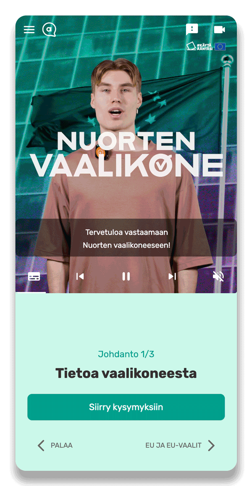
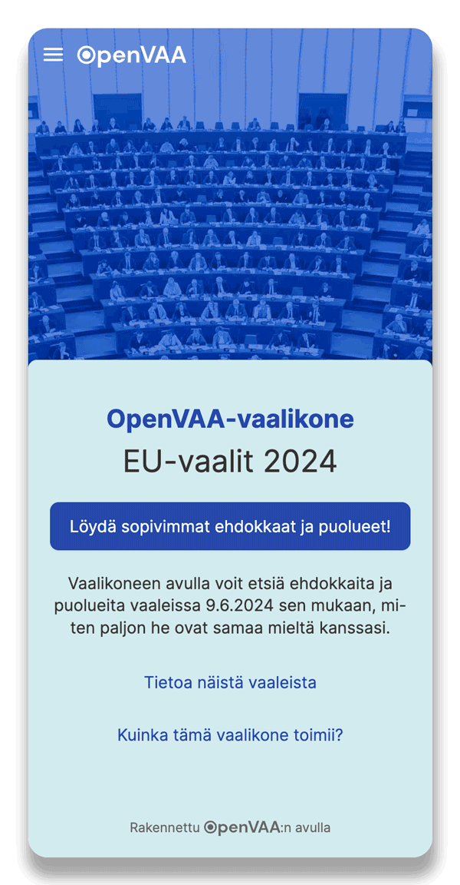

# OpenVAA Voting Advice Application

A software framework for creating [Voting Advice Applications](https://en.wikipedia.org/wiki/Voting_advice_application) (VAA), also known as Election Compasses. In short, VAAs are applications that help voters find candidates or parties in elections based on how much they agree about political or value statements. They’re currently most popular in the Nordic countries, the Netherlands and the German-speaking part of Europe.

This repository is a monorepo containing the frontend and backend, as well as other modules. In addition to the voters’ frontend, there is a similar UI for candidates that they can use to input their answers.

The project is coordinated by the Finnish non-profit association [OpenVAA](https://openvaa.org/en) and funded by [Sitra](https://www.sitra.fi/en/) – the Finnish innovation fund.

## 💡 Features

- 🔎 Transparent
- 💸 Free to use
- 🌍 Fully localisable
- 🗳 Use in any election
- 🤲 Accessible
- 🧩 Modular, customisable and extendable
- 🕶️ Privacy-preserving
- 🎓 Informed by research and research-friendly

## 🔨 Use cases

- Collect candidates’ or parties’ answers and publish a VAA for voters
- Use previously collected answers to publish a VAA
- Rapidly prototype new VAA designs or functions
- Collect VAA usage data for research

## 🥅 Project goals

- Offer a fully transparent alternative to closed-source VAAs
- Make it easier to develop new VAA features and designs
- Expand the use of VAAs to elections where they’re not currently used
- Facilitate research on VAAs

## 🚧 Project status: Alpha

> To stay up to speed, please ⭐️ star the repo or [📧 subscribe to our newsletter](https://openvaa.org/newsletter).

The project is currently in an alpha phase with the onus being on refactoring the existing code base for greater robustness and a better developer experience, as well as implementing some missing features.

We released two pilot VAAs for the 2024 EU Elections, which you can try out to see the software in action.

| Video-based VAA                                                                                                                                                                  |  Traditional VAA                                                                                                                                  |
| -------------------------------------------------------------------------------------------------------------------------------------------------------------------------------- | ------------------------------------------------------------------------------------------------------------------------------------------------- |
|  <a href="https://nuortenvaalikone.openvaa.org" target="_blank"></a> | <a href="https://vaalikone.openvaa.org" target="_blank"></a> |
|  Finnish, Swedish and English                                                                                                                                                    |  Finnish only                                                                                                                                     |
| Features custom video content                                                                                                                                                    | Select questions by theme                                                                                                                         |
| User survey and extended analytics                                                                                                                                               | No analytics                                                                                                                                      |
|  Data stored in Strapi backend                                                                                                                                                   | Data stored in local JSON files                                                                                                                   |
|  Postgres server and two Docker containers running on Render                                                                                                                     | Single Docker container running on Render                                                                                                         |
| nuortenvaalikone.openvaa.org                                                                                                                                                     | vaalikone.openvaa.org                                                                                                                             |

## 🎢 Roadmap

**2024 Q4** — Refactor the current codebase, especially:

- Abstract the frontend–backend connection into a `dataProvider` API enabling arbitrary backend implementations
- Implement the most crucial missing features, such as constituency selection and support for multiple simultaneous elections
- Stress test and improve performance for massive elections (especially Finnish local elections)
- Expand unit and end-to-end test coverage

**2025 Q1** — Release a VAA in the Finnish county elections in association with Nuorisoala

- Implement bank authentication for candidates
- Implement simple educational mode for use in schools

**2025 Q2** — Expand documentation and improve developer-friendliness

- Create a project site with documentation, which is currently spread between the [`/docs`](./docs/) folder and in-code `TSDoc` comments
- Create a research-backed methodological guide to supplement the technical documentation
- Build application manager UI
- Enable plugins or easier customisation of pages and main components

**2025 Q3** — First production release

## 🪢 Collaborate

In addition to developers and designers willing to contribute to the codebase (see below), we’re also looking for researchers to collaborate with and organisations willing to publish their own VAAs. Reach us at info@openvaa.org if you’re interested.

## 🍭 Contributing

We’re very happy to accept any help in coding, design, testing, translating and so on. If you want to help, drop a line at info@openvaa.org.

See [the contribution guide](docs/contributing/CONTRIBUTING.md) for further info about contributing to the project.

---

## Getting started

You can run the whole application in a single Docker image, or run the frontend or backend separately depending on your preferences. Using the Docker image is recommended and the quickest way to set up the application.

- See [the Docker setup guide](docs/docker-setup-guide.md) for running the whole application.
- See [the frontend Readme](frontend/README.md) for instructions on running the frontend individually.
- See [the backend Readme](/backend/vaa-strapi/README.md) for instructions on running the backend individually.

The project is a monorepo and it consists of several yarn workspaces (each is a separate NPM module). See the READMEs in each for more information.

- Abstract logic
  - [`@openvaa/core`](./packages/core/)
  - [`@openvaa/data`](./packages/data/)
  - [`@openvaa/filters`](./packages/filters/)
  - [`@openvaa/matching`](./packages/matching/)
- Application
  - [`@openvaa/app-shared`](./packages/app-shared/)
  - [`@openvaa/strapi`](./backend/vaa-strapi/)
  - [`@openvaa/frontend`](./frontend/)
- Development
  - [`@openvaa/shared-config`](./packages/shared-config/)

All workspaces share a single `yarn.lock` file located at the project root but contain their own `tsconfig.json` and `package.json` files.

The workspaces can be addressed by yarn from any directory as follows:

```bash
yarn workspace [module-name] [script-name].
```

f.e. the shared module can be build by running:

```bash
yarn workspace @openvaa/app-shared build
```

In order to install dependencies for all modules and build all modules run:

```bash
yarn install
yarn workspaces run build
```

### Module resolution

#### IDE

In order to resolve cross `import`s between the monorepo modules Visual Code Studio uses TypeScript references, which are defined in the `tsconfig.json` files of the corresponding modules.

In other words, you DO NOT have to build the **dependee** modules in order for the IDE to resolve their `import`s within a **dependent** module or to pick up changes you make in the **dependee’s** `.ts` sources.

#### NPM/Node

When you use Yarn and during runtime NPM/Node module resolution mechanism is used instead. It relies on various pointers defined in `package.json` files of the corresponding modules (e.g. `main`, `module` or `exports`). These pointers usually refer to `build`/`dist` directory containing already transpiled TS sources of a given module (`.js` files). This directory subsequently gets symlinked by `yarn install` in a `node_modules` directory of a **dependent** module.

In other words, you DO have to build the **dependee** modules prior to running a **dependent** module or using Yarn on it, so that NPM/Node can find the transpiled `.js` sources and pick up changes you make in the original `.ts` code (see also on hot module reloading support or a lack of such [here](./docs/docker-setup-guide.md#hot-reloading)).

## Maintaining dependencies

The project uses [Dependabot](https://github.com/dependabot) to maintain security updates for its dependencies. Dependabot will create automated pull requests monthly to fix potential known security issues in application dependencies.

## Troubleshooting

See [Troubleshooting](docs/troubleshooting.md) for solutions to some common issues.

Read more about [Testing](docs/testing.md).

Find further documentation in the [docs](docs/) folder.
