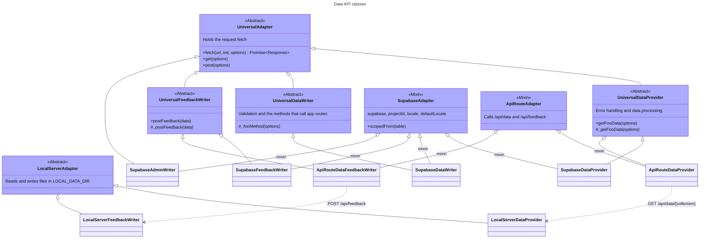

# Data API and adapters

The Data API in [`$lib/api`](https://github.com/OpenVAA/voting-advice-application/tree/main/apps/frontend/src/lib/api) is how the frontend reads and writes data. Layouts, pages, contexts and server routes never query Supabase themselves; they ask the Data API for an adapter and call its methods.

## The four entry points

Four modules at the root of `$lib/api` are the only way in. Each exports a factory:

| Module              | Factory                | Returns                  | Used for                                                                                                                                                  |
| ------------------- | ---------------------- | ------------------------ | --------------------------------------------------------------------------------------------------------------------------------------------------------- |
| `dataProvider.ts`   | `createDataProvider`   | `SupabaseDataProvider`   | Reading public data: app settings, app customization, elections, constituencies, nominations, entities and questions                                      |
| `dataWriter.ts`     | `createDataWriter`     | `SupabaseDataWriter`     | Candidate authentication, registration, pre-registration and passwords; reading and writing the signed-in candidate's data; the Admin App's job endpoints |
| `adminWriter.ts`    | `createAdminWriter`    | `SupabaseAdminWriter`    | Admin App writes: question updates, job results and email                                                                                                 |
| `feedbackWriter.ts` | `createFeedbackWriter` | `SupabaseFeedbackWriter` | Feedback from the Voter App and the Candidate App                                                                                                         |

Every call returns a new adapter for one request, or one Admin App job. No adapter is shared between requests: an ESLint rule bans constructing an adapter at module scope, and `src/lib/_guards/eslint-adapter-singleton-guard.test.ts` checks that the rule still fires.

`createDataProvider` always returns the Supabase provider. The `dataAdapter.type` static setting does not change that; it only selects the server-side local adapter described [below](#the-server-side-local-adapter).

## Where the client comes from

Every factory takes an `AdapterSource`, which names where the adapter's Supabase client comes from. There are three arms, and each one names a client, so a caller that supplies none does not compile:

- **`{ fetch, locals }`**: a server load, form action or endpoint. The adapter uses the per-request client that `hooks.server.ts` put on `event.locals`.
- **`{ fetch, client }`**: a caller that already holds a client. A universal load builds one with `createSupabaseUniversalClient` from the Supabase auth cookies that `routes/+layout.server.ts` passes down. An Admin App job passes the client from `createSupabaseJobClient`. A route that must run without a session passes `createSupabaseAnonClient({ fetch })`.
- **`{ fetch, browser: true }`**: browser-only code. The adapter uses the tab's single client from `$lib/supabase/browser`.

Every arm also accepts `locale` and `defaultLocale`, the locales the adapter extracts localized values in. A method's own `locale` option overrides them.

The root layout's universal load, `routes/+layout.ts`, shows the `client` arm:

```ts
import { createDataProvider, createSupabaseUniversalClient } from '$lib/api/dataProvider';
import { getLocale } from '$lib/paraglide/runtime';

export async function load({ data, fetch }) {
  const lang = getLocale();
  const supabaseClient = createSupabaseUniversalClient({ fetch, cookies: data.supabaseCookies });
  const dataProvider = createDataProvider({ fetch, client: supabaseClient, locale: lang });
  const appSettingsData = await dataProvider.getAppSettings({ locale: lang }).catch((e) => e);
  // …
}
```

Outside `$lib/api` and `$lib/supabase`, code may not read a Supabase client off `locals` or an adapter: an ESLint adapter-boundary rule bans it, with an annotated allowlist in `apps/frontend/eslint.config.mjs`.

## Reading data

`SupabaseDataProvider` extends `UniversalDataProvider` through the `supabaseAdapterMixin`.

- **Project scope.** The mixin resolves the project id once, from the configuration or from `PUBLIC_PROJECT_ID`, and throws when it is unset or not a UUID. There is no fallback project. Every read and write on a project-scoped table goes through `scopedFrom(table)`, which appends the project filter to reads, updates and deletes and supplies the project column on inserts. See [Project scoping](/developers-guide/backend/intro#project-scoping).
- **Row-level security.** Every client the frontend builds uses the anon key and, when there is one, the user's session. Row-level security therefore decides what each read and write may touch. The service-role key is never read under `apps/frontend/src`. See [Row-level security and column grants](/developers-guide/backend/authentication#row-level-security-and-column-grants).
- **Paging.** Large reads are fetched page by page, `staticSettings.dataAdapter.pageSize` rows at a time. The page size must equal PostgREST's `max_rows`.
- **Localization.** Localized JSONB columns are extracted in the adapter's locale with `getLocalized`, falling back to `defaultLocale`. See [Multi-locale data](/developers-guide/localization/storing-multi-locale-data).
- **Processing.** `UniversalDataProvider` handles errors and processes the raw data before it reaches the `DataRoot`, for example by checking the contrast of the colors of entities and question categories.

## Writing data

- **`SupabaseDataWriter`** extends `UniversalDataWriter`. It uses Supabase Auth through `this.supabase.auth`, with the session kept in cookies. A few methods call the app's own server routes instead of Supabase: `logout`, `preregisterWithIdToken`, the OIDC token methods `exchangeCodeForIdToken` and `clearIdToken`, and the Admin App's job methods (`getActiveJobs`, `getPastJobs`, `startJob`, `getJobProgress`, `abortJob`, `abortAllJobs`). Their URLs are in `UNIVERSAL_API_ROUTES`.
- **`SupabaseAdminWriter`** handles the Admin App's own writes: `updateQuestion`, `insertJobResult` and `sendEmail`, and `callerMayOnProject`, which checks the caller's grant. The long-running job features in `$lib/server/admin/features` build it with a job client, so every write runs as the admin who started the job.
- **`SupabaseFeedbackWriter`** inserts into `public.feedback`, with the project id of the adapter. The `anon_insert_feedback` policy and a rate-limit trigger gate the insert.

In components, the writers are reached through the contexts: `CandidateContext` and `AuthContext` wrap the data writer, `AdminContext` wraps the data and admin writers, and `AppContext.sendFeedback` posts feedback. These wrappers build their writers with the `browser` arm.

## `UniversalAdapter`

All the adapters except the local ones extend [`UniversalAdapter`](https://github.com/OpenVAA/voting-advice-application/blob/main/apps/frontend/src/lib/api/base/universalAdapter.ts). It keeps the request's `fetch` and provides the `fetch`, `get`, `post`, `put` and `delete` helpers for the methods that call HTTP routes. `fetch` passes the URL to the request's `fetch` unchanged, adds an `Authorization: Bearer` header when it is given an `authToken`, and throws when the response is a refusal.

## The server-side local adapter

[`$lib/server/api`](https://github.com/OpenVAA/voting-advice-application/tree/main/apps/frontend/src/lib/server/api) holds adapters that only run on the server. Its `dataProvider.ts` and `feedbackWriter.ts` load the local adapter when `staticSettings.dataAdapter.type` is `'local'`, and nothing otherwise. The default setting is `'supabase'`.

- `LocalServerDataProvider` reads `<collection>.json` files from the directory in `LOCAL_DATA_DIR`.
- `LocalServerFeedbackWriter` writes each feedback item as a file in the `feedbacks` subdirectory.

They are served by two API routes, `GET /api/data/[collection]` and `POST /api/feedback`, which answer with an error when no server adapter is loaded.

The `apiRoute` adapters in `$lib/api/adapters/apiRoute`, `ApiRouteDataProvider` and `ApiRouteDataFeedbackWriter`, call those two routes. No module constructs them, because `createDataProvider` and `createFeedbackWriter` always return the Supabase adapters. Setting `dataAdapter.type` to `'local'` therefore loads the local adapter behind the routes but does not switch the app's reads to it.

## How loaded data reaches components

1. A load function calls the data provider and returns the data. The root `routes/+layout.ts` loads the app settings, the app customization, the elections and the constituencies. The Voter App's `(located)/+layout.ts` loads the questions and the nominations for the selected elections and constituencies.
2. A layout writes the data into the `DataRoot` of the `DataContext`. The root `+layout.svelte` writes the elections and constituencies through `setDataRoot`, and the `(located)` layout adds the questions, entities and nominations. The `DataRoot`, from [`@openvaa/data`](https://github.com/OpenVAA/voting-advice-application/tree/main/packages/data), turns the raw data into data objects.
3. Components read the objects from `ctx.dataRoot` or from the values that the other contexts derive from it, such as `selectedElections` or `matches`. See [Contexts](/developers-guide/frontend/contexts).

The signed-in candidate's own data is not in the `DataRoot`. It is in the `userData` member of the `CandidateContext`.

## Folder structure

- [`src/lib/api/`](https://github.com/OpenVAA/voting-advice-application/tree/main/apps/frontend/src/lib/api)
  - `dataProvider.ts`, `dataWriter.ts`, `adminWriter.ts`, `feedbackWriter.ts`: the four factories. `dataProvider.ts` also defines `AdapterSource` and re-exports the client factories that routes may use.
  - `base/`: the interfaces (`DataProvider`, `DataWriter`, `FeedbackWriter`), `UniversalAdapter` and the `Universal*` base classes, and `UNIVERSAL_API_ROUTES`.
  - `adapters/supabase/`: the Supabase adapters and `supabaseAdapterMixin`.
  - `adapters/apiRoute/`: the `apiRoute` adapters.
  - `utils/`: helpers for parsing and translating data and for the OIDC exchange.
- [`src/lib/server/api/`](https://github.com/OpenVAA/voting-advice-application/tree/main/apps/frontend/src/lib/server/api)
  - `dataProvider.ts`, `feedbackWriter.ts`: select the server-side adapter.
  - `adapters/local/`: `LocalServerDataProvider`, `LocalServerFeedbackWriter` and their base class.
- `src/routes/api/`: the server routes, including `data/[collection]`, `feedback`, `auth/logout`, `candidate/preregister`, `oidc/*` and `admin/jobs/*`.

## Classes


