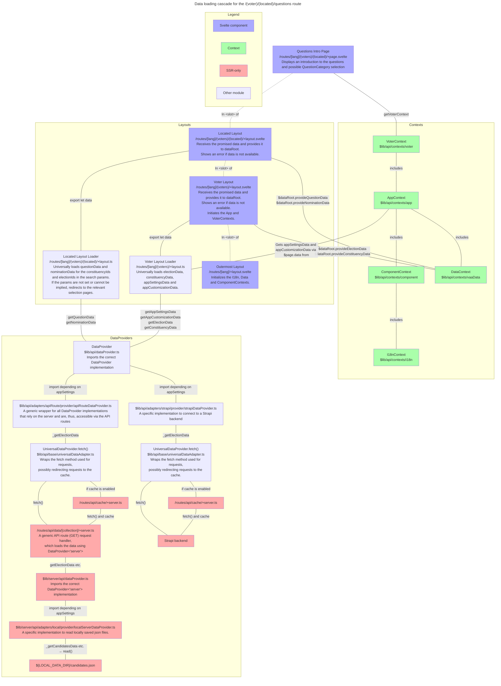

# Frontend

> The frontend currently uses Svelte 4. An update to Svelte 5 is scheduled for H1/2026.

See also:

- In-code documentation for all components, pages and layouts

## Components

For information about component properties, typing and documentation, see [Svelte components](contributing.md#svelte-components) in the Contributors' guide.

### Dynamic and static components

The components used in the app are divided into dynamic and static ones, contained in [\$lib/components](/frontend/src/lib/components) and [\$lib/dynamic-components](/frontend/src/lib/dynamic-components), respectively.

**Static components** are ’dumb’ in the sense that their access to the application state is limited to the [`ComponentContext`](/frontend/src/lib/contexts/component/componentContext.type.ts), which currently includes only localization functions and a `darkMode` store. The reasons for this restriction is twofold:

1. When properties related to the application state are changed, static components need not be updated.
2. Static components can be used anywhere, even outside the app if the `ComponentContext` is available.

**Dynamic components**, on the other hand, are given full access to the application state and data. They implement sometimes complex logic dependent on the application settings, VAA data, search and route parameters, user selections etc. [`EntityDetails`](/frontend/src/lib/dynamic-components/entityDetails/EntityDetails.svelte), for example, provides the Voter’s answers to the [`EntityOpinions`](/frontend/src/lib/dynamic-components/entityDetails/EntityOpinions.svelte) subcomponent if it’s used within the Voter App:

```tsx
const { appType } = getAppContext();
let answers: AnswerStore | undefined;
if ($appType === 'voter') {
  const context = getVoterContext();
  answers = context.answers;
}
// In the html part
<EntityOpinions {answers} ... />
```

## Contexts

All of the data, shared stores and other state variables used by the app and components are collected in [Svelte contexts](https://svelte.dev/docs/svelte#setcontext). They are defined in the [$lib/api/contexts](/frontend/src/lib/contexts) folder.

Contexts must be initialized before they can be used by calling the `initFooContext()` function. Initialisation is performed by the ancestor `+layout.svelte` files of the routes on which the contexts are available. Afterwards the contexts are accessed by `getFooContext()`.

For ease of use, most contexts contain the properties provided by lower-level contexts. The [`VoterContext`](/frontend/src/lib/contexts/voter), for example, contains the [`AppContext`](/frontend/src/lib/contexts/app/appContext.type.ts), which in turn contains the [`I18nContext`](/frontend/src/lib/contexts/i18n/i18nContext.type.ts) and [`DataContext`](/frontend/src/lib/contexts/data/dataContext.type.ts).

> See also an [example of the data loading cascade](#example-loading-cascade-for-the-voterlocatedquestions-route-example).

### Contexts vs global stores

Contexts are used instead of global stores, because they are explicitly initialised and restricted to components and their children. Tracking the use and dependency-loading of directly imported global stores is hard, because they’re initialized immediately when imported.

### Example of Context Use

On the `/(voters)/elections/` route where the Voter can select which elections to get results for we have:

```tsx
import { getVoterContext } from '$lib/contexts/voter';
const { dataRoot, getRoute, selectedElections, t } = getVoterContext();
```

The properties accessed are:

- `dataRoot`: A store providing access to all of the VAA data which has been provided to it by `load` functions. Inherited from `DataContext`.
- `getRoute`: A store containing a function with which links to internal routes are build. Inherited from `AppContext`.
- `selectedElections`: A store containing the currently selected `Election` objects, derived from the `electionId` search parameters and `dataRoot`.
- `t`: A store containing the translation function. Inherited from `I18nContext`.

#### Available contexts

> For complete descriptions of the contexts’ contents, see their associated type files.

| Context                                                                             | Description                                                   |  Consumer                                                           | Includes                       | Own contents (non-exhaustive)                                                                                                                                                                                                                                                                                                                                                                                                                                                                                                                                                                                                           | Initialized by      |
| ----------------------------------------------------------------------------------- | ------------------------------------------------------------- | ------------------------------------------------------------------- | ------------------------------ | --------------------------------------------------------------------------------------------------------------------------------------------------------------------------------------------------------------------------------------------------------------------------------------------------------------------------------------------------------------------------------------------------------------------------------------------------------------------------------------------------------------------------------------------------------------------------------------------------------------------------------------- | ------------------- |
| [`I18nContext`](/frontend/src/lib/contexts/i18n/i18nContext.type.ts)                | All localization functions                                    | Other contexts                                                      | —                              | — `t`<br> — `locale`<br> — `locales` from `$lib/i18n`                                                                                                                                                                                                                                                                                                                                                                                                                                                                                                                                                                                   | `/[lang]`           |
| [`ComponentContext`](/frontend/src/lib/contexts/component/componentContext.type.ts) | Functions available to all components                         | Any component                                                       | `I18n`                         | — `darkMode: Readable<boolean>`                                                                                                                                                                                                                                                                                                                                                                                                                                                                                                                                                                                                         | `/[lang]`           |
| [`DataContext`](/frontend/src/lib/contexts/data/dataContext.type.ts)                | All VAA data (using the `@openvaa/data` model)                | Other contexts                                                      | `I18n`\*                       | — `dataRoot: Readable<dataRoot>`                                                                                                                                                                                                                                                                                                                                                                                                                                                                                                                                                                                                        | `/[lang]`           |
| [`AppContext`](/frontend/src/lib/contexts/app/appContext.type.ts)                   | All functions shared by the Voter and Candidate Apps          | Any page, layout or dynamic component                               | `I18n`, `VaaData`, `Component` | — `appType: Writable<AppType>`<br> — `appSettings: SettingsStore`<br> — `userPreferences: Writable<UserPreferences>`<br> — `getRoute: Readable<(options: RouteOptions) => string>`<br> — `sendFeedback: (data: FeedbackData) => Promise<Response>`<br> — contents of `TrackinService`<br> — popup and modal dialog handling<br> — handling data consent and user surveys                                                                                                                                                                                                                                                                | `/[lang]`           |
| `                                                                                   |
| [`AuthContext`](/frontend/src/lib/contexts/auth/authContext.type.ts)                | Functions for logging in and out as well password editing     | Any page or layout                                                  | —                              | – `authToken`<br> — `logout()`<br> — `requestForgotPasswordEmail(opts)`<br> — `resetPassword(opts)`<br> — `setPassword(opts)`                                                                                                                                                                                                                                                                                                                                                                                                                                                                                                           | `/[lang]`           |
| [`LayoutContext`](/frontend/src/lib/contexts/layout/layoutContext.type.ts)          | Functions for subpages to affect the outer application layout | Any page or layout                                                  | —                              | — `topBarSettings: StackedStore<TopBarSettings, DeepPartial<TopBarSettings>>`<br> — `pageStyles: StackedStore<PageStyles, DeepPartial<PageStyles>>`<br> — `progress: Progress`<br> — `navigation: Navigation`                                                                                                                                                                                                                                                                                                                                                                                                                           | `/[lang]`           |
| [`VoterContext`](/frontend/src/lib/contexts/voter/voterContext.type.ts)             | All functions exclusive to the Voter App                      | Any part of the Voter App or dynamic components (conditionally)     | `App`                          | — `answers: AnswerStore`<br> — `matches: Readable<MatchTree>`<br> — `entityFilters: Readable<FilterTree>`<br> — `infoQuestions: Readable<Array<AnyQuestionVariant>>`<br> — `opinionQuestions: Readable<Array<AnyQuestionVariant>>`<br> — `selectedConstituencies: Readable<Array<Constituency>>`<br> — `selectedElections: Readable<Array<Election>>`<br> — handling question category selection and question ordering<br> — other selection-related functions                                                                                                                                                                          | `/[lang]/(voter)`   |
| [`CandidateContext`](/frontend/src/lib/contexts/candidate/candidateContext.type.ts) | All functions exclusive to the Candidate App                  | Any part of the Candidate App or dynamic components (conditionally) | `App`                          | — `userData: UserDataStore`<br> — `preregistrationElectionIds: Readable<Array<Id>>` and other preregisration stores<br> — `selectedElections: Readable<Array<Election>>` and other stores matching those in `VoterContext`<br> — `checkRegistrationKey(opts)`<br> — `register(opts)`<br> — `logout()`<br> — `requestForgotPasswordEmail(opts)`<br> — `resetPassword(opts)`<br> — `setPassword(opts)`<br> — `exchangeCodeForIdToken(opts)`<br> — `preregister(opts)`<br> — `clearIdToken()`<br> — `answersLocked: Readable<boolean>`<br> — `requiredInfoQuestions: Readable<Array<AnyQuestionVariant>>` and other utility derived stores | `/[lang]/candidate` |
| [`AdminContext`](/frontend/src/lib/contexts/admin/adminContext.type.ts)             | All functions exclusive to the Admin App                      | Any part of the Admin App or dynamic components (conditionally)     | `App`, `Auth`                  | TBA                                                                                                                                                                                                                                                                                                                                                                                                                                                                                                                                                                                                                                     | `/[lang]/admin`     |

\* The `DataContext` accesses the `I18nContext` because it needs `locale` but it doesn’t export its contents.

## Accessing data and state management

The overall model for loading and writing data and managing the application state is as follows.

1. External data is loaded (and written) using the [Data API](#data-api). The API is accessed by universal `load` functions in `+layout.ts` files, the `Context`s or some API routes.
   - Depending on [settings](/packages/app-shared/src/settings/staticSettings.type.ts), either a Strapi backend is accessed or data is read from local `json` files.
2. The loaded data is passed to the `dataRoot` store accessible via the `DataContext` and converted into functional objects using the [`@openvaa/data` model](/packages/data/).
   - All pages, some other [contexts](#contexts) and [dynamic components](#components) can access the `DataContext`.
   - Some data in the Candidate App is contained in a `UserDataStore` instead of the `dataRoot` store.
3. All other shared stores are contained in [contexts](#contexts).
   - Some contexts are globally available and some to only certain parts of the application.

### Example: loading cascade for the `/(voter)/(located)/questions` route {#example}

Below is description of the data loading, provision and context initialisation cascade for the `/(voter)/(located)/questions/+page.svelte` page, which displays an introduction to the questions and possible `QuestionCategory` selection. See the individual files for more details.

- The `(located)` virtual route folder contains a layout that loads the `Entity`, `Nomination` and `QuestionData` that are relevant to the selected `electionId`s and `constituencyId`s, which are either stores in search parameters or implied, e.g. when there’s only on `Election`.

The basic paradigm is (from top to bottom):

- `+page.svelte` files access VAA data via the `dataRoot: Readable<DataRoot>` store contained in `DataContext` or derived stores using it.
- `+layout.svelte` files await for the data loaded by universal `load` functions and provide it to the `dataRoot` store. `DataRoot` converts the data into fully-fletched data objects with methods etc.
- `+layout.ts` universal loaders import a `DataProvider` from `$lib/api/dataProvider` and use it to get data as promises.
- `$lib/api/dataProvider` exports the correct `DataProvider` implementation based on the configuration.
- The specific `DataProvider` implementations may either
  - directly access the database, or
  - if they can only run on the server circulate the calls via the generic `ApiRouteDataProvider`—`/routes/api/data/[collection]/+server.ts`—`$lib/server/_api/serverDataProvider` chain, the last part of which exports the correct `ServerDataProvider` implementation.
- If the `PUBLIC_CACHE_ENABLED` env variable is set, the either adapters `fetch` requests are rerouted via the cache route (`/routes/api/cache/server.ts`). This is handled by the [`UniversalAdapter.fetch`](/frontend/src/lib/api/base/universalAdapter.ts), which the providers use internally.

The process is described in the flowchart below.



\* The AppContext and its associated data will be loaded by the outermost layout and in the future when the Candidate App is refactored.

## Data API

The Data API is the interface between the frontend and the backend. It handles reading and writing of data in such a way that the frontend can remain agnostic to the actual implementation.

The Data API is composed of three services:

1. `DataProvider`: Reads of public data used by the Voter App from the backend.
2. `FeedbackWriter`: Writes feedback items from either the Voter or Candidate App to the backend.
3. `DataWriter`: Writes data from the Candidate App to the backend and reads some data requiring authentication.

> See also an [example of the data loading cascade](#example-loading-cascade-for-the-voterlocatedquestions-route-example).

### Cache

A simple [disk cache](https://github.com/jaredwray/cacheable#readme) may also be opted in by setting the `PUBLIC_CACHE_ENABLED` env variable to `true` (and configuring the other `CACHE_` variables). If enabled, non-authenticated `GET` requests are cached by default. Caching is handled by the [UniversalAdapter.fetch](/frontend/src/lib/api/base/universalAdapter.ts) method, using the [/api/cache/+server] route.

Note that the cache can be enabled also when the `local` data adapter is used. This may, however, not improve performance by much, as the only overhead saved is the application of query filters to the locally stored json data.

### Folder structure

- [frontend/](/frontend)
  - [src/](/frontend/src)
    - [lib/api/](/frontend/src/lib/api) — All universally available Data API implementations.
      - [adapters/](/frontend/src/lib/api/adapters) — Specific Data API implemenations.
        - [apiRoute/](/frontend/src/lib/api/adapters/apiRoute) — Generic `ApiRouteDataProvider` and `ApiRouteFeedbackWriter` implementations through which all server-run implementations are accessed. Redirects calls to local API routes (see below).
        - [strapi/](/frontend/src/lib/api/adapters/strapi) – Specific `StrapiDataProvider`, `StrapiFeedbackWriter` and `StrapiDataWriter` implementations for use with the Strapi backend.
      - [base/](/frontend/src/lib/api/base) — Common types and interfaces as well as the `UniversalDataProvider`, `UniversalFeedbackWriter` and `UniversalDataWriter` classes which the specific implementations extend. All common data processing, such as color contrast checking, is handled by these classes.
      - [utils/](/frontend/src/lib/api/utils) — Utilities related to the Data API.
      - [dataProvider.ts](/frontend/src/lib/api/dataProvider.ts) — The main entry point for the `load` functions via `import { dataProvider } from '$lib/api/dataProvider'`. The implementation specified in the settings is returned (as a Promise).
      - [dataWriter.ts](/frontend/src/lib/api/dataWriter.ts) — The main entry point for the `CandidateContext` methods.
      - [feedbackWriter.ts](/frontend/src/lib/api/feedbackWriter.ts) — The main entry point for the `sendFeedback` method of `AppContext`.
    - [server/api/](/frontend/src/lib/server/api) – All Data API implementations that must run on the server.
      - [adapters/local/](/frontend/src/lib/server/api/adapters/local) — Specific `LocalServerDataProvider` and `LocalServerFeedbackWriter` implementations that read and write local `json` files in the [data](/frontend/data) folder.
      - [dataProvider.ts](/frontend/src/lib/server/api/dataProvider.ts) — The main entry point for the `GET` function of the `/api/data/[collection]/+server.ts` API route.
      - [feedbackWriter.ts](/frontend/src/lib/server/api/feedbackWriter.ts) — The main entry point for the `POST` function of the `/api/feedback/+server.ts` API route.
    - `routes/[lang=locale]/`
      - `api/` – Contains the API routes.
        - `cache/+server.ts` – Implements simple disk caching using [`flat-cache`](https://github.com/jaredwray/cacheable#readme)
        - `candidate/logout/+server.ts` – Clear the strict cookie containing the authentication token (does not actually access`DataWriter`).
        - `candidate/preregister/+server.ts` – Access to `DataWriter.preregisterWithApiToken`.
        - `data/[collection]/+server.ts` – Access to the server-run `ServerDataProvider` implementations.
        - `feedback/+server.ts` – Access to the server-run `ServerFeedbackWriter` implementations.
      - `candidate/login/+page.server.ts` - Access to `DataWriter.login` and set the authentication cookie.
  - [data/](/frontend/data) — For data used by the `LocalServerDataProvider` and `LocalServerFeedbackWriter`.

### Classes and interfaces

```mermaid
---
title: Data API classes and interfaces
---
classDiagram
direction TD

%% CLASS DEFINITIONS

namespace Universal {

  class DPReturnType:::interface {
    <<Type>>
    Contains the return types for all DataProvider
    getter methods, e.g.:
    Partial~DynamicSettings~ +appSettings
    Array~ElectionData~ +elections
  }

  class DataProvider_AdapterType_:::interface {
    <<Interface>>
    Ensures that all the getters are implemented
    both universally and on the server
    with the return type defined by ~AdapterType~,
    which is either 'universal' or 'server'
    +getFooData(options) Promise~DPReturnType['foo'] | Response~
  }

  class DataWriter_AdapterType_:::interface {
    <<Interface>>
    Ensures that all the writers are implemented universally
    Contains methods for
    loggin in and out
    setting and resetting passwords
    registration
    pre-registration
    getting user data
    setting user data
  }

  class FeedbackWriter:::interface {
    <<Interface>>
    Ensures a matching interface for posting feedback
    both universally and on the server
    +postFeedback(data) Promise~Response~
  }

  class UniversalAdapter:::abstract {
    <<Abstract>>
    Implements common fetch for Data API services that handles possible disk caching,
    must be initialized by providing the fetch function before use.
    +init(fetch) void
    +fetch(opts) Promise~Response~
  }

  class UniversalDataProvider:::abstract {
    <<Abstract>>
    Implements all the data getter methods
    Processes all data returned, e.g., ensuring colors
    Requires subclasses to implement protected methods
    +getFooData(options) Promise~DPReturnType['foo']~
    #_getFooData(options)* Promise~DPReturnType['foo']~
  }

  class UniversalDataWriter:::abstract {
    <<Abstract>>
    Implements all the DataWriter methods,
    Requires subclasses to implement protected methods,
    except for methods using universal API routes
    +getFooData(options) Promise~DPReturnType['foo']~
    #_getFooData(options)* Promise~DPReturnType['foo']~
  }

  class UniversalFeedbackWriter:::abstract {
    <<Abstract>>
    Implements postFeedback method
    Processes the data by adding possibly missing fields
    Requires subclasses to implement the protected method
    +postFeedback(data) Promise~Response~
    #_postFeedback(data)* Promise~Response~
  }

  class StrapiAdapter:::abstract {
    <<Abstract/Mixin>>
    Implements methods for accessing the Strapi API
    +apiFetch(opts) Promise~Response~
    +apiGet(opts) Promise~StrapiReturnType['foo']~
    +apiPost(opts) Promise~Response~
    +apiPut(opts) Promise~Response~
  }

  class StrapiDataProvider {
    Implements the actual _getter methods,
    which use StrapiAdapter.apiGet and convert
    the Strapi data into DPReturnType['foo']
    #_getFooData(options) Promise~Array~FooData~~
  }

  class StrapiDataWriter {
    Implements the actual _foo methods,
    mandated by UniversalDataWriter
  }

  class StrapiFeedbackWriter {
    Implements the _postFeedback method
    #_postFeedback(data) Promise~Response~
  }

  class ApiRouteAdapter:::abstract {
    <<Abstract/Mixin>>
    Implements methods for accessing the API routes
    +apiFetch(opts) Promise~Response~
    +apiGet(opts) Promise~DPReturnType['foo']~
    +apiPost(opts) Promise~Response~
  }

  class ApiRouteDataProvider {
    Implements the actual _getter methods by fetching
    from the API route /api/data/[collection]
    #_getFooData() Promise~DPReturnType['foo']~
  }

  class ApiRouteFeedbackWriter {
    Implements the _postFeedback method by fetching
    from the API route /api/feedback
    #_postFeedback() Promise~Response~
  }
}

namespace Server {

  class LocalServerAdapter:::abstract {
    <<Abstract>>
    Implements methods for accessing local files
    in the /data folder
    +exist(endpoint) Promise~boolean~
    +read(endpoint) Response
    +create(endpoint, data) Promise~Response~
  }

  class LocalServerDataProvider {
    Implements the actual getter methods
    by reading from disk
    getFooData(options) Promise~Response~
  }

  class LocalServerFeedbackWriter {
    Implements the postFeedback method
    by writing to disk
    postFeedback(data) Promise~Response~
  }

}

%% CONNECTIONS

DPReturnType ..> DataProvider_AdapterType_ : defined return types
DataProvider_AdapterType_ <.. UniversalDataProvider : implements (universal)
DataWriter_AdapterType_ <.. UniversalDataWriter : implements (universal)
FeedbackWriter <.. UniversalFeedbackWriter : implements (universal)
UniversalAdapter <|-- UniversalDataProvider
UniversalAdapter <|-- UniversalDataWriter
UniversalAdapter <|-- UniversalFeedbackWriter

StrapiAdapter <|-- StrapiDataProvider : mixin
StrapiAdapter <|-- StrapiDataWriter : mixin
StrapiAdapter <|-- StrapiFeedbackWriter : mixin
UniversalDataProvider <|-- StrapiDataProvider
UniversalDataWriter <|-- StrapiDataWriter
UniversalFeedbackWriter <|-- StrapiFeedbackWriter

ApiRouteAdapter <|-- ApiRouteDataProvider : mixin
ApiRouteAdapter <|-- ApiRouteFeedbackWriter : mixin
UniversalDataProvider <|-- ApiRouteDataProvider
UniversalFeedbackWriter <|-- ApiRouteFeedbackWriter
ApiRouteDataProvider ..> LocalServerDataProvider : accesses via GET /api/data/[collection]?...
ApiRouteFeedbackWriter ..> LocalServerFeedbackWriter : accesses via POST /api/feedback

DataProvider_AdapterType_ <.. LocalServerDataProvider : implements (server)
FeedbackWriter <.. LocalServerFeedbackWriter : implements (server)
LocalServerAdapter <|-- LocalServerDataProvider
LocalServerAdapter <|-- LocalServerFeedbackWriter

%% STYLING

namespace Legend {
  class Interface:::interface
  class Abstract:::abstract
  class Concrete
}

classDef interface fill:#afa
classDef abstract fill:#aaf
```



## Environmental variables

Environmental variables are never accessed directly in the frontend (i.e. from `$env/static/public` etc.), but instead via two utility modules:

- [$lib/utils/constants](/frontend/src/lib/utils/constants.ts) which contains the publicly accessible variables, always prefixed with `PUBLIC_`.
- [$lib/server/constants](/frontend/src/lib/server/constants.ts) which contains the private variables only accessible on the server.

Furthermore, the variables are not imported directly from these modules due to production compilation intricacies. They are imported wholesale instead:

```ts
import { constants } from '$lib/utils/constants';
const urlRoot = constants.PUBLIC_BROWSER_BACKEND_URL;
```

## Routing

Routing is based on either route or search parameters:

- Route parameters are used when the parameters are required, such as the `entityType` and `entityId` parameters on the route displaying individual `Entity`s.
- Search parameters are used when the parameters are always or sometimes optional, such as the `electionId` parameter which is optional if there data only has one `Election` or the `elections.disallowSelection` setting is `true`.

For a list of the parameters in use, see [params.ts](/frontend/src/lib/utils/route/params.ts). Some of the parameters (`ArrayParam`s) support multiple values but always accept single values as well.

For implying optional parameters, the utilities in [impliedParams.ts](/frontend/src/lib/utils/route/impliedParams.ts) are used.

### Building routes

Routes are constructed using the [`buildRoute`](/frontend/src/lib/utils/route/buildRoute.ts) function, which takes as arguments the name of the [`Route`](/frontend/src/lib/utils/route/route.ts), parameter values and values of the current route.

In most cases, the dynamic function contained in the [`getRoute`](/frontend/src/lib/contexts/app/getRoute.ts) store of [`AppContext`](/frontend/src/lib/contexts/app/appContext.type.ts) is used. It automatically supplies the current route to the route builder, so that already effective parameters need not be explicitly supplied.

Calling `$getRoute('Results')`, for example, will build a route to the Results page taking into account the currently selected `electionId`s, `constituencyId`s and `lang`. They can also be set explicitly, such as on the election selection page, with `$getRoute({ route: 'Results', electionId: ['e1', 'e2'] })`.

When passing parameters to [`buildRoute`](/frontend/src/lib/utils/route/buildRoute.ts) or [`$getRoute`](/frontend/src/lib/contexts/app/getRoute.ts), search and route parameters need not be treated differently. The function will take care of rendering them correctly.

## Styling

The frontend uses [Tailwind](https://tailwindcss.com/docs) and the [DaisyUI plugin](https://daisyui.com/components/) for styling. See below for more information on how these are used in the project.

### Tailwind classes

We use only a limited set of some of the [Tailwind utility classes](https://tailwindcss.com/docs/) for, e.g., spacing and font sizes, as well as the colours DaisyUI uses. For a list of the classes in use, see `tailwind.config.cjs` or use autocomplete.

The reason for limiting Tailwind classes is that this way adherence to the design system is easier, because Tailwind gives nice autocomplete for the available options. For most classes names, such as `md` and `lg` are used. For spacing numeric values are also available, such as `w-40`, with the named ones, such as `gap-md`, reserved the most commonly used values.

Note that you can still use [arbitrary values](https://tailwindcss.com/docs/adding-custom-styles#using-arbitrary-values) with any Tailwind utility class with the bracket notation, e.g. `w-[21.35px]`. Bear in mind, however, that you should not construct these (or any other Tailwind classes) in code, unless the whole final string for the class is spelled out in code, such as `class = 'w-' + size === 'lg' ? 'lg' : 'md'`, because Tailwind only compiles classes it can spot in the source code using a naïve search.

#### Passing classes to components

The components in the app allow passing any attributes of the underlying element as component properties. This is most commonly used to add extra classes to those defined by the component (see [Component properties](/contributing/style-guides.md#component-properties) in the Contributors’ guide). However, note that due to styling compartmentalization, **you should only pass Tailwind or global classes, not any classes defined locally**.

### Colors

For DaisyUI, all the [basic colours](https://daisyui.com/docs/colors/) are defined for both the default and the dark theme, which is used in dark mode. The colours are applicable to Tailwind utility classes (e.g. `text-primary`, `bg-base-300`) and DaisyUI component classes (e.g. `btn-primary`). You can see all the colours in `tailwind.config.cjs` but the most common ones are listed below.

|                                                                                                                       | Name            | Use                                                                   |
| --------------------------------------------------------------------------------------------------------------------- | --------------- | --------------------------------------------------------------------- |
| <div style="background: #333333; width: 1.5rem; height: 1.5rem;"/>                                                    | `neutral`       | Default colour for text                                               |
| <div style="background: #2546a8; width: 1.5rem; height: 1.5rem;"/>                                                    | `primary`       | For actions and links                                                 |
|  <div style="background: #666666; width: 1.5rem; height: 1.5rem;"/>                                                   | `secondary`     | For secondary text and disabled buttons                               |
|  <div style="background: #a82525; width: 1.5rem; height: 1.5rem;"/>                                                   | `warning`       | For warnings and actions demanding caution                            |
|  <div style="background: #a82525; width: 1.5rem; height: 1.5rem;"/>                                                   | `error`         | For errors                                                            |
|  <div style="background: #ffffff; outline: 1px solid #666666; outline-offset: -1px; width: 1.5rem; height: 1.5rem;"/> | `base-100`      | Default background                                                    |
|  <div style="background: #e8f5f6; width: 1.5rem; height: 1.5rem;"/>                                                   | `base-200`      | Slightly less prominent shaded background                             |
|  <div style="background: #d1ebee; width: 1.5rem; height: 1.5rem;"/>                                                   | `base-300`      | Default prominent background                                          |
|  <div style="background: #ffffff; outline: 1px solid #2546a8; outline-offset: -1px; width: 1.5rem; height: 1.5rem;"/> | primary-content | Text on `bg-primary`. Each colour has its associated `content` colour |

#### Color contrast

In order to fulfil the application's accessibility requirements, a [WGAC AA level color contrast](https://www.w3.org/WAI/WCAG21/Understanding/contrast-minimum.html) has to be reached. The colors have been defined to ensure this as long as:

- If the background is any of the base colors, e.g. `bg-base-100`, `bg-base-200` or `bg-base-300`, you can use any of the basic text colors on it.
- If background is any other color, such as `bg-primary`, always use the matching `content` color for text on it, e.g. `text-primary-content`.

#### Testing the colors

To test all of the application's colors, copy-paste the contents of [`color-test.txt`](/docs/frontend/color-test.txt) in a `+page.svelte` file somewhere, navigate to it and use the Wave browser extension to check the colors. Remember to do this for both the light and dark modes.

The file is not included anywhere as a ready Svelte file, because otherwise all of the color classes in it would unnecessarily be compiled into the application by Tailwind.

### Z-index

For basic content, avoid using `z-index` and prefer layerying using the element order.

For elements that absolutely need their `z-index` set, the following Tailwind classes are used:

- `z-10`: Navigation drawer menu, page header
- `z-20`: Buttons overlaid on the header by the [`<Video>`](/frontend/src/lib/components/video/Video.svelte) component
- `z-30`: The [`<Alert>`](<(/frontend/src/lib/components/alert/Alert.svelte)>) component
- `z-40`: Not used currently
- `z-50`: Not used currently

Note that the dialog created by the [`<Modal>`](/frontend/src/lib/components/modal/Modal.svelte) component, is placed in a ’Top Layer’ placed in front of any content, regardless of their `z-index`.

### Default styling

See `app.css` for some styling defaults that are set throughout the app.

## Setting up the application for local development using Docker

Using Docker is the simplest way to set up the application for local development, as it combines the frontend and
backend into a single image that can be built with just a few commands.

## Data API

## Contexts

## Components

For information about component properties, typing and documentation, see [Svelte components](contributing.md#svelte-components) in the Contributors' guide.

### Dynamic and static components

The components used in the app are divided into dynamic and static ones, contained in [\$lib/components](/frontend/src/lib/components) and [\$lib/dynamic-components](/frontend/src/lib/dynamic-components), respectively.
