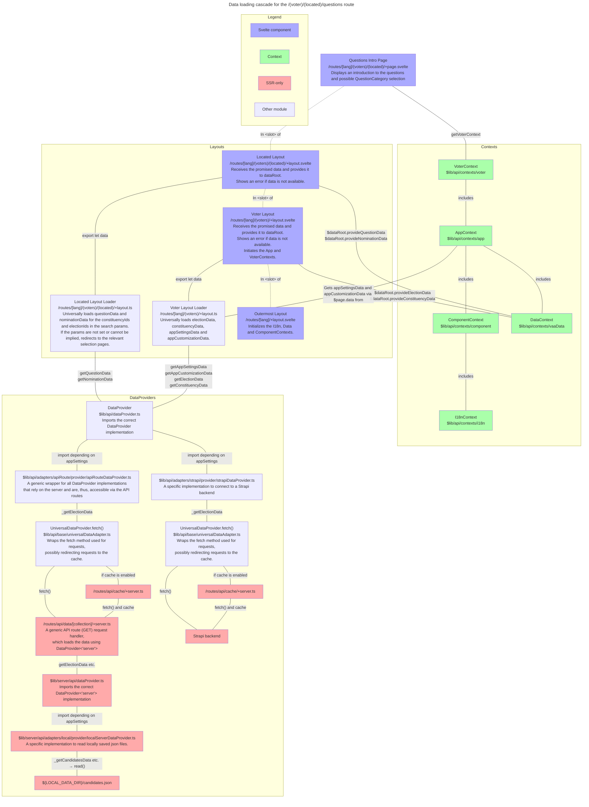

# Accessing data and state management

The overall model for loading and writing data and managing the application state is as follows.

1. External data is loaded (and written) using the [Data API](#data-api). The API is accessed by universal `load` functions in `+layout.ts` files, the `Context`s or some API routes.
   - Depending on [settings](../../packages/app-shared/src/settings/staticSettings.type.ts), either a Strapi backend is accessed or data is read from local `json` files.
2. The loaded data is passed to the `dataRoot` store accessible via the `DataContext` and converted into functional objects using the [`@openvaa/data` model](../../packages/data/).
   - All pages, some other [contexts](contexts.md) and [dynamic components](./components.md) can access the `DataContext`.
   - Some data in the Candidate App is contained in a `UserDataStore` instead of the `dataRoot` store.
3. All other shared stores are contained in [contexts](./contexts.md).
   - Some contexts are globally available and some to only certain parts of the application.

## Example: loading cascade for the `/(voter)/(located)/questions` route {#example}

Below is description of the data loading, provision and context initialisation cascade for the `/(voter)/(located)/questions/+page.svelte` page, which displays an introduction to the questions and possible `QuestionCategory` selection. See the individual files for more details.

- The `(located)` virtual route folder contains a layout that loads the `Entity`, `Nomination` and `QuestionData` that are relevant to the selected `electionId`s and `constituencyId`s, which are either stores in search parameters or implied, e.g. when there’s only on `Election`.

The basic paradigm is (from top to bottom):

- `+page.svelte` files access VAA data via the `dataRoot: Readable<DataRoot>` store contained in `DataContext` or derived stores using it.
- `+layout.svelte` files await for the data loaded by universal `load` functions and provide it to the `dataRoot` store. `DataRoot` converts the data into fully-fletched data objects with methods etc.
- `+layout.ts` universal loaders import a `DataProvider` from `$lib/api/dataProvider` and use it to get data as promises.
- `$lib/api/dataProvider` exports the correct `DataProvider` implementation based on the configuration.
- The specific `DataProvider` implementations may either
  - directly access the database, or
  - if they can only run on the server circulate the calls via the generic `ApiRouteDataProvider`—`/routes/api/data/[collection]/+server.ts`—`$lib/server/_api/serverDataProvider` chain, the last part of which exports the correct `ServerDataProvider` implementation.
- If the `PUBLIC_CACHE_ENABLED` env variable is set, the either adapters `fetch` requests are rerouted via the cache route (`/routes/api/cache/server.ts`). This is handled by the [`UniversalAdapter.fetch`](/frontend/src/lib/api/base/universalAdapter.ts), which the providers use internally.

The process is described in the flowchart below.

\* The AppContext and its associated data will be loaded by the outermost layout and in the future when the Candidate App is refactored.
