# Data API

The Data API is the interface between the frontend and the backend. It handles reading and writing of data in such a way that the frontend can remain agnostic to the actual implementation.

The Data API is composed of three services:

1. `DataProvider`: Reads of public data used by the Voter App from the backend.
2. `FeedbackWriter`: Writes feedback items from either the Voter or Candidate App to the backend.
3. `DataWriter`: Writes data from the Candidate App to the backend and reads some data requiring authentication.

> See also an [example of the data loading cascade](./data-and-state-management.md#example).

## Cache

A simple [disk cache](https://github.com/jaredwray/cacheable#readme) may also be opted in by setting the `PUBLIC_CACHE_ENABLED` env variable to `true` (and configuring the other `CACHE_` variables). If enabled, non-authenticated `GET` requests are cached by default. Caching is handled by the [UniversalAdapter.fetch](/frontend/src/lib/api/base/universalAdapter.ts) method, using the [/api/cache/+server] route.

Note that the cache can be enabled also when the `local` data adapter is used. This may, however, not improve performance by much, as the only overhead saved is the application of query filters to the locally stored json data.

## Folder structure

- [frontend/](../../frontend)
  - [src/](../../frontend/src)
    - [lib/api/](../../frontend/src/lib/api) — All universally available Data API implementations.
      - [adapters/](../../frontend/src/lib/api/adapters) — Specific Data API implemenations.
        - [apiRoute/](../../frontend/src/lib/api/adapters/apiRoute) — Generic `ApiRouteDataProvider` and `ApiRouteFeedbackWriter` implementations through which all server-run implementations are accessed. Redirects calls to local API routes (see below).
        - [strapi/](../../frontend/src/lib/api/adapters/strapi) – Specific `StrapiDataProvider`, `StrapiFeedbackWriter` and `StrapiDataWriter` implementations for use with the Strapi backend.
      - [base/](../../frontend/src/lib/api/base) — Common types and interfaces as well as the `UniversalDataProvider`, `UniversalFeedbackWriter` and `UniversalDataWriter` classes which the specific implementations extend. All common data processing, such as color contrast checking, is handled by these classes.
      - [utils/](../../frontend/src/lib/api/utils) — Utilities related to the Data API.
      - [dataProvider.ts](../../frontend/src/lib/api/dataProvider.ts) — The main entry point for the `load` functions via `import { dataProvider } from '$lib/api/dataProvider'`. The implementation specified in the settings is returned (as a Promise).
      - [dataWriter.ts](../../frontend/src/lib/api/dataWriter.ts) — The main entry point for the `CandidateContext` methods.
      - [feedbackWriter.ts](../../frontend/src/lib/api/feedbackWriter.ts) — The main entry point for the `sendFeedback` method of `AppContext`.
    - [server/api/](../../frontend/src/lib/server/api) – All Data API implementations that must run on the server.
      - [adapters/local/](../../frontend/src/lib/server/api/adapters/local) — Specific `LocalServerDataProvider` and `LocalServerFeedbackWriter` implementations that read and write local `json` files in the [data](../../frontend/data) folder.
      - [dataProvider.ts](../../frontend/src/lib/server/api/dataProvider.ts) — The main entry point for the `GET` function of the `/api/data/[collection]/+server.ts` API route.
      - [feedbackWriter.ts](../../frontend/src/lib/server/api/feedbackWriter.ts) — The main entry point for the `POST` function of the `/api/feedback/+server.ts` API route.
    - `routes/[lang=locale]/`
      - `api/` – Contains the API routes.
        - `cache/+server.ts` – Implements simple disk caching using [`flat-cache`](https://github.com/jaredwray/cacheable#readme)
        - `candidate/logout/+server.ts` – Clear the strict cookie containing the authentication token (does not actually access`DataWriter`).
        - `candidate/preregister/+server.ts` – Access to `DataWriter.preregisterWithApiToken`.
        - `data/[collection]/+server.ts` – Access to the server-run `ServerDataProvider` implementations.
        - `feedback/+server.ts` – Access to the server-run `ServerFeedbackWriter` implementations.
      - `candidate/login/+page.server.ts` - Access to `DataWriter.login` and set the authentication cookie.
  - [data/](../../frontend/data) — For data used by the `LocalServerDataProvider` and `LocalServerFeedbackWriter`.

## Classes and interfaces

```mermaid
---
title: Data API classes and interfaces
---
classDiagram
direction TD

%% CLASS DEFINITIONS

namespace Universal {

  class DPReturnType:::interface {
    <<Type>>
    Contains the return types for all DataProvider
    getter methods, e.g.:
    Partial~DynamicSettings~ +appSettings
    Array~ElectionData~ +elections
  }

  class DataProvider_AdapterType_:::interface {
    <<Interface>>
    Ensures that all the getters are implemented
    both universally and on the server
    with the return type defined by ~AdapterType~,
    which is either 'universal' or 'server'
    +getFooData(options) Promise~DPReturnType['foo'] | Response~
  }

  class DataWriter_AdapterType_:::interface {
    <<Interface>>
    Ensures that all the writers are implemented universally
    Contains methods for
    loggin in and out
    setting and resetting passwords
    registration
    pre-registration
    getting user data
    setting user data
  }

  class FeedbackWriter:::interface {
    <<Interface>>
    Ensures a matching interface for posting feedback
    both universally and on the server
    +postFeedback(data) Promise~Response~
  }

  class UniversalAdapter:::abstract {
    <<Abstract>>
    Implements common fetch for Data API services that handles possible disk caching,
    must be initialized by providing the fetch function before use.
    +init(fetch) void
    +fetch(opts) Promise~Response~
  }

  class UniversalDataProvider:::abstract {
    <<Abstract>>
    Implements all the data getter methods
    Processes all data returned, e.g., ensuring colors
    Requires subclasses to implement protected methods
    +getFooData(options) Promise~DPReturnType['foo']~
    #_getFooData(options)* Promise~DPReturnType['foo']~
  }

  class UniversalDataWriter:::abstract {
    <<Abstract>>
    Implements all the DataWriter methods,
    Requires subclasses to implement protected methods,
    except for methods using universal API routes
    +getFooData(options) Promise~DPReturnType['foo']~
    #_getFooData(options)* Promise~DPReturnType['foo']~
  }

  class UniversalFeedbackWriter:::abstract {
    <<Abstract>>
    Implements postFeedback method
    Processes the data by adding possibly missing fields
    Requires subclasses to implement the protected method
    +postFeedback(data) Promise~Response~
    #_postFeedback(data)* Promise~Response~
  }

  class StrapiAdapter:::abstract {
    <<Abstract/Mixin>>
    Implements methods for accessing the Strapi API
    +apiFetch(opts) Promise~Response~
    +apiGet(opts) Promise~StrapiReturnType['foo']~
    +apiPost(opts) Promise~Response~
    +apiPut(opts) Promise~Response~
  }

  class StrapiDataProvider {
    Implements the actual _getter methods,
    which use StrapiAdapter.apiGet and convert
    the Strapi data into DPReturnType['foo']
    #_getFooData(options) Promise~Array~FooData~~
  }

  class StrapiDataWriter {
    Implements the actual _foo methods,
    mandated by UniversalDataWriter
  }

  class StrapiFeedbackWriter {
    Implements the _postFeedback method
    #_postFeedback(data) Promise~Response~
  }

  class ApiRouteAdapter:::abstract {
    <<Abstract/Mixin>>
    Implements methods for accessing the API routes
    +apiFetch(opts) Promise~Response~
    +apiGet(opts) Promise~DPReturnType['foo']~
    +apiPost(opts) Promise~Response~
  }

  class ApiRouteDataProvider {
    Implements the actual _getter methods by fetching
    from the API route /api/data/[collection]
    #_getFooData() Promise~DPReturnType['foo']~
  }

  class ApiRouteFeedbackWriter {
    Implements the _postFeedback method by fetching
    from the API route /api/feedback
    #_postFeedback() Promise~Response~
  }
}

namespace Server {

  class LocalServerAdapter:::abstract {
    <<Abstract>>
    Implements methods for accessing local files
    in the /data folder
    +exist(endpoint) Promise~boolean~
    +read(endpoint) Response
    +create(endpoint, data) Promise~Response~
  }

  class LocalServerDataProvider {
    Implements the actual getter methods
    by reading from disk
    getFooData(options) Promise~Response~
  }

  class LocalServerFeedbackWriter {
    Implements the postFeedback method
    by writing to disk
    postFeedback(data) Promise~Response~
  }

}

%% CONNECTIONS

DPReturnType ..> DataProvider_AdapterType_ : defined return types
DataProvider_AdapterType_ <.. UniversalDataProvider : implements (universal)
DataWriter_AdapterType_ <.. UniversalDataWriter : implements (universal)
FeedbackWriter <.. UniversalFeedbackWriter : implements (universal)
UniversalAdapter <|-- UniversalDataProvider
UniversalAdapter <|-- UniversalDataWriter
UniversalAdapter <|-- UniversalFeedbackWriter

StrapiAdapter <|-- StrapiDataProvider : mixin
StrapiAdapter <|-- StrapiDataWriter : mixin
StrapiAdapter <|-- StrapiFeedbackWriter : mixin
UniversalDataProvider <|-- StrapiDataProvider
UniversalDataWriter <|-- StrapiDataWriter
UniversalFeedbackWriter <|-- StrapiFeedbackWriter

ApiRouteAdapter <|-- ApiRouteDataProvider : mixin
ApiRouteAdapter <|-- ApiRouteFeedbackWriter : mixin
UniversalDataProvider <|-- ApiRouteDataProvider
UniversalFeedbackWriter <|-- ApiRouteFeedbackWriter
ApiRouteDataProvider ..> LocalServerDataProvider : accesses via GET /api/data/[collection]?...
ApiRouteFeedbackWriter ..> LocalServerFeedbackWriter : accesses via POST /api/feedback

DataProvider_AdapterType_ <.. LocalServerDataProvider : implements (server)
FeedbackWriter <.. LocalServerFeedbackWriter : implements (server)
LocalServerAdapter <|-- LocalServerDataProvider
LocalServerAdapter <|-- LocalServerFeedbackWriter

%% STYLING

namespace Legend {
  class Interface:::interface
  class Abstract:::abstract
  class Concrete
}

classDef interface fill:#afa
classDef abstract fill:#aaf
```

