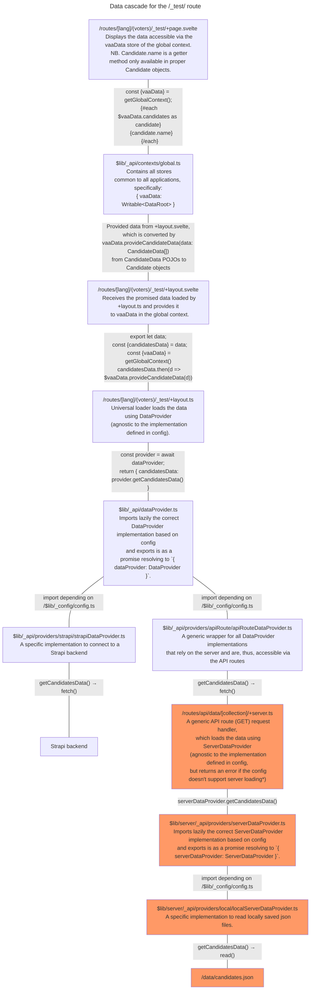

# Data loading

## Loading cascade

Below is description of the data cascade on the `/_test/` route. See the individual files for more details.

The basic paradigm is:

- `+page.svelte` files access election data (questions, candidates etc.) via the `vaa-data: DataRoot` store contained in `GlobalContext` (retrieved with `$lib/_contexts/global: getGlobalContext()`).
- `+layout.svelte` files await for the data loaded by universal `+layout.ts` loaders and provide it to the `GlobalContext.vaaData` `DataRoot`. The `DataRoot` converts the data into fully-fletched data objects with methods etc.
- `+layout.ts` universal loaders import a `DataProvider` from `$lib/_api/dataProvider` and use it to get data as promises.
- `$lib/_api/dataProvider` exports the correct `DataProvider` implementation based on the configuration.
- The specific `DataProvider` implementations may either
  - directly access the database, or
  - if they can only run on the server circulate the calls via the generic `ApiRouteDataProvider`—`/routes/api/data/[collection]/+server.ts`—`$lib/server/_api/serverDataProvider` chain, the last part of which exports the correct `ServerDataProvider` implementation.

The whole process is described in the flowchart.

Files on orange background are only accessible on the server.

\* This could actually be changed so that the universal DataProvider would be used instead, because it might be useful to always expose the API routes.
