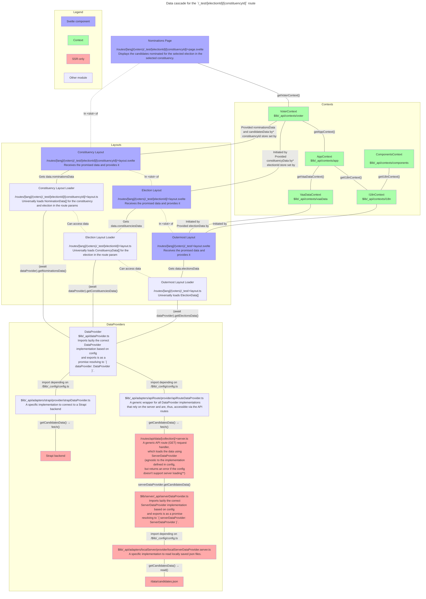

## WHY:

- Advances #249
- Advances #513
- Advances #529
- Advances #536
- Advances #537

## What has been changed (if possible, add screenshots, gifs, etc. )

Prepares for refactoring data API connections, state management and the internal data model.

The proposed new modules are all prefixed with an underscore.

# Trying out

1. Navigate to `/_test/`
2. Select an election
3. Select a constituency
4. Edit the mock answer to see (random) updates in the matches
5. Edit the options in `$lib/_config/config.ts`. Valid options for `adapter` are 'local' and 'strapi'

# Data loading

## Loading cascade

Below is description of the data cascade on the `/_test/[electionId]/[constituencyId]` route. See the individual files for more details.

The basic paradigm is:

- `+page.svelte` files access election data (questions, candidates etc.) via the `vaa-data: DataRoot` store contained in `VaaDataContext` or contexts subsuming it.
- `+layout.svelte` files await for the data loaded by universal `+layout.ts` loaders and provide it to the `VaaDataContext.vaaData` `DataRoot` store. The `DataRoot` converts the data into fully-fletched data objects with methods etc.
- `+layout.ts` universal loaders import a `DataProvider` from `$lib/_api/dataProvider` and use it to get data as promises.
- `$lib/_api/dataProvider` exports the correct `DataProvider` implementation based on the configuration.
- The specific `DataProvider` implementations may either
  - directly access the database, or
  - if they can only run on the server circulate the calls via the generic `ApiRouteDataProvider`—`/routes/api/data/[collection]/+server.ts`—`$lib/server/_api/serverDataProvider` chain, the last part of which exports the correct `ServerDataProvider` implementation.

The whole process is described in the flowchart below.



\* The data are provided to the `dataRoot` or its descendants which `VoterContext` gets from `VaaDataContext`.
\*\* This could actually be changed so that the universal DataProvider would be used instead, because it might be useful to always expose the API routes.

## Contexts

| Context      |  Consumer                                             | Depends on         | Contents                                                                                            | Initiated by        |
| ------------ | ----------------------------------------------------- | ------------------ | --------------------------------------------------------------------------------------------------- | ------------------- |
| `i18n`       | Other contexts                                        | —                  | `t`, `locale`, `locales` from `$lib/i18n`                                                           | `/[lang]`           |
| `vaa-data`   | Other contexts                                        | `i18n`             | `Readable<dataRoot>`                                                                                | `/[lang]`           |
| `components` | Any component\*                                       | `i18n`             | Contents of `i18n` for now                                                                          | `/[lang]`           |
| `app`        | Any part of the app or dynamic components             | `i18n`, `vaa-data` | Contents of `i18n` and `vaa-data`                                                                   | `/[lang]`           |
| `voter`      | Any part of the Voter App or voter components         | `app`              | Contents of `app` and voter-specific stores, such as `answers`, `constituencyId` and `constituency` | `/[lang]/(voter)`   |
| `candidate`  | Any part of the Candidate App or candidate components | `app`              | Contents of `app` and candidate-specific functions, such as `DataWriter` API methods                | `/[lang]/candidate` |

\* `ComponentContext` should be imported in such a way that another context that implements the same functions can easily be provided if the components are used elsewhere.

## Route parameters

The user selections in the Voter app are store in route params. When the user has selected election 1 and constituency 2 and is using the app in English, the route is:

`/en/_test/1/2`

NB. In the future, multiple election selection needs to be implemented, in which case the route might be `/en/_test/1,2/3`. The possible issue in this case is that the ids cannot contain commas. A more robust option might be to add folders so that the route becomes:

`/en/_test/election/1/2/constituency/3`

This will make the server folder structure a bit cumbersome, and we still would need to disallow `constituency` as an id, but maybe that's okay.

# Further Considerations

## API Services

All external connections from the frontend can be configured in the (static) settings in `/_config`.

The configuration defines which adapters to use for the various functions of the app, of which some are optional.

| Service           | Optional                   | Notes                                                                                    |
| ----------------- | -------------------------- | ---------------------------------------------------------------------------------------- |
| `DataProvider`    | Required                   |  All (readonly) connections to the backend that both the Voter and Candidate apps need   |
| `FeedbackWriter`  | Optional                   |  Write (and limited read) connection to the backend for writing and reading feedback     |
| `DataWriter`      | Required for Candidate App | All write and authenticated read connections to the backend that the Candidate app needs |
| `AnalyticsWriter` | Optional                   | All write connections to an analytics service                                            |

The API service are collected in the `$lib/_api` folder by adapter.

> Only the ones marked with \* are in this PR.

```
_api
  adapters
    local
      (common files)
      provider *
      writer
      feedback
    strapi
      (common files)
      provider *
      writer
      feedback
    umami
      analytics
  dataProvider.ts (API entry point)
  serverDataProvider.server.ts (API route entry point)
```

## `Match`, `Nomination`, wrapped and naked `Entity`

Entity cards, details and lists should accept `Entities` either in their naked form or possibly under multiple wraps.

> The current PR does not yet implement the code below, but it will be necessary if this paradigm is accepted.

```ts
type MaybeWrappedEntity<TEntity extends Entity = Entity> =
  | TEntity
  | Match<TEntity>
  | Nomination<TEntity>
  | Match<Nomination<TEntity>>;

interface EntityCardProps<TEntity extends Entity = Entity> {
  content: MaybeWrappedEntity<TEntity>;
}

function parseEntity<TEntity extends Entity = Entity>(
  maybeWrapped: MaybeWrappedEntity<TEntity>
): ParsedEntity<TEntity> {
  let entity: TEntity | undefined = undefined;
  let nomination: Nomination<TEntity> | undefined = undefined;
  let match: Match<TEntity> | Match<Nomination<TEntity>> | undefined = undefined;
  let current: MaybeWrappedEntity<TEntity> = maybeWrapped;
  while (current) {
    if (current instanceof Match) {
      match = current;
      current = match.entity;
    } else if (current instanceof Nomination) {
      nomination = current;
      current = match.entity;
    } else if (current instanceof Entity) {
      entity = current;
      break;
    } else {
      throw new Error(`Unknown entity or wrapper type: ${current.prototype.name}`);
    }
  }
  if (!entity) throw new Error('No entity found in wrapped entity');
  return {
    entity,
    nomination,
    match
  };
}

type ParsedEntity<TEntity extends Entity = Entity> = {
  entity: TEntity;
  nomination: Nomination<TEntity> | undefined;
  match: Match<TEntity> | Match<Nomination<TEntity>> | undefined;
};
```

## Localized data for Candidate App

We might not need to deal with locales in `vaa-data` at all, because what we're mostly concerned is the possibility of using `DataProvider` to get data without translating it.

> Not yet implemented in this PR.

```ts
export interface DataWriter {
  /**
   * An extended version of the DataProvider method. We could also just
   * expand the DataProvider implementation to cover this.
   */
  getCandidatesData<TLocale extends string | undefined | null>({
    locale
  }: {
    locale: TLocale;
  }): TLocale extends string ? CandidateData[] : Localized<CandidateData[]>;
  // If `locale` is not defined, do not translate the object
}

/**
 * Convert the `string` types in `TData` (usually a `vaa-data` `DataObjectData`
 * type) to `LocalizedString` with the exception of id references.
 */
export type Localized<TData> = {
  [Key in keyof TData]: Key extends IdProp
    ? TData[Key]
    : TData[Key] extends string
      ? LocalizedString | string
      : TData[Key];
};

/**
 * Rererence to another object by id or this object's own id.
 * @example 'id', 'candidateId', 'constituencyIds'
 */
type IdProp = 'id' | `${string}Id` | `${string}Ids`;
```

## TODO

- Consider electionId and constituencyId for NominationData
- Convert `vaa-matching` `entity` to `target`
- Locale change for dataRoot: check duplicate updates on server, check invalidate bc cached Promises seem to be returned when changing locale back to an earlier one => consider whole locale change logic

## Check off each of the following tasks as they are completed

- [ ] I have reviewed the changes myself in this PR. Please check the [self-review document](https://github.com/OpenVAA/voting-advice-application/blob/main/docs/contributing/self-review.md)
- [ ] I have added or edited unit tests.
- [ ] I have run the unit tests successfully.
- [ ] I have run the e2e tests successfully.
- [ ] I have tested this change on my own device.
- [ ] I have tested this change on other devices (Using Browserstack is recommended).
- [ ] I have tested my changes using the [WAVE extension](https://wave.webaim.org/extension/)
- [ ] I have added documentation where necessary.
- [ ] Is there an existing issue linked to this PR?

**Clean up your git commit history before submitting the pull request!**
