# To do:

onMount(() => {
if ($elections.length === 1) goto($getRoute({ route: 'Questions', constituencyId: 'constituency-1-1' }), { replaceState: true });
});

- Nomination display in entity details simpler if just one election or one const

- Fix app custom incl. poster images
- Don't return errors
- Check that Strapi allows all filters used
- When Cand App refact complete, remove depr Strapi data types and controller policies

- Party matching

- Remove global types
  - Figure out what to do with wrapped entities
- Create the data context and decide what stores it should expose
- Create the other contexts and decide into which to combine LayoutContext
  - Check the missing requirements for each context from the PR intro
  - Check that we have collected all global stores into the contexts
- Fix Anwers store
- Build the new routes for election, constituency
  - Use /election/[...electionId]/constituency/[...constituencyId]
- Figure out dataRoot locale change, perhaps listen to route param changes instead of locale store which is update with a delay?
- Docs: Adapter setting sets dp, fr, dr but maybe changed in the future for dynamic import
- Check if we need \_utils/awaitAll
- Check that dataObjectStore unsubscribe really works
- Global error store?

- Later when Cand App is unified:
  - Move i18n into contexts and don't import it /layout.ts
  - Refactor /layout.server.ts

# Data API

The Data API is the interface between the frontend and the backend. It handles reading and writing of data, and is composed of three services:

1. `DataProvider`: Reads of public data used by the Voter App from the backend.
2. `FeedbackWriter`: Writes feedback items from either the Voter or Candidate App to the backend.
3. `DataWriter`: 🚧 **Not implemented yet.** Writes data from the Candidate App to the backend.

## Folder structure

```
$lib
  /api
    dataProvider.type.ts   // Interface for both universal and server implemenation mahdating that all collections are supported
    feedbackWriter.type.ts // "
    dataWriter.type.ts     // "
    dataProvider.ts // Main entry point
    feedbackWriter.ts // Main entry point
    dataWriter.ts // Main entry point
    /adapters
      /strapi
        /feebackWriter
        /dataProvider
        /dataWriter
        strapiApi.ts
        strapiData.type.ts
        strapiAdapter.ts // The base class for the writer, provider etc.
      /apiRoute
  /server
    /api
      // Entry points for API routes
      serverDataProvider.ts
      serverFeedbackWriter.ts
      serverDataWriter.ts
      /adapters
        /local
          /feebackWriter
          /dataProvider
          /dataWriter
          localFiles.ts
          localData.type.ts
          localAdapter.ts // The base class for the writer, provider etc.
```

## `DataProvider` classes and interfaces

```mermaid
---
title: DataProvider classes and interfaces
---
classDiagram
direction TD

%% CLASS DEFINITIONS

namespace Universal {

  class DataProvider~AdapterType~ {
    <<Interface>>
    Ensures that all the getters are implemented
    both universally and on the server
    with the return type defined by ~AdapterType~
    +getFooData(options) Promise~Promise~Array~FooData~~ | JsonString~
  }

  %%  class DataWriter~AdapterType~ {
  %%    <<Interface>>
  %%    Ensures that all the writers are implemented
  %%    both universally and on the server
  %%    with the return type defined by ~AdapterType~
  %%    +putFooData(data) Promise~Response~ | Error
  %%  }

  class FeedbackWriter {
    <<Interface>>
    Ensures a matching interface for posting feedback
    both universally and on the server
    +postFeedback(data) Promise~Response~ | Error
  }

  class UniversalAdapter {
    <<Abstract>>
    Implements common initialization for Data API services
    +init(fetch) void
  }

  class UniversalDataProvider {
    <<Abstract>>
    Implements all the data getter methods
    Processes all data returned, e.g., ensuring colors
    +getFooData(options) Promise~Array~FooData~~
    #_getFooData(options)* Promise~Array~FooData~~
  }

  class UniversalFeedbackWriter {
    <<Abstract>>
    Implements postFeedback method
    Processes the data by adding possibly missing fields
    +postFeedback(data) Promise~Response~ | Error
    #_postFeedback(data)* Promise~Response~ | Error
  }

  class StrapiDataProvider {
    Implements the actual _getter methods
    #_getFooData(options) Promise~Array~FooData~~
  }

  class StrapiFeedbackWriter {
    Implements the _postFeedback method
    #_postFeedback(data) Promise~Response~ | Error
  }

  class strapiAdapterCommons:::sharedLib {
    <<Shared library>>
    Not an actual class but vars and methods shared
    between Strapi API implementations. Ideally we would
    also inherit these.
    ApiDict +strapiApi
    +strapiFetch~TData~(url, request?) Promise~TData~ | Error
  }

  class ApiRouteDataProvider {
    Implements the actual _getter methods by fetching
    from the API route /api/data/[collection]
    #_getFooData() Promise~Array~FooData~~
  }

  class ApiRouteFeedbackWriter {
    Implements the _postFeedback methods by fetching
    from the API route /api/feedback
    #_postFeedback() Promise~Array~FooData~~
  }

  class apiRouteAdapterCommons:::sharedLib {
    <<Shared library>>
    Not an actual class but vars and methods shared
    between API Route API implementations. Ideally we would
    also inherit these.
    ApiDict +apiRoutes
    +apiRouteFetch~TData~(url, request?) Promise~TData~ | Error
  }

}

namespace Server {

  class ServerDataProvider {
    <<Abstract>>
    Implements all the data getter methods
    Provides some common methods
    #filter~TData~(TData data, options) TData
    +getFooData(options) Promise~JsonString~
    #_getFooData(options)* Promise~JsonString~
  }

  class ServerFeedbackWriter {
    <<Abstract>>
    Implements postFeedback method
    which only calls _postFeedback
    +postFeedback(data) Promise~Response~ | Error
    #_postFeedback(data)* Promise~Response~ | Error
  }

  class LocalDataProvider {
    Implements the actual _getter methods
    by reading from disk
    #_getFooData(options) Promise~JsonString~
  }

  class LocalFeedbackWriter {
    Implements the _postFeedback method
    by writing on disk
    #_postFeedback(data)* Promise~Response~ | Error
  }

  class localAdapterCommons:::sharedLib {
    <<Shared library>>
    Not an actual class but vars and methods shared
    between Local API implementations. Ideally we would
    also inherit these.
    PathDict +localPaths
    +localRead~TData~(path) Promise~TData~ | Error
    +localWrite~TData~(path, data) Promise~void~ | Error
  }

}

%% CONNECTIONS

DataProvider <.. UniversalDataProvider : implements (universal)
UniversalDataProvider <|-- StrapiDataProvider
strapiAdapterCommons <.. StrapiDataProvider : uses
UniversalDataProvider <|-- ApiRouteDataProvider
apiRouteAdapterCommons <.. ApiRouteDataProvider : uses

ApiRouteDataProvider ..> ServerDataProvider : accesses via GET /api/data/[collection]?...
DataProvider <.. ServerDataProvider : implements (server)
ServerDataProvider <|-- LocalDataProvider
localAdapterCommons <.. LocalDataProvider : uses

FeedbackWriter <.. UniversalFeedbackWriter : implements (universal)
UniversalFeedbackWriter <|-- StrapiFeedbackWriter
strapiAdapterCommons <.. StrapiFeedbackWriter : uses
UniversalFeedbackWriter <|-- ApiRouteFeedbackWriter
apiRouteAdapterCommons <.. ApiRouteFeedbackWriter : uses

ApiRouteFeedbackWriter ..> ServerFeedbackWriter : accesses via POST /api/data/feedback
FeedbackWriter <.. ServerFeedbackWriter : implements (server)
ServerFeedbackWriter <|-- LocalFeedbackWriter
localAdapterCommons <.. LocalFeedbackWriter : uses

%% STYLING

classDef sharedLib fill:#aff
```



===

## What has been changed (if possible, add screenshots, gifs, etc. )

Prepares for refactoring data API connections, state management and the internal data model.

The proposed new modules are all prefixed with an underscore.

# Trying out

1. Navigate to `/_test/`
2. Select an election
3. Select a constituency
4. Edit the mock answer to see (random) updates in the matches
5. Edit the options in `$lib/_config/config.ts`. Valid options for `adapter` are 'local' and 'strapi'

# Data loading

## Loading cascade

Below is description of the data cascade on the `/_test/[electionId]/[constituencyId]` route. See the individual files for more details.

The basic paradigm is:

- `+page.svelte` files access election data (questions, candidates etc.) via the `vaa-data: DataRoot` store contained in `DataContext` or contexts subsuming it.
- `+layout.svelte` files await for the data loaded by universal `+layout.ts` loaders and provide it to the `DataContext.vaaData` `DataRoot` store. The `DataRoot` converts the data into fully-fletched data objects with methods etc.
- `+layout.ts` universal loaders import a `DataProvider` from `$lib/api/dataProvider` and use it to get data as promises.
- `$lib/api/dataProvider` exports the correct `DataProvider` implementation based on the configuration.
- The specific `DataProvider` implementations may either
  - directly access the database, or
  - if they can only run on the server circulate the calls via the generic `ApiRouteDataProvider`—`/routes/api/data/[collection]/+server.ts`—`$lib/server/_api/serverDataProvider` chain, the last part of which exports the correct `ServerDataProvider` implementation.

The whole process is described in the flowchart below.


\* The data are provided to the `dataRoot` or its descendants which `VoterContext` gets from `DataContext`.
\*\* This could actually be changed so that the universal DataProvider would be used instead, because it might be useful to always expose the API routes.

## Contexts

All of the data and state variables used by the app and components are contained in [Svelte contexts](https://svelte.dev/docs/svelte#setcontext).

| Context                                                       |  Consumer                                             | Includes          | Own contents                                                                                                                                                                                                                                                                                                                                                                           | Initiated by                     |
| ------------------------------------------------------------- | ----------------------------------------------------- | ----------------- | -------------------------------------------------------------------------------------------------------------------------------------------------------------------------------------------------------------------------------------------------------------------------------------------------------------------------------------------------------------------------------------- | -------------------------------- |
| [`I18nContext`](/frontend/src/lib/contexts/i18n.ts)           | Other contexts                                        | —                 | — `t`<br> — `locale`<br> — `locales` from `$lib/i18n`                                                                                                                                                                                                                                                                                                                                  | `/[lang]`                        |
| [`DataContext`](/frontend/src/lib/contexts/vaaData.ts)        | Other contexts                                        | `I18n`            | — `dataRoot: Readable<dataRoot>`                                                                                                                                                                                                                                                                                                                                                       | `/[lang]`                        |
| [`ComponentContext`](/frontend/src/lib/contexts/component.ts) | Any component\*                                       | `I18n`            | None currently, but the context is separate because the components might be moved later to a separate module                                                                                                                                                                                                                                                                           | `/[lang]`                        |
| [`AppContext`](/frontend/src/lib/contexts/app.ts)             | Any part of the app or dynamic components             | `I18n`, `VaaData` | — `appSettings: SettingsStore`<br>— `appType: Writable<AppType>`<br> — `userPreferences: Writable<UserPreferences>`<br> — `feedback: DialogService<Feedback>`<br> — `survey: DialogService<Survey>`<br> — `progress: Writable<number \| undefined>`<br> — `getRoute: Readable<RouteGetter>`<br> — `darkMode: Readable<boolean>`<br> — `track`, `startPageview`, `startEvent` etc.      | `/[lang]`                        |
| [`LayoutContext`](/frontend/src/lib/contexts/layout.ts)       | Any page or layout                                    | —                 | — `appSettings: SettingsStore`<br> — `topBarSettings: StackedStore<TopBarSettings, DeepPartial<TopBarSettings>>`<br> — `pageStyles: StackedStore<PageStyles, DeepPartial<PageStyles>>`<br> — `progress: Progress`<br> — `navigation: Navigation`                                                                                                                                       | `/[lang]` (currently (/(voter))) |
| [`VoterContext`](/frontend/src/lib/contexts/voter/context.ts) | Any part of the Voter App or voter components         | `App`             | — `electionId: Writable<id>`<br> — `election: Readable<Election>`<br> — `constituencyId: Writable<id>`<br> — `constituency: Readable<Constituency>`<br> — `algorithm: MatchingAlgorithm`<br> — `answers: AnswerStore`<br> — `matchedCandidates: Readable<Promise<Array<Match<Nomination>>>>`<br> — `entityFilters: Readable<Promise<FilterGroup<MaybeRanked<CandidateProps>>>` • MAYBE | `/[lang]/(voter)`                |
| [`CandidateContext`](/frontend/src/lib/contexts/candidate.ts) | Any part of the Candidate App or candidate components | `App`             | — TBA<br> — `logout: DialogService<LogoutModal>`                                                                                                                                                                                                                                                                                                                                       | `/[lang]/candidate`              |

\* `ComponentContext` should be imported in such a way that another context that implements the same functions can easily be provided if the components are used elsewhere.

> Some of the contents or the Candidate context are not implemented yet in this PR. Some of them are described below.

### `RouteGetter`

```ts
// getRoute.ts
import { derived } from 'svelte/store';
import { page } from '$app/stores';

export const getRoute = derived(
  page,
  ({ params, url }) =>
    (options: GetRouteOptions) =>
      buildRoute(options, { params, url }),
  (options: GetRouteOptions) => buildRoute(options)
);

type GetRouteOptions = Parameters<typeof buildRoute>[0];

// buildRoute.ts
export function buildRoute(
  routeOptions: RouteOptions | Route,
  current?: {
    params: Record<string, string>;
    url: URL;
  }
): string {
  let route = '';
  // Build route here
  return route;
}

export type RouteOptions = {
  route: Route;
  locale?: string | null;
};

// route.ts
export const ROUTE = {
  // Define routes here
} as const;

export type Route = keyof typeof ROUTE;
```

### `SettingsStore`

```ts
/**
 * An extended store for handling settings merged from default settings, locally defined overrides and those accessed via `DataProvider`.
 */
type SettingsStore = Readable<AppSettings> & {
  /**
   * Merge `settings` into the settings. Nullish values will be skipped.
   */
  extend: (settings: Partial<AppSettings>) => AppSettings;
};
```

### `DialogService`

```ts
/**
 * Used to control showing and hiding dialogs which exist on the top level of the app. These include dialogs for feedback, user survey and logging out.
 */
type DialogService<TComponent> = {
  /**
   * Store indicating whether the popup is open.
   */
  open: Readable<boolean>;
  /**
   * Open the popup and return a promise resolving to the component when it's open.
   * @param force Force opening the popup even if showing it is prevented by user preferences
   */
  show: (force?: boolean) => Promise<TComponent>;
  /**
   * Open the popup after `delay` seconds.
   */
  startCountdown: (delay?: number) => Promise<TComponent>;
};
```

## Route parameters

The user selections in the Voter app are store in route params. When the user has selected election 1 and constituency 2 and is using the app in English, the route is:

`/en/_test/1/2`

NB. In the future, multiple election selection needs to be implemented, in which case the route might be `/en/_test/1,2/3`. The possible issue in this case is that the ids cannot contain commas. A more robust option might be to add folders so that the route becomes:

`/en/_test/election/1/2/constituency/3`

This will make the server folder structure a bit cumbersome, and we still would need to disallow `constituency` as an id, but maybe that's okay.

# Candidate App

The Candidate App will follow the same paradigm and will therefore demand quite a bit of reorganising. As an example, setting a Candidate’s answer to one of the info question on the profile page could proceed thus:

```ts
// /candidate/profile/+page.svelte

const { answers } = getCandidateContext();

const current: Record<Id, Answer<LocalizedString>> = $answers;

// $lib/contexts/candidate/context.ts

const answers = new CandidateAnswerStore();

// $lib/contexts/candidate/candidateAnswerStore.ts

import { dataWriter } from '$lib/api/dataWriter';

// Maybe create an ExtendedStore class which this and the Voter's `AnswerStore` implement
class CandidateAnswerStore implements Readable<CandidateAnswers> {
  readonly subscribe: Writable<CandidateAnswers>['subscribe'];
  protected update: Writable<CandidateAnswers>['update'];
  protected set: Writable<CandidateAnswers>['set'];

  constructor() {
    const {update, set, subscribe} = writable<Answers>(Object.freeze(answers));
    this.update = update;
    this.set = set;
    this.subscribe = subscribe;
    this.load();
  }

  load(): Promise<void | Error> {
    return dataWriter.getAnswers()
      .then((answers) => this.set(() => Object.freeze(answers)))
      .catch((e) => e);
  }

  /** Set an answer, which will be saved in localStorage but not yet in the backend unless `save` is `true` */
  setAnswer(questionId: Id, answer: Omit<CandidateAnswer, 'unsaved'>, save = false): void {
    // Implement using this.set
  }

  /** Save all unsaved answers. Resolves to `true` if any were saved. */
  save(): Promise<boolean | Error> {
    const answers = get(this);
    const unsaved = Object.fromEntries(Object.entries(answers).filter(([,answer]) => answer.unsaved);
    if (!Object.keys(unsaved).length) return Promise.resolve(false);
    return dataWriter.setAnswers(unsaved)
      .then(() => this.set(() =>
        Object.freeze(
          Object.fromEntries(
            Object.entries(answers).map(([key, value]) => ([key, {...value, unsaved: false}]))
          )
        )
      ))
      .catch((e) => e);
  }

  /** Reset all answers to their saved values */
  reset(): void {
    // Implement
  }
}

type CandidateAnswers = Record<Id, CandidateAnswer>;

// Instead of a separate type, we probably want to define a parameterized common Answer used for both Voters and Candidates
type CandidateAnswer = {
  value: SerializableValue; // or more specific
  openAnswer?: LocalizedString;
  unsaved?: boolean;
}
```

The `DataWriter` imported functions the same way as `DataProvider` but also handles authentication.

# Further Considerations

## API Services

All external connections from the frontend can be configured in the (static) settings in `/_config`.

The configuration defines which adapters to use for the various functions of the app, of which some are optional.

| Service           | Optional                   | Notes                                                                                    |
| ----------------- | -------------------------- | ---------------------------------------------------------------------------------------- |
| `DataProvider`    | Required                   |  All (readonly) connections to the backend that both the Voter and Candidate apps need   |
| `FeedbackWriter`  | Optional                   |  Write (and limited read) connection to the backend for writing and reading feedback     |
| `DataWriter`      | Required for Candidate App | All write and authenticated read connections to the backend that the Candidate app needs |
| `AnalyticsWriter` | Optional                   | All write connections to an analytics service                                            |

The API service are collected in the `$lib/api` folder by adapter.

> Only the ones marked with \* are in this PR.

```
_api
  adapters
    local
      (common files)
      provider *
      writer
      feedback
    strapi
      (common files)
      provider *
      writer
      feedback
    umami
      analytics
  dataProvider.ts (API entry point)
  serverDataProvider.server.ts (API route entry point)
```

## `Match`, `Nomination`, wrapped and naked `Entity`

Entity cards, details and lists should accept `Entities` either in their naked form or possibly under multiple wraps.

> The current PR does not yet implement the code below, but it will be necessary if this paradigm is accepted.

```ts
type MaybeWrappedEntity<TEntity extends Entity = Entity> =
  | TEntity
  | Match<TEntity>
  | Nomination<TEntity>
  | Match<Nomination<TEntity>>;

interface EntityCardProps<TEntity extends Entity = Entity> {
  content: MaybeWrappedEntity<TEntity>;
}

function parseEntity<TEntity extends Entity = Entity>(
  maybeWrapped: MaybeWrappedEntity<TEntity>
): ParsedEntity<TEntity> {
  let entity: TEntity | undefined = undefined;
  let nomination: Nomination<TEntity> | undefined = undefined;
  let match: Match<TEntity> | Match<Nomination<TEntity>> | undefined = undefined;
  let current: MaybeWrappedEntity<TEntity> = maybeWrapped;
  while (current) {
    if (current instanceof Match) {
      match = current;
      current = match.entity;
    } else if (current instanceof Nomination) {
      nomination = current;
      current = match.entity;
    } else if (current instanceof Entity) {
      entity = current;
      break;
    } else {
      throw new Error(`Unknown entity or wrapper type: ${current.prototype.name}`);
    }
  }
  if (!entity) throw new Error('No entity found in wrapped entity');
  return {
    entity,
    nomination,
    match
  };
}

type ParsedEntity<TEntity extends Entity = Entity> = {
  entity: TEntity;
  nomination: Nomination<TEntity> | undefined;
  match: Match<TEntity> | Match<Nomination<TEntity>> | undefined;
};
```

## Localized data for Candidate App

We might not need to deal with locales in `vaa-data` at all, because what we're mostly concerned is the possibility of using `DataProvider` to get data without translating it.

> Not yet implemented in this PR.

```ts
export interface DataWriter {
  /**
   * An extended version of the DataProvider method. We could also just
   * expand the DataProvider implementation to cover this.
   */
  getCandidatesData<TLocale extends string | undefined | null>({
    locale
  }: {
    locale: TLocale;
  }): TLocale extends string ? CandidateData[] : Localized<CandidateData[]>;
  // If `locale` is not defined, do not translate the object
}

/**
 * Convert the `string` types in `TData` (usually a `vaa-data` `DataObjectData`
 * type) to `LocalizedString` with the exception of id references.
 */
export type Localized<TData> = {
  [Key in keyof TData]: Key extends IdProp
    ? TData[Key]
    : TData[Key] extends string
      ? LocalizedString | string
      : TData[Key];
};

/**
 * Rererence to another object by id or this object's own id.
 * @example 'id', 'candidateId', 'constituencyIds'
 */
type IdProp = 'id' | `${string}Id` | `${string}Ids`;
```

## TODO

- Consider electionId and constituencyId for NominationData
- Convert `vaa-matching` `entity` to `target`
- Locale change for dataRoot: check duplicate updates on server, check invalidate bc cached Promises seem to be returned when changing locale back to an earlier one => consider whole locale change logic
- Make sure `StrapiDataProvider.getCandidatesData({id})` uses a direct `id` route instead of a filter to bypass pagination issues.

## Check off each of the following tasks as they are completed

- [ ] I have reviewed the changes myself in this PR. Please check the [self-review document](https://github.com/OpenVAA/voting-advice-application/blob/main/docs/contributing/self-review.md)
- [ ] I have added or edited unit tests.
- [ ] I have run the unit tests successfully.
- [ ] I have run the e2e tests successfully.
- [ ] I have tested this change on my own device.
- [ ] I have tested this change on other devices (Using Browserstack is recommended).
- [ ] I have tested my changes using the [WAVE extension](https://wave.webaim.org/extension/)
- [ ] I have added documentation where necessary.
- [ ] Is there an existing issue linked to this PR?

**Clean up your git commit history before submitting the pull request!**
