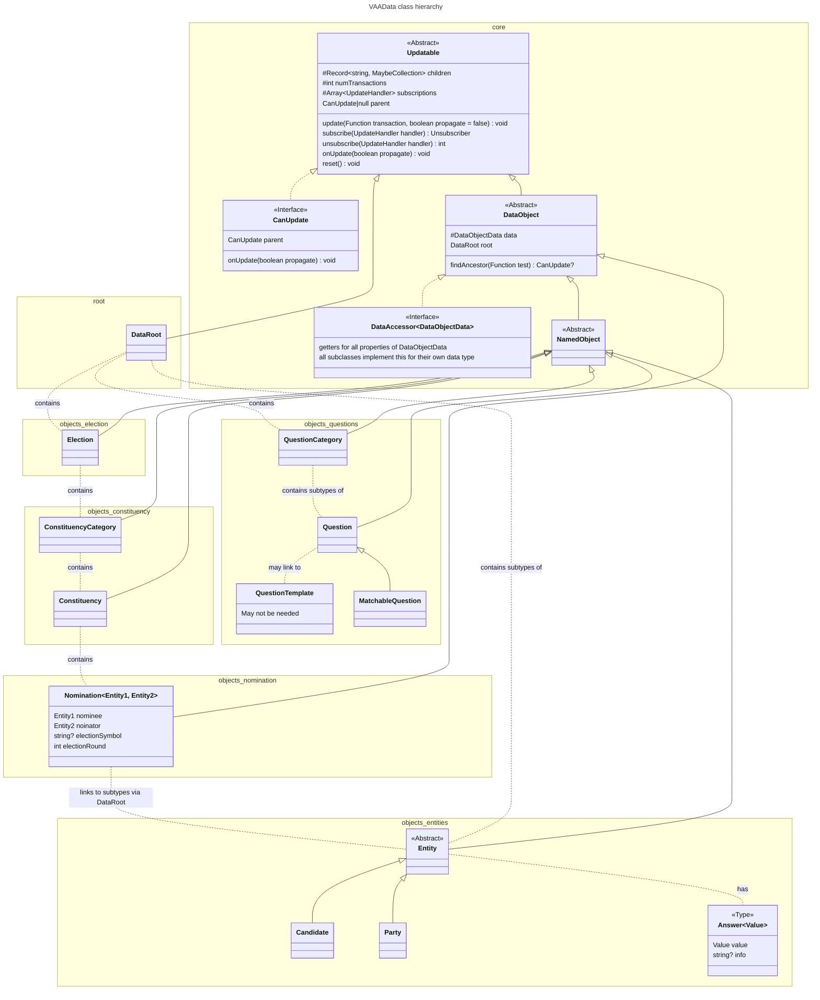

# VAA-Data: the Voting Advice Application data model

The VAA-Data module defines an abstract data model for Voting Advice Applications encompassing (simultaneous) elections; candidates, parties and other entities; the constituencies in which these may be nominated and such nominations; questions or statements posed for the entities and voters to answer; the entities’ answers to these questions.

The module can be used by itself to build an easily traversable, hierarchical model of these data, but it is also designed to work seamlessly with the `vaa-matching` and `vaa-filters` modules as well as the OpenVAA voting advice application front- and backends.

## TODO

We have to be able to use a key to point to a choice in the question options. The value for the option may be different from the key but should optimally default to the key.

```ts
interface Answer {
  key: string | number;
  info?: string;
}

interface Choice {
  key: Answer['key'];
  value: number;
  label: string;
}
```

## File organisation

- `index.ts`: provides public exports
- `src/`
  - `internal.ts`: provides all exports used internally, ordered such that the module can be built without errors
  - `core/`: contains the abstract base classes `Updatable`, `DataObject`, `NamedObject` and atomic data types and some interfaces
  - `objects/`:
    - `constituency/`: `Constituency` and `ConstituencyCategory`
    - `election/`: `Election`
    - `entities/`: the abstract `Entity` base class and its descendants: `Candidate`, `Party`, `Faction`, `Alliance`
    - `nomination/`: the `Nomination` class which connects Entities to Constituencies
    - `questions/`: `Question` and `QuestionCategory` as well as subclasses of the former
  - `root/`: `DataRoot`
  - `utils/`: utilities used internally
- `tests/`: unit tests

See boxes in the class diagram to see in which folder the classes are located.

The `DataObjectData` subtype for each class using such is defined in the accompanying `type.ts` file, e.g. `ElectionData` is defined in [election.type.ts](./src/objects/election/election.type.ts).

## General structure

The data forms a hierarchy with the `DataRoot` object as its root. Each object in the hierarchy is contained as a child of its parent.

Each `DataObject` is associated with a matching `DataObjectData` type, which is used to provide the object with JSON-serializable data.

All parent objects expose methods like `provideFooData(data: Array<FooData>)`, which are used to build their child collections. These collections are stored internally as `Collection`s or `MappedCollection`s but are always returned as `Collection`s, i.e. `Array`s, by the public getters.

`Candidate`s, for example, are stored as a `Map<Id, Candidate>` in `DataRoot`’s `children` but publicly accessed by `DataRoot.candidates: Array<Candidate>` or individually by `DataRoot.getCandidate(id: Id): Candidate | undefined`.

All objects, including `DataRoot`, inherit from the abstract `Updatable` class, which allows others to `subscribe` to an `onUpdate` event triggered whenever the object’s data or children change.

## Classes

> This diagram is preliminary and does not contain all class properties.


