# `@openvaa/data`: A universal data model for voting advice applications

The module defines an abstract data model for Voting Advice Applications encompassing (simultaneous) elections; candidates, parties and other entities; the constituencies in which these may be nominated and such nominations; questions or statements posed for the entities and voters to answer; the entities’ answers to these questions.

The module can be used by itself to build an easily traversable, hierarchical model of these data, but it is also designed to work seamlessly with the `@openvaa/matching` and `@openvaa/filters` modules as well as the OpenVAA voting advice application frontend and backend.

## Dependencies

- `@openvaa/core`: Definitions related to ids, answers, missing values and matching distances to these are shared between this and other `vaa` modules.
- Node or browser: `console` for debugging. The `tsconfig` includes the `dom` lib for this purpose.
- If used with Node: `crypto` and `Intl`.

## Developing

- The module uses [`tsc-esm-fix`](https://github.com/antongolub/tsc-esm-fix) which allows us to use suffixless imports in Typescript.
- See also note on [Exports](#exports).

### Test data

Test data is available in [testData.ts](./src/testUtils/testData.ts). It’s in a tree-like format and can be exported into multiple json files with the [`exportTestData`](./src/testUtils/exportTestData.ts) utility:

```ts
import { exportTestData } from './src/exportTestData'; // Not included in module exports
exportTestData('path-to-export-folder');
```

## Quick start

```ts
import { DataRoot, EXAMPLE_DATA } from '@openvaa/data';
const root = new DataRoot({ data: EXAMPLE_DATA });
for (const e of root.elections!) console.info(`- ${e}`);
// Output:
// > - Election 'Hyrule Parliamentary Elections 2033' • id: election-1
// > - Election 'Hyrule Municipal Elections 2033' • id: election-2
```

For more interactions, see [example.ts](./examples/example.ts).

## Features

- Single source of truth: all objects are accessed by reference and are never copied
- Smart default values for all properties: all missing values are converted to empty literals of the same data type, e.g. empty strings. In the rare cases, where an explicitly missing value is needed, `null` is returned, or in the case of methods related to `@openvaa/matching`, the `MISSING_VALUE` constant defined in `@openvaa/core`
- Utility getters for accessing other objects within the same hierarchy, e.g. all objects have the `root` getter returning the [`DataRoot`](./src/root/dataRoot.ts)
- [`Question`](./src/objects/questions/base/question.ts) and [`Entity`](./src/objects/entities/base/entity.ts) classes implement the required interfaces defined in `@openvaa/matching` for seamless use with the matching algorithm
- Support for multiple simultaneous elections with possibly linked constituencies
- Idempotent data provision

### Localization

The data model itself does not support localization, but the module contains a [`translate`](./src/i18n/translate.ts) utility, which can be used to translate localized data structures into a single-locale format. The function accepts data structures in which localized `string` values are be replaced by [`LocalizedValue`](./src/i18n/localized.ts) objects.

## Exports

The default exports contain a set of non-abstract classes, some abstract base classes, types and utilities.

Imports are handled internally from [`/internal`](./src/internal.ts), which collects all exports from the source files in an order that prevents errors due to circular dependencies. When editing the source code, always route internal imports from this file. Note that these exports should not be used by external consumers of the module, because their availability may change in future versions.

## Constraints and future developments

- The constructors for the `Entity`, `Nomination` and `Question` variants require a redundant `type` to be passed in the arguments, although this could be added by default. This could be changed in the future.
- `Question.appliesTo` is based on the super class method and does not take into account the filters in the `QuestionCategory` it belongs to (contrary to `DataRoot.findQuestions`). This could be changed.
- Currently no way to define the internals of the `customData` property all [`DataObjectData`](./src/core/dataObject.type.ts) share
- Currently no way to extend the model with new subclasses _ad hoc_. This could perhaps be remedied by making provision methods of objects user-definable such that their return types would be used to type the `children` collections.
- Question types not fully implemented:
  - [`MultipleChoiceCategoricalQuestion`](./src/objects/questions/variants/multipleChoiceCategoricalQuestion.ts) – not matchable yet
  - `PreferenceOrderQuestion` – not implemented at all (this can be based on [`MultipleChoiceCategoricalQuestion`](./src/objects/questions/variants/multipleChoiceCategoricalQuestion.ts) because the logic for the matching algorithm is the same)
- Data passed to the provision methods is only partially validated with [`checkObject`](./src/root/dataRoot.ts).
- The [`OrganizationNomination.allianceNomination`](./src/objects/nominations/variants/organizationNomination.ts) getter may need to be called for all [`OrganizationNomination`](./src/objects/nominations/variants/organizationNomination.ts)s. It calls the [`DataRoot.getAllianceNominationForOrganizationNomination`](./src/root/dataRoot.ts) method each time it’s accessed, so it could be useful to cache the results or save the `allianceNominationId` directly in the [`OrganizationNomination`](./src/objects/nominations/variants/organizationNomination.ts) object.
- An object is only added to the [`DataRoot`](./src/root/dataRoot.ts)’s collection when using the data provision methods. Thus, it’s possible to create dangling objects by just using the [`DataObject`](./src/core/dataObject.ts) constructors. An option would be to register each object with [`DataRoot`](./src/root/dataRoot.ts) directly in the [`DataObject`](./src/core/dataObject.ts) constructor.
- The `value` property of [`Answer`](./src/objects/questions/base/answer.type.ts)s is generic and not connected to the type of [`Question`](./src/objects/questions/base/question.ts). It might be good to offer typing for the `value` in the form of either an accompanying reference to the [`QuestionType`](./src/objects/questions/base/questionTypes.ts) or different property names for different value kinds, e.g. `stringValue` and `idArrayValue`.

## Source file organisation

- [`index.ts`](./src/index.ts): provides public exports
- [`internal.ts`](./src/internal.ts): provides all exports used internally, ordered such that the module can be built without errors
- [`core/`](./src/core/): contains the abstract base classes [`Updatable`](./src/core/updatable.ts) and [`DataObject`](./src/core/dataObject.ts) as well as atomic data types and some interfaces
- [`i18n/`](./src/i18n/): contains [localization](#Localization) utilities and types
- [`objects/`](./src/objects/):
  - [`constituency/`](./src/objects/constituency/): [`Constituency`](./src/objects/constituency/constituency.ts) and [`ConstituencyGroup`](./src/objects/constituency/constituencyGroup.ts)
  - [`election/`](./src/objects/election/): [`Election`](./src/objects/election/election.ts)
  - [`entities/`](./src/objects/entities/): the abstract [`Entity`](./src/objects/entities/base/entity.ts) base class and its descendants: [`Candidate`](./src/objects/entities/variants/candidate.ts), [`Organization`](./src/objects/entities/variants/organization.ts), [`Faction`](./src/objects/entities/variants/faction.ts), [`Alliance`](./src/objects/entities/variants/alliance.ts)
    - [`base/`](./src/objects/entities/base/): the abstract base classes for all entities and common types
    - [`variants/`](./src/objects/entities/variants/): the concrete entity subclasses that can be instantiated
  - [`nominations/`](./src/objects/nominations): the abstract [`Nomination`](./src/objects/nominations/base/nomination.ts) base class which connects [`Entity`](./src/objects/entities/base/entity.ts)s to [`Election`](./src/objects/election/election.ts)-[`Constituency`](./src/objects/constituency/constituency.ts) pairs
    - [`base/`](./src/objects/nominations/base/): the abstract base classes for all nominations and common types
    - [`variants/`](./src/objects/nominations/variants/): the concrete nomination subclasses that can be instantiated
  - [`questions/`](./src/objects/questions/): [`Question`](./src/objects/questions/base/question.ts) and [`QuestionCategory`](./src/objects/questions/category/questionCategory.ts) as well as subclasses of the former
    - [`base/`](./src/objects/questions/base/): the abstract base classes for all questions and question categories and common types
    - [`category/`](./src/objects/questions/category): the class for question categories
    - [`variants/`](./src/objects/questions/variants): the concrete question subclasses that can be instantiated
- [`root/`](./src/root/): [`DataRoot`](./src/root/dataRoot.ts)
- [`testUtils/`](./src/testUtils/): utilities and data used for testing (not exported)
- [`utils/`](./src/utils/): utilities that are mostly used internally, but a few are exported by default

See boxes in the class diagram below to see in which folder the classes are located.

The [`DataObjectData`](./src/core/dataObject.type.ts) subtype for each class using such is defined in the accompanying `type.ts` file, e.g. `ElectionData` is defined in [election.type.ts](./src/objects/election/election.type.ts). However, if the data type is inherited unchanged, see the superclass’ `type.ts` file.

## General structure

All of the data is contained in the [`DataRoot`](./src/root/dataRoot.ts) object. Objects are added to the root using the data provision methods described below. The data provided is JSON-serializable and is converted into rich [`DataObject`](./src/core/dataObject.ts)s upon provision. The objects are accessed via [`DataRoot`](./src/root/dataRoot.ts) or other [`DataObject`](./src/core/dataObject.ts)s.

### Object data

Each [`DataObject`](./src/core/dataObject.ts) is associated with a matching [`DataObjectData`](./src/core/dataObject.type.ts) type, which is used to provide the object with JSON-serializable data.

The data passed to the objects is accessed via getters mandated by the [`DataAccessor<TData extends DataObjectData>`](./src/core/dataAccessor.type.ts) interface. The getters always provide a sensible default for the values of the same data type. Thus, for example, getters for optional `string` data properties always return an empty string (`''`).

The data is expected to be immutable and no setters are provided for the properties.

### Providing data

The [`DataRoot`](./src/root/dataRoot.ts) exposes data provision methods like `provideElectionData(data: Readonly<Array<ElectionData>>)`, which are used to build the child [`DataObject`](./src/core/dataObject.ts)s. The objects are stored in the root’s `children` collections.

Data provision is designed to be idempotent and for this reason whenever data is provided the whole collection is rewritten, along with those depending on it. See [`DEPENDENT_COLLECTIONS`](./src/root/dependentCollections.ts) for details. This means that data should be provided in this order:

1. Elections
2. Constituency groups
3. Constituencies
4. In either order:
   1. Entities and the Nominations
   2. Question categories and then Questions

### Accessing data objects

The objects are stored internally in the [`DataRoot`](./src/root/dataRoot.ts) in `Id`-mapped collections. These collections cannot be accessed directly, but the [`DataRoot`](./src/root/dataRoot.ts) provides two main ways for accessing them:

- collection getters, such as `DataRoot.elections`, which return an `Array` of the objects, sorted by their `order` property (ascending)
- `Id`-based getters, such as `DataRoot.getElection(id: Id)`, which return the individual object and throw a `DataNotFoundError` if the object is not found.

In addition to accessing the objects via the root, many objects provide getters and methods for accessing related objects. The [`Election`](./src/objects/election/election.ts) object, for example, provides a `constituencyGroups` getter for the [`ConstituencyGroup`](./src/objects/constituency/constituencyGroup.ts)s available for that election as well as a `getCandidateNominations({id})` method which returns the [`CandidateNomination`](./src/objects/nominations/variants/candidateNomination.ts)s for the [`Constituency`](./src/objects/constituency/constituency.ts) with the `id` passed as the argument.

None of these utility getters store references to the objects, but use the [`DataRoot`](./src/root/dataRoot.ts)’s getters when called.

#### NB: Always reference objects by `id`

The objects are always compared and referenced by their `id` instead of proper object equality. This is to prevent errors in cases where the data for is accidentally provided twice and the objects are recreated.

Dynamically created objects – implied [`Entity`](./src/objects/entities/base/entity.ts)s (see also below) and [`Nomination`](./src/objects/nominations/base/nomination.ts)s – will be given a deterministic `Id` based on their hashed properties:

- For [`Nomination`](./src/objects/nominations/base/nomination.ts)s a hash of:
  1. Keyword `nomination`
  2. `electionId`
  3. `constituencyId`
  4. `electionRound`
  5. `entityType`
  6. `entityId`
  7. possible `parentNominationId`
- For implied [`Alliance`](./src/objects/entities/variants/alliance.ts)s or [`Faction`](./src/objects/entities/variants/faction.ts)s:
  1. Keyword `alliance` or `faction`
  2. `electionId`
  3. `constituencyId`
  4. `electionRound`
  5. `entityType`
  6. `parentNominationId` for `FactionNomination`s
  7. `Id`s of the entities in the child nominations:
     - `Organization`s for `AllianceNomination`s
     - `Candidate`s for `FactionNomination`s

### [`ConstituencyGroup`](./src/objects/constituency/constituencyGroup.ts)s and [`Constituency`](./src/objects/constituency/constituency.ts)s

The [`Constituency`](./src/objects/constituency/constituency.ts) objects represent constituencies or [electoral districts](https://en.wikipedia.org/wiki/Electoral_district), which are most commonly the geographical areas into which nominees and voters are grouped.

[`ConstituencyGroup`](./src/objects/constituency/constituencyGroup.ts)s are groups of [`Constituency`](./src/objects/constituency/constituency.ts) objects that the voter can choose from. An [`Election`](./src/objects/election/election.ts) usually has only one such group, but in some cases the voters may be eligible to cast their vote in both a geographical and an ethnic [`Constituency`](./src/objects/constituency/constituency.ts).

For consistency, a [`ConstituencyGroup`](./src/objects/constituency/constituencyGroup.ts) with one [`Constituency`](./src/objects/constituency/constituency.ts) must be defined for [`Election`](./src/objects/election/election.ts)s only having one, e.g. countrywide, constituency.

#### Nested [`Constituency`](./src/objects/constituency/constituency.ts)s

[`Constituency`](./src/objects/constituency/constituency.ts) objects may have a `parentConstituency`, which can be used in situations where multiple elections take place on differing levels of a country’s regional hierarchy, such as regional and municipal. In these cases, the VAA use may be shown only the lowest-level [`Constituency`](./src/objects/constituency/constituency.ts)s for selecting from and the parentage used to deduce the higher-level ones. (See [Recipes](#recipes), below.)

### [`Nomination`](./src/objects/nominations/base/nomination.ts)s and [`Entity`](./src/objects/entities/base/entity.ts)s

In order to provide an accurate description of an election, the model maintains a distinction between entities and nominations. As an example, a candidate standing in an election is represented by a combination of a [`Candidate`](./src/objects/entities/variants/candidate.ts) (a subclass of [`Entity`](./src/objects/entities/base/entity.ts)) and a [`CandidateNomination`](./src/objects/nominations/variants/candidateNomination.ts) (a subclass of [`Nomination`](./src/objects/nominations/base/nomination.ts)) object.

- The [`Entity`](./src/objects/entities/base/entity.ts) represents the entity itself and can exist without an associated [`Nomination`](./src/objects/nominations/base/nomination.ts), a person in the case of a [`Candidate`](./src/objects/entities/variants/candidate.ts). The [`Entity`](./src/objects/entities/base/entity.ts) has the `name` and the possible [`Answers`](#answers) to the [VAA questions](#questions-and-questioncategorys).
- The [`Nomination`](./src/objects/nominations/base/nomination.ts) in turn represents the nomination of the associated [`Entity`](./src/objects/entities/base/entity.ts) in a [`Constituency`](./src/objects/constituency/constituency.ts) in an [`Election`](./src/objects/election/election.ts). It is basically just a combination of references to those three objects, but may also defined an `electionSymbol`, e.g. a candidate number marked on the ballot.

The reason for not collating these two object types is that the same [`Entity`](./src/objects/entities/base/entity.ts) may have multiple [`Nomination`](./src/objects/nominations/base/nomination.ts)s, even in the same [`Election`](./src/objects/election/election.ts).

The nominated [`Entity`](./src/objects/entities/base/entity.ts) can be accessed via the [`Nomination`](./src/objects/nominations/base/nomination.ts)’s `entity` property.

#### Explicit and implied [`Entity`](./src/objects/entities/base/entity.ts) **objects**

There are four types of [`Entity`](./src/objects/entities/base/entity.ts) objects. Two of them are _explicit_, meaning that when providing the [`NominationData`](./src/objects/nominations/base/nomination.type.ts) for them, the associated [`EntityData`](./src/objects/entities/base/entity.type.ts) must also be (separately) provided:

- [`Candidate`](./src/objects/entities/variants/candidate.ts), a person
- [`Organization`](./src/objects/entities/variants/organization.ts), a political party, constituency association or similar organization nominating candidates.

The other two may be _implied_, which means that they can be defined with just the [`NominationData`](./src/objects/nominations/base/nomination.type.ts). For these, the [`Nomination`](./src/objects/nominations/base/nomination.ts) constructor will create an implied [`Entity`](./src/objects/entities/base/entity.ts) for these, if the data does not contain an `entityId`.

- [`Faction`](./src/objects/entities/variants/faction.ts), a grouping of candidates inside a party, used in ’ley de lemas’ election systems
- [`Alliance`](./src/objects/entities/variants/alliance.ts), an electoral alliance between [`Organization`](./src/objects/entities/variants/organization.ts)s

In the case of implied entities, this means that they will be specific to a [`Constituency`](./src/objects/constituency/constituency.ts) and an [`Election`](./src/objects/election/election.ts), which is in line with actual elections. Electoral alliances, for example, are most often constituency-specific. If, however, the alliance is an election-wide one (or its representatives have provided answers to the VAA questions), one can provide [`AllianceData`](./src/objects/entities/variants/alliance.type.ts) for an explicit [`Alliance`](./src/objects/entities/variants/alliance.ts) and link the [`AllianceNomination`](./src/objects/nominations/variants/allianceNomination.ts) to that by specifying the `entityId` the same way as for [`Candidate`](./src/objects/entities/variants/candidate.ts)s.

The implied entities are created for consistency of the data model.

### [`Question`](./src/objects/questions/base/question.ts)s and [`QuestionCategory`](./src/objects/questions/category/questionCategory.ts)s

The [[`Question`](./src/objects/questions/base/question.ts)](./src/objects/questions/base/question.ts) objects represent, naturally enough, the questions or statements posed by the VAA. They’re grouped into categories and are expect belong to one and only one [`QuestionCategory`](./src/objects/questions/category/questionCategory.ts).

There are subclasses for many different types of questions, dubbed [`AnyQuestionVariant`](./src/objects/questions/variants/variants.ts)s. The data for each of these is differentiated by the [`type: QuestionType`](./src/objects/questions/base/questionTypes.ts) property. The subclasses differ in the type of [`Answer`](./src/objects/questions/base/answer.type.ts)s they accept. If they can be used in matching, they also implement the `MatchableQuestion` interface defined by the `@openvaa/core` module and required by `@openvaa/matching`.

Both [`Question`](./src/objects/questions/base/question.ts)s and [`QuestionCategory`](./src/objects/questions/category/questionCategory.ts)s can be made specific to an [`Election`](./src/objects/election/election.ts), [`Constituency`](./src/objects/constituency/constituency.ts), [`EntityType`](./src/objects/entities/base/entityTypes.ts) or `electionRound` by setting the relavant filters in the data. The [`QuestionAndCategoryBase.appliesTo(targets: FilterTargets)`](./src/objects/questions/base/questionAndCategoryBase.ts) method can be used to this effect.

### [`Answer`](./src/objects/questions/base/answer.type.ts)s

The answers of [`Entity`](./src/objects/entities/base/entity.ts)s to the VAA questions are stored as a `Id`-[`Answer`](./src/objects/questions/base/answer.type.ts) record in their data. The `Answer<TValue>` interface is defined by the `@openvaa/core` module. The type parameter defines the type of the [`Answer`](./src/objects/questions/base/answer.type.ts)’s `value` property, which is used to store the answer proper. [`Answer`](./src/objects/questions/base/answer.type.ts)s may also contain an `info: string` property, which usually is the respondent’s freeform explanation for their answer.

While the `value` types of the [`Entity`](./src/objects/entities/base/entity.ts)s [`Answer`](./src/objects/questions/base/answer.type.ts)s are currently not checked when the object is initialised, the [`Entity.getAnswer(question: AnyQuestionVariant)`](./src/objects/entities/base/entity.ts) method does that and will return a `MISSING_ANSWER` (i.e. `undefined`, typed in `@openvaa/core`) if the stored [`Answer`](./src/objects/questions/base/answer.type.ts)’s `value` is not valid for the [`AnyQuestionVariant`](./src/objects/questions/variants/variants.ts) in case. This way the consumers of the `@openvaa/data` model do not have to perform further checks when accessing the answers.

#### Formatting [`Answer`](./src/objects/questions/base/answer.type.ts)s for output

For convenience, [`Entity`](./src/objects/entities/base/entity.ts)s also have a `getFormattedAnswer(question: AnyQuestionVariant)` method, which can be used to retrieve the `Answer.value` and format it as a string, regardless of the `value` type. To overwrite the default formats, the [`DataRoot.setFormatter(...)`](./src/root/dataRoot.ts) method can be used. The optional [`DataRoot.locale`](./src/root/dataRoot.ts) property also affects some of the formats (e.g. [`formatDateAnswer`](./src/utils/formatAnswer.ts)).

### [`Updatable`](./src/core/updatable.ts) and subscribictions

All objects, including [`DataRoot`](./src/root/dataRoot.ts), inherit from the abstract [`Updatable`](./src/core/updatable.ts) class, which allows others to `subscribe` to an `onUpdate` event triggered whenever the object’s data or children change.

## Classes

Note that the diagrams below does not contain all defined types, only object classes as well as some central interfaces and types.

The hierarchy is split into two diagrams with [`Question`](./src/objects/questions/base/question.ts)s in their own diagram.

### Classes and inheritance without [`Question`](./src/objects/questions/base/question.ts)s

```mermaid
---
title: VAAData class inheritance (with Questions collapsed)
---
classDiagram
  direction TD

  %% CLASS DEFINITIONS

  namespace core {

    class Updatable {
      <<Abstract>>
      Provides methods for updates and subscribing to changes in this object
    }

    class DataAccessor~DataObjectData~ {
      <<Interface>>
      Mandates getters for all properties of DataObjectData
      All subclasses implement this for their own data type
    }

    class DataObject {
      <<Abstract>>
      Mandates an id and provides getters for other properties common to all DataObjects
      Implements the DataAccessor interface
      Provides access to DataRoot
    }
  }

  namespace objects_constituency {

    class Constituency {
      An electoral district, usually representing a geographical area, in which candidates can be nominated
    }

    class ConstituencyGroup {
      A group of Constituencies that the voter can choose from.
    }
  }

  namespace objects_election {

    class Election {
      Defines the name of the election and possible dates
    }
  }

  namespace objects_entities_base {

    class Entity {
      <<Abstract>>
      Any entity standing in an Election
      Can have Answers
    }
  }

  namespace objects_entities_variants {

    class Alliance {
      An electoral alliance of Organizations
      Usually specific to an Election and a Constituency
      May be implied by an AllianceNomination
    }

    class Candidate {
      A person that can be nominated
    }

    class Faction {
      A subgroup of an Organization, used in ’ley de lemas’ electoral systems
      Usually specific to an Election and a Constituency
      May be implied by an FactionNomination
    }

    class Organization {
      A political organization that can nominate Candidates or Factions
      Usually a party or a constituency association
    }
  }

  namespace objects_nomination_base {
    class Nomination {
      <<Abstract>>
      Defines an Entity nominated for an Election in a Constituency
      Defines the electionSymbol and possible electionRound
    }
  }

  namespace objects_nomination_variants {

    class AllianceNomination {
      Defines an alliance of OrganizationNominations
      May create an implied Alliance entity
    }

    class CandidateNomination {
      Defines a nomination of a Candidate
    }

    class FactionNomination {
      Defines a faction of nominated Candidates for an Organization
      May create an implied Faction entity
      Must be part of an OrganizationNomination
    }

    class OrganizationNomination {
      Defines a nomination of an Organization
      May contain nominated Candidates
    }
  }

  namespace objects_questions {

    class Answer~TValue~ {
      <<Type>>
      An answer to a Question with value of typoe TValue
      Implements the @openvaa/core Answer interface
    }

    class QuestionAndCategoryBase {
      <<Abstract>>
      A base class for both Questions and QuestionCategories
      Can be made specific to an Election, Constituency, EntityType or electionRound
    }

    class Question {
      <<Abstract>>
      A base class for all questions
      Implements methods for ensuring Answer values match the expected value type
      Implements the @openvaa/core MatchableQuestion interface,
      but for subclasses that can be used for matching the isMatchable property must be true
      See separate diagram for subclasses
    }

    class QuestionCategory {
      A category of Questions
    }

  }

  namespace root {
    class DataRoot {
      Contains all data objects
      Provides id-based and array getters for all objects
      Exposes data provision methods
      Contains formatters for some data objects’ properties
    }
  }

  %% INHERITANCE

  Updatable <|-- DataRoot
  Updatable <|-- DataObject
  DataObject <|.. DataAccessor : implements
  DataObject <|-- Constituency
  DataObject <|-- ConstituencyGroup
  DataObject <|-- Election
  DataObject <|-- Entity
  DataObject <|-- Nomination
  DataObject <|-- QuestionAndCategoryBase
  Entity <|-- Alliance
  Entity <|-- Candidate
  Entity <|-- Faction
  Entity <|-- Organization
  Nomination <|-- AllianceNomination
  Nomination <|-- CandidateNomination
  Nomination <|-- FactionNomination
  Nomination <|-- OrganizationNomination
  QuestionAndCategoryBase <|-- Question
  QuestionAndCategoryBase <|-- QuestionCategory
```



### [`Question`](./src/objects/questions/base/question.ts) and [`QuestionCategory`](./src/objects/questions/category/questionCategory.ts) classes and inheritance


### Links between objects without [`Question`](./src/objects/questions/base/question.ts)s

> Accessors inherited from subclasses of [`DataObject`](./src/core/dataObject.ts), [`Entity`](./src/objects/entities/base/entity.ts) and [`Nomination`](./src/objects/nominations/base/nomination.ts), are only shown for the superclass.
> Also exluded from the diagram are the getters for all objects that [`DataRoot`](./src/root/dataRoot.ts) provides.


## Recipes

### Constituency selection and inheritance

If the VAA has multiple simultaneous [`Election`](./src/objects/election/election.ts)s and their [`ConstituencyGroup`](./src/objects/constituency/constituencyGroup.ts)s overlap in such a way that one is completely subsumed by the other, the user may be shown only the [`Constituency`](./src/objects/constituency/constituency.ts)s from the more specific group for selection.

An example would be that the [`Constituency`](./src/objects/constituency/constituency.ts)s for one [`Election`](./src/objects/election/election.ts) are the regions and the municipalities within them for the other. In such a case, we could only show the municipalities, because the region could always be implied from them.

The following rough logic can be used for that.

```ts
// A mapping of a ConstituencyGroup being implied by the other. We will only show the groups for selection, which are not implied
const impliedBy = new Map<ConstituencyGroup, ConstituencyGroup>();

const elections = root.elections;
const constituencyGroups = removeDuplicates(elections.map((e) => e.constituencyGroups));

// We proceed from the group with the least items upwards, because only groups with less items can be implied from those with more
constituencyGroups.sort((a, b) => a.length - b.length);

for (let i = 0; i < constituencyGroups.length - 1; i++) {
  const smaller = constituencyGroups[i];
  // Compare smaller against all the other groups with equal or larger number of Constituencies
  for (const larger of constituencyGroups.slice(i + 1)) {
    // Use larger to imply smaller if:
    // - every constituency in smaller is the parent of some constituency in larger
    // - every constituency in larger has a parent in smaller
    const largersParents = larger.constituencies.map((c) => c.parentConstituency);
    if (
      smaller.constituencies.every((c) => largersParents.includes(c)) &&
      larger.constituencies.every((c) => c.parentConstituency && smaller.constituencies.includes(c.parentConstituency))
    )
      impliedBy.set(smaller, larger);
  }
}

// Only show those ConstituencyGroups that are not implied
for (const group of constituencyGroups.filter((g) => !impliedBy.has(g))) {
  // Show group
  // NB! When resolving the Constituencies after selection, note that the implication hierarchy may be multi-level, e.g. C implies B implies A
}
```
